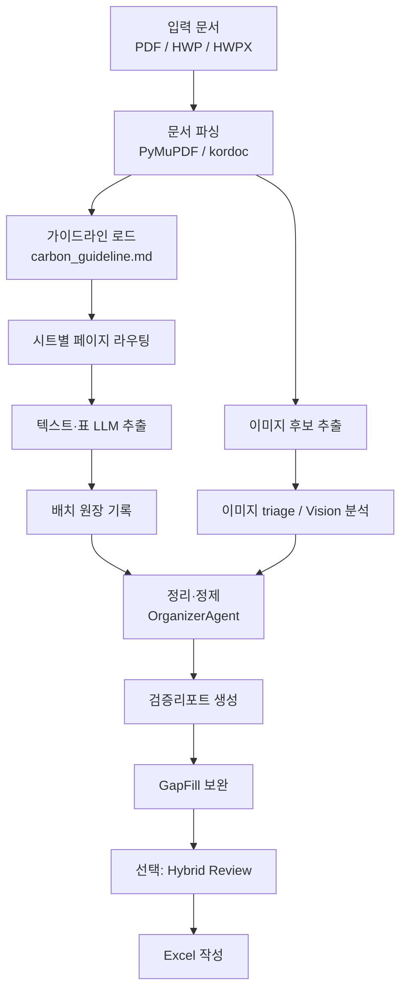

# 가이드라인 기반 지자체 탄소중립 계획 정보 추출 시스템

환경부 「지자체 탄소중립 녹색성장 기본계획 수립 및 추진상황 점검 가이드라인」(`carbon_guideline.md`)을 기준으로 지자체 탄소중립 계획서에서 구조화 데이터를 추출해 Excel로 정리하는 파이프라인입니다.

이 프로젝트의 핵심 목표는 단순히 많이 뽑는 것이 아니라, **조용한 데이터 유실을 막고 사람이 검증할 수 있는 근거를 남기는 것**입니다. v4/v4.1은 이 목표를 위해 부분 실패 허용, 배치 원장, 검증리포트, 출처페이지, quota 복구를 중심으로 안정성을 강화했습니다.

## 현재 구현 요약

- 입력: PDF, HWP, HWPX
- 출력: `00_문서메타`부터 `16_시각자료목록`까지 17개 기본 시트
- 선택 출력: `17_보조검수후보`, `18_보조병합로그`, `19_검증리포트`
- 기본 LLM 백엔드: Gemini API
- 선택 백엔드: OpenAI API, Codex CLI, Claude Code CLI
- 기본 정책: 정확도와 검증 가능성을 우선하고, 위험한 최적화는 opt-in으로만 사용

## v4/v4.1에서 달라진 핵심

### 1. 실패를 숨기지 않는 추출 원장

각 LLM 배치의 결과를 원장으로 남깁니다.

- `ok`: 추출 성공
- `call_fail`: 호출 실패
- `parse_fail`: JSON 파싱 실패

실패한 배치가 있어도 이미 성공한 배치 결과는 버리지 않습니다. 실패 정보는 `19_검증리포트`에 `원장 호출실패` 또는 `원장 파싱실패`로 남아 사람이 어느 시트·어느 페이지를 다시 확인해야 하는지 알 수 있습니다.

### 2. quota/세션 한도 복구

v4.1 기준 quota 동작은 다음 원칙을 따릅니다.

1. 짧게 기다려 회복을 시도한다.
2. 정해진 상한을 넘으면 해당 배치만 실패로 격리한다.
3. 이미 성공한 배치 결과는 보존한다.
4. 가능한 경우 파이프라인은 부분 데이터로 끝까지 완주한다.

즉, quota가 발생했다고 전체 실행 결과가 통째로 사라지지 않습니다. 다만 quota가 실제로 발생한 경우에는 회복 대기 때문에 실행 시간이 길어질 수 있습니다.

### 3. 부분 실패 허용 병렬 실행

`parallel_map_collect`는 독립적인 LLM 배치를 병렬로 실행하되, 항목별 성공/실패를 `(결과, 예외)` 형태로 수집합니다.

- 일반 실패는 해당 배치 원장에 기록하고 나머지 배치는 계속 처리
- quota는 이후 미완료 배치를 실패로 채우고, 이미 완료된 결과는 보존
- 입력 순서가 유지되어 출력 결정성이 흔들리지 않음

### 4. JSON 재시도와 성공 판정 보정

LLM 응답이 JSON으로 파싱되지 않으면 같은 프롬프트에 재요청 문구를 붙여 1회만 다시 호출합니다.

v4.1에서는 불필요한 재호출을 줄이기 위해 다음 응답도 정상 JSON으로 인정합니다.

- 최상위 JSON 배열: `[ { ... } ]`
- 코드펜스에 감싼 의도적 빈 객체: 예를 들어 `json` 코드블록 안의 `{}`
- 의도적 빈 배열: `[]`

### 5. 출처페이지와 검증리포트

데이터 행에는 가능한 경우 `출처페이지`를 붙입니다. 정제 단계에서는 아래 항목을 결정론적으로 점검해 `19_검증리포트`에 남깁니다.

- 배치 호출/파싱 실패
- 빈 시트 원인
- 감축률 산식 불일치
- 부문/목표연도 누락 가능성
- 단위 스케일 혼재
- 기준배출량과 배출현황 불일치
- 재정 합계와 부분합 불일치
- 중복 키의 값 충돌

### 6. GapFill 보완

1차 추출 후 비어 있거나 커버리지가 낮은 핵심 시트를 다시 점검합니다. 단순히 “라우팅된 페이지”가 아니라 **성공적으로 추출된 페이지**를 기준으로 보완 대상을 정하므로, 호출 실패나 파싱 실패로 유실된 페이지도 다시 후보가 될 수 있습니다.

### 7. Organizer는 결정론적 정제만 수행

`OrganizerAgent`는 LLM을 호출하지 않습니다. 정제·중복 제거·검증은 Python 규칙으로 처리합니다. 이 설계는 재현성과 디버깅 가능성을 위해 유지합니다.

## 무거운 기능은 기본으로 켜지지 않습니다

아래 기능은 품질 회귀 가능성이 있어 기본값이 꺼져 있습니다.

| 설정 | 기본값 | 의미 |
|---|---:|---|
| `EXTRACTION_SHEET_CLUSTERING` | `False` | 여러 시트를 한 번에 추출해 호출 수를 줄이는 opt-in 최적화 |
| `ROUTE_DROP_UBIQUITOUS_STRONG` | `False` | 문서 전반에 반복되는 strong 키워드까지 라우팅 점수에서 제외하는 실험적 최적화 |
| `HYBRID_REVIEW_ENABLED` | `False` | 기본 추출 후 보조 모델로 누락/충돌 후보를 검수하는 선택 기능 |

테스트 파일이 늘어난 것은 런타임을 무겁게 만들기 위해서가 아니라, 위 안정성 계약을 깨지 못하게 막기 위한 회귀 테스트입니다. 일반 실행 시 `tests/`는 실행되지 않습니다.

## 처리 흐름



## 출력 Excel 시트

### 기본 시트

| 시트 | 내용 |
|---|---|
| `00_문서메타` | 계획명, 지자체, 발간기관, 계획기간, 기준/목표연도 |
| `01_계획개요` | 수립 배경, 법적 근거, 추진체계, 추진경과 |
| `02_지역여건` | 자연·인문·경제·에너지 지표 |
| `03_배출현황_지역` | 지역 기준 온실가스 배출·흡수 현황 |
| `04_배출현황_관리권한` | 지자체 관리권한 인벤토리 |
| `05_배출전망` | BAU 및 시나리오별 배출 전망 |
| `06_감축목표` | 총괄·부문별 감축목표, 감축률 |
| `07_비전전략` | 비전문구, 추진전략, 세부전략 |
| `08_감축사업목록` | 감축사업, 관리번호, 성과지표 |
| `09_연차별이행계획` | 사업별 연도별 계획과 목표물량 |
| `10_정량감축량` | 활동량, 감축원단위, 예상감축량 |
| `11_재정투자계획` | 부문·사업·재원·연도별 예산 |
| `12_대응기반강화` | 적응, 교육, 녹색성장 등 대응 기반 과제 |
| `13_이행관리환류` | 점검체계, 담당조직, 절차, 산출물 |
| `14_점검실적` | 연도별 이행실적, 달성여부, 사업유형 |
| `15_변경과제_조치` | 변경사업, 미달성 사유, 조치계획 |
| `16_시각자료목록` | 이미지·그래프 판독 결과와 디지타이징 필요 여부 |

### 선택 시트

| 시트 | 생성 조건 | 내용 |
|---|---|---|
| `17_보조검수후보` | `--hybrid-review` | 보조 모델이 찾은 누락 후보, 값 충돌, 오염 의심 항목 |
| `18_보조병합로그` | `--hybrid-review` | 후보 판정, 원문 근거, 병합 여부와 차단 사유 |
| `19_검증리포트` | 검증 이슈 존재 | 원장 실패, 정합성 경고, 빈 시트 원인 등 |

## 설치

Python 3.10 이상을 권장합니다.

```powershell
py -m pip install -r requirements.txt
npm install
```

PDF만 처리한다면 Node.js는 필수가 아닙니다. HWP/HWPX 입력이나 kordoc 기반 파싱을 사용하려면 Node.js 18 이상과 `npm install`이 필요합니다.

### API 키 설정

기본 백엔드는 Gemini입니다.

```env
GEMINI_API_KEY=
```

OpenAI 백엔드를 사용할 때는 다음 값을 설정합니다.

```env
LLM_PROVIDER=openai
OPENAI_API_KEY=
OPENAI_MODEL=gpt-5.4-mini
```

로컬 에이전트를 사용할 때는 Codex CLI 또는 Claude Code CLI가 설치·로그인되어 있어야 합니다.

```powershell
codex --version
claude --version
```

## 실행 방법

### 기본 실행

```powershell
py main.py "서울특별시_탄소중립계획.pdf" -o "서울_결과.xlsx"
```

### 백엔드 선택

```powershell
py main.py "서울특별시_탄소중립계획.pdf" --agent gemini -o "서울_결과.xlsx"
py main.py "서울특별시_탄소중립계획.pdf" --agent openai --agent-model gpt-5.4-mini -o "서울_결과.xlsx"
py main.py "서울특별시_탄소중립계획.pdf" --agent codex -o "서울_결과.xlsx"
py main.py "서울특별시_탄소중립계획.pdf" --agent claude -o "서울_결과.xlsx"
```

### 이미지 분석 제외

이미지 Vision 호출 비용이나 시간을 줄이고 싶을 때 사용합니다.

```powershell
py main.py "서울특별시_탄소중립계획.pdf" --no-images -o "서울_결과.xlsx"
```

### 전체 페이지 스캔

라우팅 누락이 의심될 때 사용합니다. 비용과 시간이 늘어납니다.

```powershell
py main.py "서울특별시_탄소중립계획.pdf" --full-scan -o "서울_결과.xlsx"
```

### 보조 모델 검수

기본 추출본을 만든 뒤 고위험 시트만 보조 모델로 다시 검수합니다. 기본값에서는 후보를 본 시트에 자동 병합하지 않고 `17_보조검수후보`, `18_보조병합로그`에 남깁니다.

```powershell
py main.py "서울특별시_탄소중립계획.pdf" --agent openai --agent-model gpt-5.4-mini --hybrid-review -o "서울_결과.xlsx"
```

자동 병합까지 테스트하려면 명시적으로 켭니다.

```powershell
py main.py "서울특별시_탄소중립계획.pdf" --agent openai --agent-model gpt-5.4-mini --hybrid-review --hybrid-auto-merge -o "서울_결과.xlsx"
```

## 주요 옵션

| 옵션 | 설명 |
|---|---|
| `input_path` | 입력 문서 경로. PDF, HWP, HWPX 지원 |
| `-o`, `--output` | 출력 Excel 파일 경로 |
| `-g`, `--guideline` | 환경부 가이드라인 HWP/HWPX 경로 |
| `--agent` | `gemini`, `openai`, `codex`, `claude`, `auto` 중 선택 |
| `--agent-model` | 선택 백엔드 모델명 |
| `--agent-timeout` | 로컬 에이전트 1회 호출 제한 시간(초) |
| `-k`, `--api-key` | API 백엔드 키 |
| `-r`, `--retries` | 품질 미달 시 전체 파이프라인 재시도 횟수 |
| `-v`, `--verbose` | 상세 로그 출력 |
| `--no-images` | 이미지·그래프 분석 생략 |
| `--max-images` | Vision 분석 이미지 수를 명시적으로 제한 |
| `--full-scan` | 시트 라우팅 대신 전체 페이지를 스캔 |
| `--hybrid-review` | 보조 모델 후보 검수 활성화 |
| `--hybrid-review-max-batches` | 보조 검수 시 시트당 최대 배치 수 |
| `--hybrid-adjudication-model` | 보조 후보 판정 모델 |
| `--hybrid-adjudication-max-candidates` | 판정 후보 최대 개수. `0`이면 전체 |
| `--no-hybrid-adjudication` | 후보 판정 생략 |
| `--hybrid-auto-merge` | 안전 조건을 통과한 후보를 본 시트에 자동 병합 |

## 중요한 설정

`config.py` 또는 환경변수로 조정합니다.

| 설정 | 기본값 | 설명 |
|---|---:|---|
| `LLM_PROVIDER` | `gemini` | 기본 LLM 백엔드 |
| `LOCAL_AGENT_TIMEOUT` | `300` | Codex/Claude 1회 호출 제한 시간 |
| `PARALLEL_PROCESSING_ENABLED` | `True` | 독립 배치 병렬 실행 |
| `TEXT_WORKERS` | `4` | 텍스트 추출 병렬 워커 수 |
| `LLM_CACHE_ENABLED` | `True` | 성공한 LLM 응답 캐시 |
| `LLM_CACHE_DIR` | `.cache/llm_responses` | 캐시 저장 위치 |
| `LLM_QUOTA_WAIT_ENABLED` | `True` | quota 발생 시 짧게 대기 후 재개 |
| `LLM_QUOTA_WAIT_POLL_SECONDS` | `120` | quota 회복 대기 기본 간격 |
| `LLM_QUOTA_WAIT_MAX_SECONDS` | `1800` | quota 누적 대기 상한 |
| `GAP_FILL_ENABLED` | `True` | 커버리지 낮은 시트 재추출 |
| `PROVENANCE_ENABLED` | `True` | 본문 시트에 `출처페이지` 컬럼 추가 |
| `MAX_IMAGES` | `None` | 기본은 triage 통과 이미지 전수 분석 |
| `HYBRID_REVIEW_ENABLED` | `False` | 보조 모델 검수 기본 비활성 |
| `HYBRID_AUTO_MERGE_ENABLED` | `False` | 보조 후보 자동 병합 기본 비활성 |
| `EXTRACTION_SHEET_CLUSTERING` | `False` | 시트 클러스터링 추출 opt-in |
| `ROUTE_DROP_UBIQUITOUS_STRONG` | `False` | strong 키워드 라우팅 샤프닝 opt-in |

## 프로젝트 구조

```text
2026_GovReport_Analyzer/
├─ main.py                    # CLI 진입점
├─ config.py                  # 백엔드, 배치, 라우팅, quota, 검수 설정
├─ carbon_guideline.md        # 환경부 가이드라인 기반 보조 지침
├─ agents/
│  ├─ guideline_agent.py      # 가이드라인/스키마 관리
│  ├─ extractor_agent.py      # 텍스트·표 추출, 배치 원장
│  ├─ image_agent.py          # 이미지 triage와 그래프 판독
│  ├─ organizer_agent.py      # 결정론적 정제·중복 제거·검증
│  ├─ gap_fill_agent.py       # 커버리지 기반 빈칸 보완
│  ├─ hybrid_review_agent.py  # 선택 보조 모델 검수
│  ├─ excel_agent.py          # Excel 작성
│  └─ supervisor.py           # 전체 파이프라인 조율
├─ utils/
│  ├─ llm_client.py           # LLM 호출, JSON 파싱, quota 대기, 재시도
│  ├─ llm_cache.py            # 성공 응답 캐시
│  ├─ parallel.py             # 순서 보존 병렬 실행/실패 수집
│  ├─ pdf_reader.py           # PDF 파싱
│  ├─ hwp_reader.py           # HWP/HWPX 파싱(kordoc)
│  └─ excel_writer.py         # openpyxl 기반 Excel 생성
├─ scripts/
│  ├─ run_ab_validation.py    # A/B 검증 리포트 생성
│  └─ verify_routing_coverage.py
└─ tests/                     # v4/v4.1 신뢰성 계약 회귀 테스트
```

## 테스트

전체 테스트는 현재 v4/v4.1의 핵심 계약을 검증합니다.

```powershell
python -m pytest tests/ -q
```

주요 테스트 역할은 다음과 같습니다.

| 영역 | 테스트 파일 |
|---|---|
| LLM 호출, 캐시, JSON 재시도, quota 예외 | `tests/test_llm_client.py`, `tests/test_llm_json_retry_stats.py`, `tests/test_quota_resilience.py` |
| 병렬 실패 수집과 원장 | `tests/test_parallel.py`, `tests/test_extraction_ledger.py` |
| 라우팅/GAP_FILL/검증리포트 | `tests/test_extractor_routing.py`, `tests/test_gap_fill_trigger.py`, `tests/test_validation_report.py` |
| 이미지/PDF/출처페이지 | `tests/test_image_agent_fallback.py`, `tests/test_pdf_reader_rendering.py`, `tests/test_provenance.py` |
| 정제·중복 제거 | `tests/test_organizer_dedup.py` |
| A/B 하네스 | `tests/test_ab_validation.py` |

## 검증과 운영 팁

### 라우팅 최적화 검증

라우팅 기본값을 더 공격적으로 바꾸기 전에는 정답지 기반 커버리지 검증을 먼저 통과해야 합니다.

```powershell
py scripts/verify_routing_coverage.py "서울특별시_탄소중립계획_정리.xlsx" "서울특별시_탄소중립계획.pdf"
```

### A/B 비교

설정 변경 전후의 출력 차이를 기록하려면 A/B 하네스를 사용합니다.

```powershell
py scripts/run_ab_validation.py "서울특별시_탄소중립계획.pdf" --output-dir output/ab
```

### 캐시

성공한 LLM 응답은 `.cache/llm_responses`에 저장됩니다. 같은 프롬프트·모델·이미지 조합은 재사용되므로 재실행 비용이 줄어듭니다. 실패 응답은 캐시하지 않습니다.

### 실행 시간 로그

파이프라인 종료 시 단계별 소요 시간, LLM 호출 수, 실패 수, 재시도 수, quota 대기 누적, 캐시 hit/miss가 출력됩니다. 병목을 볼 때는 전체 시간보다 `텍스트 추출`, `이미지 분석`, `quota 대기 누적`을 먼저 확인하세요.

## 자주 발생하는 상황

### `JSON 파싱 실패`

응답에 설명이 섞이거나 JSON이 깨진 경우입니다. 현재는 1회 재요청 후에도 실패하면 원장과 검증리포트에 남깁니다. 반복된다면 `BATCH_SIZE`를 낮추는 것이 안전합니다.

### `원장 호출실패` 또는 `원장 파싱실패`

해당 배치가 실패했지만 파이프라인은 완주했다는 뜻입니다. `19_검증리포트`의 시트명과 페이지를 기준으로 재실행 또는 수동 검토하면 됩니다.

### quota/세션 한도 대기

Codex/Claude 로컬 에이전트에서 quota나 세션 한도가 감지되면 짧게 대기 후 재개합니다. 상한을 넘으면 해당 배치만 실패로 기록합니다.

### `MuPDF error: syntax error`

일부 PDF 내부 객체가 엄격하지 않아 PyMuPDF가 경고를 출력하는 경우입니다. 페이지 파싱이 완료되고 결과가 생성된다면 대체로 치명적 문제는 아닙니다.

## 한계

- LLM 기반 추출이므로 원문 표가 복잡하거나 OCR 품질이 낮으면 오추출이 생길 수 있습니다.
- 스캔본 PDF처럼 텍스트 레이어가 약한 문서는 정확도가 낮습니다.
- HWP/HWPX 입력은 텍스트·표 중심이며 PDF 이미지 분석과 동일한 수준의 이미지 추출을 보장하지 않습니다.
- 지도형 시각화와 수치가 없는 그래프는 자동 판독 신뢰도가 낮습니다.
- opt-in 최적화는 반드시 A/B 검증 후 사용해야 합니다.

## 변경 이력 요약

- v4: 부분 실패 허용 병렬 실행, 배치 원장, JSON 재시도, dedup 충돌 리포트, 커버리지 기반 GapFill, 출처페이지, 검증리포트 확장, A/B 하네스, 실행 텔레메트리 도입
- v4.1: quota 복구 공백 해소, quota 실패 배치 격리, Supervisor 부분 결과 안전망, 스테일 summary 코드 제거, JSON 성공 판정 보정
