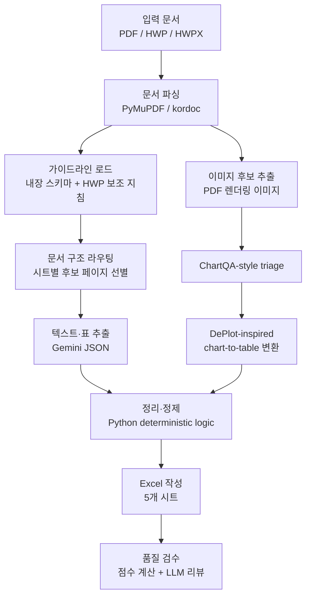

# LLM 기반 지자체 탄소중립 계획 정보 추출 시스템

지자체 탄소중립·녹색성장 기본계획 문서에서 온실가스 배출량, 에너지 사용량, 감축전략, 요약 정보를 추출해 환경부 양식에 가까운 Excel 파일로 정리하는 Python 프로젝트입니다.

PDF를 주 입력으로 지원하며, HWP/HWPX 문서는 `kordoc`를 통해 텍스트와 표를 읽어 기존 파이프라인에 연결합니다.

## 주요 기능

- PDF, HWP, HWPX 입력 지원
- 환경부 가이드라인 HWP를 보조 지침으로 반영
- 문서 구조 라우팅으로 시트별 관련 페이지 선별
- Gemini JSON 모드 기반 구조화 추출
- ChartQA-style 이미지 triage로 그래프·표 후보 선별
- DePlot-inspired chart-to-table 변환으로 그래프 수치 보완
- 부문명 정규화, 중복 제거, 단위 스케일 보정, 이상치 처리
- 5개 시트 Excel 자동 생성

## 처리 흐름



## 프로젝트 구조

```text
졸업프로젝트/
├─ main.py                    # CLI 진입점
├─ config.py                  # 모델, 배치, 라우팅, 이미지 분석 설정
├─ requirements.txt           # Python 의존성
├─ package.json               # kordoc(Node.js) 의존성
├─ install.bat                # Windows 설치 보조 스크립트
├─ agents/
│  ├─ guideline_agent.py      # 환경부 가이드라인/스키마 관리
│  ├─ extractor_agent.py      # 텍스트·표 추출
│  ├─ image_agent.py          # 이미지 triage 및 그래프 표 변환
│  ├─ organizer_agent.py      # 정제·정규화·이상치 처리
│  ├─ excel_agent.py          # Excel 작성 에이전트
│  └─ supervisor.py           # 전체 파이프라인 조율
└─ utils/
   ├─ llm_client.py           # Gemini 호출, JSON 파싱, 재시도
   ├─ pdf_reader.py           # PDF 파싱
   ├─ hwp_reader.py           # HWP/HWPX 파싱(kordoc)
   └─ excel_writer.py         # openpyxl 기반 Excel 생성
```

## 설치

### 1. Python 패키지

Python 3.10 이상을 권장합니다.

```powershell
py -m pip install -r requirements.txt
```

또는 Windows에서:

```powershell
.\install.bat
```

### 2. HWP/HWPX 지원용 Node 패키지

PDF만 사용할 경우 필수는 아니지만, HWP/HWPX 입력 또는 가이드라인 HWP를 쓰려면 Node.js 18 이상과 `kordoc`가 필요합니다.

```powershell
npm install
```

프로젝트는 가능한 경우 전역 `npx`보다 로컬 `node_modules/.bin/kordoc.cmd`를 우선 사용합니다.

### 3. Gemini API 키

프로젝트 루트에 `.env` 파일을 만들고 API 키를 입력합니다.

```text
GEMINI_API_KEY=AIzaSy...
```

또는 실행 시 `--api-key` 옵션으로 넘길 수 있습니다.

## 실행

### 기본 실행

```powershell
py main.py "서울특별시_탄소중립계획.pdf"
```

### 출력 파일명 지정

```powershell
py main.py "서울특별시_탄소중립계획.pdf" -o "서울_결과.xlsx"
```

### 환경부 가이드라인 HWP 반영

```powershell
py main.py "서울특별시_탄소중립계획.pdf" `
  --guideline "가이드라인.hwp" `
  -o "서울_결과.xlsx"
```

### 이미지 분석 제외

이미지 Vision 호출이 느리거나 비용을 줄이고 싶을 때 사용합니다.

```powershell
py main.py "서울특별시_탄소중립계획.pdf" --no-images
```

### 주요 옵션

| 옵션 | 설명 |
|---|---|
| `input_path` | 입력 문서 경로. PDF, HWP, HWPX 지원 |
| `-o`, `--output` | 출력 Excel 파일 경로 |
| `-g`, `--guideline` | 환경부 가이드라인 HWP/HWPX 경로 |
| `-k`, `--api-key` | Gemini API 키 |
| `-r`, `--retries` | 품질 미달 시 파이프라인 재시도 횟수 |
| `-v`, `--verbose` | 상세 로그 출력 |
| `--no-images` | 이미지·그래프 분석 생략 |

## 출력 Excel

생성 파일은 다음 5개 시트로 구성됩니다.

| 시트 | 내용 |
|---|---|
| `용도별 자동차(현황)` | 용도·차종별 차량 대수와 1일 평균 주행거리 |
| `용도별 에너지(현황)` | 용도별 에너지원 소비량 |
| `온실가스(현황전망목표)` | 배출유형, 종류, 부문별 연도별 온실가스 값 |
| `감축전략(계획실적)` | 감축사업별 계획·실적·예산·감축량 |
| `지자체별 요약카드` | 배출유형, 감축목표, 핵심전략, 연결성 요약 |

## 현재 주요 설정

`config.py`에서 실행 시간과 정확도 균형을 조정할 수 있습니다.

```python
MODEL = "gemini-2.5-flash-lite"
MAX_TOKENS = 65536

BATCH_SIZE = 15

DOCUMENT_ROUTE_CONTEXT_PAGES = 1
DOCUMENT_ROUTE_MIN_SCORE = 3
DOCUMENT_ROUTE_MAX_PAGES = {
    "vehicle": 80,
    "energy": 120,
    "ghg": 220,
    "strategy": 240,
    "summary": 60,
}

MAX_IMAGES = 50
IMAGE_TRIAGE_ENABLED = True
IMAGE_TRIAGE_MIN_SCORE = 5
IMAGE_TRIAGE_KEEP_RENDERED_CONTEXT = True
IMAGE_CHART_TABLE_EXTRACTION = True
```

권장값:

- 테스트 중: `MAX_IMAGES = 30~50`
- 최종 산출용: `MAX_IMAGES = 100~150`
- JSON 파싱 실패가 잦을 때: `BATCH_SIZE = 10~15`
- API 호출 수를 줄이고 싶을 때: `BATCH_SIZE = 20~30`, 단 긴 JSON 실패 가능성 증가

## 동작 방식

### 문서 파싱

PDF는 PyMuPDF로 텍스트, 표, 이미지 후보를 추출합니다. HWP/HWPX는 `kordoc`를 subprocess로 호출해 Markdown/JSON 결과를 읽고, 기존 `PDFContent` 구조로 변환합니다.

### 가이드라인 반영

가이드라인 HWP가 제공되면 `GuidelineAgent`가 본문을 시트별 키워드로 검색해 관련 지침 조각을 추출 프롬프트에 추가합니다. 파싱에 실패하거나 관련 지침이 없으면 내장 스키마만 사용합니다.

### 텍스트 추출

전체 문서를 그대로 LLM에 넣지 않고, 시트별로 관련성이 높은 후보 페이지를 먼저 고릅니다. 이후 후보 페이지를 `BATCH_SIZE` 단위로 묶어 Gemini JSON 모드로 호출합니다.

라우팅 로그의 후보 페이지 수와 최종 추출 행 수는 다른 값입니다.

```text
문서 구조 라우팅 완료(시트별 후보 페이지 수): {'ghg': 180, ...}
완료. 누적: {'ghg': 75, ...}
```

첫 번째는 LLM에 보낼 후보 페이지 수이고, 두 번째는 실제 추출된 JSON 행 수입니다.

### 이미지 분석

이미지가 많은 PDF에서는 모든 이미지를 Vision API에 보내지 않습니다.

1. 로컬 triage로 차트·표 가능성이 높은 이미지 선별
2. 상위 `MAX_IMAGES`개만 Gemini Vision 호출
3. 그래프는 `chart_table` 형태로 변환
4. 변환된 표를 GHG 데이터 보조 근거로 병합

Gemini Vision에서 `503 UNAVAILABLE`이 발생하면 서버 수요 증가로 인한 일시 지연일 수 있으며, 자동 재시도합니다.

### 정리·정제

정제 단계는 가능한 한 LLM이 아니라 Python 규칙으로 처리합니다.

- 부문명 표준화
- 용도/차종명 정규화
- 중복 행 병합
- 비정상 주행거리 제거
- 에너지 합산행 제거
- GHG 이상치 제거
- `25432000 → 25432` 같은 천 단위 스케일 보정
- 요약카드 5개 항목 정리

## 자주 발생하는 로그

### `관련 지침 0개 반영`

가이드라인 파일은 읽었지만 시트별 키워드로 선택된 보조 지침이 없다는 뜻입니다. 최근 버전에서는 kordoc의 `markdown`, `text`, `table.cells` 구조를 모두 읽도록 보완했습니다.

### `JSON 파싱 실패`

Gemini 응답이 길거나 중간에 잘려 JSON 구조가 깨진 경우입니다. `BATCH_SIZE`를 낮추면 완화됩니다.

### `Vision 오류: 503 UNAVAILABLE`

Gemini Vision API 수요가 높아 일시적으로 재시도하는 상황입니다. 코드 오류라기보다 외부 API 혼잡에 가깝습니다.

### `MuPDF error: syntax error`

일부 PDF 내부 객체 형식이 엄격하지 않아 PyMuPDF가 경고를 출력하는 경우입니다. 텍스트/페이지 파싱이 완료된다면 대체로 치명적 문제는 아닙니다.

## 한계

- LLM 기반 추출이므로 원문 표 구조가 복잡하면 오추출이 발생할 수 있습니다.
- 스캔본 PDF처럼 텍스트 레이어가 약한 문서는 정확도가 낮습니다.
- HWP 입력은 현재 텍스트·표 중심이며 이미지 추출은 지원하지 않습니다.
- 지도형 시각화는 일반 그래프보다 수치 추출 신뢰도가 낮습니다.
- API 속도와 비용은 Gemini 서버 상태, 이미지 분석 개수, 배치 크기에 영향을 받습니다.

## 개발 환경

| 항목 | 내용 |
|---|---|
| 언어 | Python 3.10+ |
| LLM | Google Gemini API (`google-genai`) |
| PDF | PyMuPDF |
| HWP/HWPX | kordoc(Node.js) |
| Excel | openpyxl |
| 이미지 처리 | Pillow |
