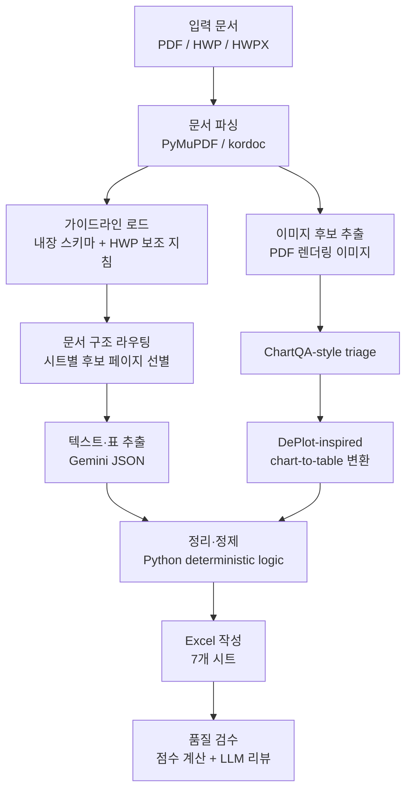

# LLM 기반 지자체 탄소중립 계획 정보 추출 시스템

지자체 탄소중립·녹색성장 기본계획 문서에서 온실가스 배출량, 에너지 사용량, 감축전략, 요약 정보를 추출해 환경부 양식에 가까운 Excel 파일로 정리하는 Python 프로젝트입니다.

PDF를 주 입력으로 지원하며, HWP/HWPX 문서는 `kordoc`를 통해 텍스트와 표를 읽어 기존 파이프라인에 연결합니다.

## 2026년 5월 15일 업데이트

기존 파이프라인 구조는 유지하되, 추출 결과의 신뢰도와 정확성을 높이기 위해 다음 개선을 추가했습니다.

- **문서 구조 라우팅 강화**: 전체 문서를 고정 배치로만 나누지 않고, 자동차·에너지·온실가스·감축전략·요약카드별 관련 페이지를 먼저 선별한 뒤 추출합니다.
- **HWP/HWPX 입력 보강**: `kordoc` 기반 HWP/HWPX 파서를 연결해 PDF 외 문서도 기존 파이프라인에 투입할 수 있게 했습니다.
- **자동차·에너지 집중 보완**: 보고서마다 위치가 다른 자동차 등록대수, 주행거리, 최종에너지, 에너지원별 소비량 구간을 전체 문서에서 다시 점수화해 집중 재추출합니다.
- **Gap-Fill 보완 단계 추가**: 1차 정제 후 자동차, 에너지, GHG, 감축전략의 빈칸이 큰 행만 좁은 문맥으로 다시 조회해 누락값을 보완합니다.
- **감축전략 정성사업 분리**: 연도별 수치가 없는 정성사업은 삭제하지 않고 `감축전략(정성사업)` 시트로 분리해 보관합니다.
- **이미지·그래프 판독 시트 추가**: ChartQA-style triage와 DePlot-inspired chart-to-table 변환 결과를 `이미지·그래프 판독결과` 시트에 남기고, 신뢰도와 반영 여부를 함께 기록합니다.
- **참고자료 이미지 사전 필터링**: `우리나라 NDC`, `주요국`, `세계도시`, `COP`, `IPCC`, `동향`, `목차` 등 지자체 직접 데이터가 아닌 이미지는 Vision 호출 전에 최대한 제외합니다.
- **그래프 자동 반영 기준 강화**: 연도·값이 명확한 표 기반 행만 본 데이터에 자동 병합하고, 막대·선 그래프 추정값이나 연도 없는 값은 검토 후보로만 남깁니다.
- **정제 로직 확대**: 부문명, 자동차 용도·차종, 에너지 합산행, 중복 행, 천 단위 스케일 오류, 이상치, JSON 파싱 실패 대응을 보강했습니다.

## 주요 기능

- PDF, HWP, HWPX 입력 지원
- 환경부 가이드라인 HWP를 보조 지침으로 반영
- 문서 구조 라우팅으로 시트별 관련 페이지 선별
- Gemini JSON 모드 기반 구조화 추출
- ChartQA-style 이미지 triage로 그래프·표 후보 선별
- DePlot-inspired chart-to-table 변환으로 그래프 수치 보완
- 1차 결과의 빈칸을 탐지해 관련 원문만 재조회하는 Gap-Fill 보완
- 부문명 정규화, 중복 제거, 단위 스케일 보정, 이상치 처리
- 7개 시트 Excel 자동 생성

## 처리 흐름



## 프로젝트 구조

```text
졸업프로젝트/
├─ main.py                    # CLI 진입점
├─ config.py                  # 모델, 배치, 라우팅, 이미지 분석 설정
├─ requirements.txt           # Python 의존성
├─ package.json               # kordoc(Node.js) 의존성
├─ install.bat                # Windows 설치 보조 스크립트
├─ agents/
│  ├─ guideline_agent.py      # 환경부 가이드라인/스키마 관리
│  ├─ extractor_agent.py      # 텍스트·표 추출
│  ├─ image_agent.py          # 이미지 triage 및 그래프 표 변환
│  ├─ organizer_agent.py      # 정제·정규화·이상치 처리
│  ├─ excel_agent.py          # Excel 작성 에이전트
│  └─ supervisor.py           # 전체 파이프라인 조율
└─ utils/
   ├─ llm_client.py           # Gemini 호출, JSON 파싱, 재시도
   ├─ pdf_reader.py           # PDF 파싱
   ├─ hwp_reader.py           # HWP/HWPX 파싱(kordoc)
   └─ excel_writer.py         # openpyxl 기반 Excel 생성
```

## 설치

### 1. Python 패키지

Python 3.10 이상을 권장합니다.

```powershell
py -m pip install -r requirements.txt
```

`py -m ...` 실행 시 `No installed Python found!`가 나오면 Python 런타임이 설치되어 있지 않거나 Windows Python Launcher가 실제 Python을 찾지 못하는 상태입니다. 이 경우 [python.org](https://www.python.org/downloads/windows/)에서 Python 3.11 이상을 설치하고, 설치 화면에서 `Add python.exe to PATH`를 체크한 뒤 새 PowerShell을 열어 아래 명령으로 확인합니다.

```powershell
py -0p
py --version
```

또는 Windows에서:

```powershell
.\install.bat
```

### 2. HWP/HWPX 지원용 Node 패키지

PDF만 사용할 경우 필수는 아니지만, HWP/HWPX 입력 또는 가이드라인 HWP를 쓰려면 Node.js 18 이상과 `kordoc`가 필요합니다.

```powershell
npm install
```

프로젝트는 가능한 경우 전역 `npx`보다 로컬 `node_modules/.bin/kordoc.cmd`를 우선 사용합니다.

### 3. Gemini API 키

프로젝트 루트에 `.env` 파일을 만들고 API 키를 입력합니다.

```text
GEMINI_API_KEY=AIzaSy...
```

또는 실행 시 `--api-key` 옵션으로 넘길 수 있습니다.

## 실행

### 기본 실행

```powershell
py main.py "서울특별시_탄소중립계획.pdf"
```

### 출력 파일명 지정

```powershell
py main.py "서울특별시_탄소중립계획.pdf" -o "서울_결과.xlsx"
```

### 환경부 가이드라인 HWP 반영

```powershell
py main.py "서울특별시_탄소중립계획.pdf" `
  --guideline "가이드라인.hwp" `
  -o "서울_결과.xlsx"
```

### 이미지 분석 제외

이미지 Vision 호출이 느리거나 비용을 줄이고 싶을 때 사용합니다.

```powershell
py main.py "서울특별시_탄소중립계획.pdf" --no-images
```

### 주요 옵션

| 옵션 | 설명 |
|---|---|
| `input_path` | 입력 문서 경로. PDF, HWP, HWPX 지원 |
| `-o`, `--output` | 출력 Excel 파일 경로 |
| `-g`, `--guideline` | 환경부 가이드라인 HWP/HWPX 경로 |
| `-k`, `--api-key` | Gemini API 키 |
| `-r`, `--retries` | 품질 미달 시 파이프라인 재시도 횟수 |
| `-v`, `--verbose` | 상세 로그 출력 |
| `--no-images` | 이미지·그래프 분석 생략 |

## 출력 Excel

생성 파일은 다음 7개 시트로 구성됩니다.

| 시트 | 내용 |
|---|---|
| `용도별 자동차(현황)` | 용도·차종별 차량 대수와 1일 평균 주행거리 |
| `용도별 에너지(현황)` | 용도별 에너지원 소비량 |
| `온실가스(현황전망목표)` | 배출유형, 종류, 부문별 연도별 온실가스 값 |
| `감축전략(계획실적)` | 감축사업별 계획·실적·예산·감축량 |
| `감축전략(정성사업)` | 연도별 수치가 없거나 정성사업으로 판단된 감축전략 |
| `이미지·그래프 판독결과` | 막대·선 그래프 등 이미지 판독값, 신뢰도, 반영 여부 |
| `지자체별 요약카드` | 배출유형, 감축목표, 핵심전략, 연결성 요약 |

## 현재 주요 설정

`config.py`에서 실행 시간과 정확도 균형을 조정할 수 있습니다.

```python
MODEL = "gemini-2.5-flash-lite"
MAX_TOKENS = 65536

BATCH_SIZE = 15

DOCUMENT_ROUTE_CONTEXT_PAGES = 1
DOCUMENT_ROUTE_MIN_SCORE = 3
DOCUMENT_ROUTE_MAX_PAGES = {
    "vehicle": 80,
    "energy": 120,
    "ghg": 220,
    "strategy": 240,
    "summary": 60,
}

MAX_IMAGES = 50
IMAGE_TRIAGE_ENABLED = True
IMAGE_TRIAGE_MIN_SCORE = 5
IMAGE_TRIAGE_KEEP_RENDERED_CONTEXT = True
IMAGE_CHART_TABLE_EXTRACTION = True
IMAGE_CHART_MERGE_MIN_CONFIDENCE = "medium"

GAP_FILL_ENABLED = True
GAP_FILL_TARGET_BATCH_SIZE = 10

FOCUSED_GAP_FILL_ENABLED = True
FOCUSED_GAP_FILL_MAX_ANCHORS = {
    "vehicle": 10,
    "energy": 10,
}
```

권장값:

- 테스트 중: `MAX_IMAGES = 30~50`
- 최종 산출용: `MAX_IMAGES = 100~150`
- JSON 파싱 실패가 잦을 때: `BATCH_SIZE = 10~15`
- API 호출 수를 줄이고 싶을 때: `BATCH_SIZE = 20~30`, 단 긴 JSON 실패 가능성 증가

## 동작 방식

### 문서 파싱

PDF는 PyMuPDF로 텍스트, 표, 이미지 후보를 추출합니다. HWP/HWPX는 `kordoc`를 subprocess로 호출해 Markdown/JSON 결과를 읽고, 기존 `PDFContent` 구조로 변환합니다.

### 가이드라인 반영

가이드라인 HWP가 제공되면 `GuidelineAgent`가 본문을 시트별 키워드로 검색해 관련 지침 조각을 추출 프롬프트에 추가합니다. 파싱에 실패하거나 관련 지침이 없으면 내장 스키마만 사용합니다.

### 텍스트 추출

전체 문서를 그대로 LLM에 넣지 않고, 시트별로 관련성이 높은 후보 페이지를 먼저 고릅니다. 이후 후보 페이지를 `BATCH_SIZE` 단위로 묶어 Gemini JSON 모드로 호출합니다.

라우팅 로그의 후보 페이지 수와 최종 추출 행 수는 다른 값입니다.

```text
문서 구조 라우팅 완료(시트별 후보 페이지 수): {'ghg': 180, ...}
완료. 누적: {'ghg': 75, ...}
```

첫 번째는 LLM에 보낼 후보 페이지 수이고, 두 번째는 실제 추출된 JSON 행 수입니다.

### 이미지 분석

이미지가 많은 PDF에서는 모든 이미지를 Vision API에 보내지 않습니다.

1. 로컬 triage로 차트·표 가능성이 높은 이미지 선별
2. `우리나라 NDC`, `주요국`, `세계도시`, `COP`, `IPCC`, `동향`, `목차` 등 지자체 직접 데이터가 아닌 참고자료성 페이지 제외
3. 남은 후보 중 상위 `MAX_IMAGES`개만 Gemini Vision 호출
4. 그래프는 `chart_table` 형태로 변환
5. 변환된 표를 `이미지·그래프 판독결과` 시트에 기록
6. 중복 행을 제거하고 연도 범위, 참고자료 여부, 값 존재 여부를 재검증
7. 연도와 값이 명확한 표 기반 고신뢰 행만 본 데이터에 병합하고, 막대·선 그래프 추정값은 검토 후보로 보관

Gemini Vision에서 `503 UNAVAILABLE`이 발생하면 서버 수요 증가로 인한 일시 지연일 수 있으며, 자동 재시도합니다.

### 정리·정제

정제 단계는 가능한 한 LLM이 아니라 Python 규칙으로 처리합니다.

- 부문명 표준화
- 용도/차종명 정규화
- 중복 행 병합
- 비정상 주행거리 제거
- 에너지 합산행 제거
- GHG 이상치 제거
- `25432000 → 25432` 같은 천 단위 스케일 보정
- 요약카드 5개 항목 정리

### 빈칸 보완

1차 정제 후 자동차 대수/주행거리, 에너지 소비량, GHG 연도값, 감축전략 연도값이 크게 비어 있는 행을 찾습니다. 보완 대상 행과 관련 원문 페이지만 다시 Gemini에 보내 후보 값을 추가한 뒤, Organizer를 한 번 더 통과시켜 기존 중복 병합 로직으로 합칩니다.

자동차와 에너지는 보고서마다 위치가 다르므로 특정 페이지 번호에 의존하지 않습니다. `자동차 등록대수`, `연료별 자동차`, `주행거리`, `최종에너지`, `에너지원별 소비량`, `부문별 최종에너지` 같은 키워드로 전체 문서를 다시 점수화하고, 점수가 높은 구간만 집중 재분석합니다. 원문이 용도별 교차표가 아니라 연료별 총량만 제공하면 `용도=전체`로 기록해 잘못된 용도에 억지 배정하지 않습니다.

감축전략에서 연도값을 끝내 찾지 못한 행은 기존 `감축전략(계획실적)` 시트에서 제외하고 `감축전략(정성사업)` 시트로 분리합니다. 별도 상태 문구를 셀에 반복해서 적지 않고, 원문에서 확인된 성과지표만 유지합니다. 이 작업은 이미 추출된 행을 나누는 후처리이므로 API 호출 수에는 영향을 주지 않습니다.

## 자주 발생하는 로그

### `관련 지침 0개 반영`

가이드라인 파일은 읽었지만 시트별 키워드로 선택된 보조 지침이 없다는 뜻입니다. 최근 버전에서는 kordoc의 `markdown`, `text`, `table.cells` 구조를 모두 읽도록 보완했습니다.

### `JSON 파싱 실패`

Gemini 응답이 길거나 중간에 잘려 JSON 구조가 깨진 경우입니다. `BATCH_SIZE`를 낮추면 완화됩니다.

### `Vision 오류: 503 UNAVAILABLE`

Gemini Vision API 수요가 높아 일시적으로 재시도하는 상황입니다. 코드 오류라기보다 외부 API 혼잡에 가깝습니다.

### `MuPDF error: syntax error`

일부 PDF 내부 객체 형식이 엄격하지 않아 PyMuPDF가 경고를 출력하는 경우입니다. 텍스트/페이지 파싱이 완료된다면 대체로 치명적 문제는 아닙니다.

## 한계

- LLM 기반 추출이므로 원문 표 구조가 복잡하면 오추출이 발생할 수 있습니다.
- 스캔본 PDF처럼 텍스트 레이어가 약한 문서는 정확도가 낮습니다.
- HWP 입력은 현재 텍스트·표 중심이며 이미지 추출은 지원하지 않습니다.
- 지도형 시각화는 일반 그래프보다 수치 추출 신뢰도가 낮습니다.
- API 속도와 비용은 Gemini 서버 상태, 이미지 분석 개수, 배치 크기에 영향을 받습니다.

## 개발 환경

| 항목 | 내용 |
|---|---|
| 언어 | Python 3.10+ |
| LLM | Google Gemini API (`google-genai`) |
| PDF | PyMuPDF |
| HWP/HWPX | kordoc(Node.js) |
| Excel | openpyxl |
| 이미지 처리 | Pillow |

## 참고 공식 자료

본 저장소에는 원본 PDF/HWP 문서를 포함하지 않습니다. 실행에 필요한 공식 문서는 아래 배포처에서 다운로드한 뒤 프로젝트 폴더 또는 `data/input/` 폴더에 배치해 사용합니다.

- [환경부 지자체 탄소중립 녹색성장 기본계획 수립 및 추진상황 점검 가이드라인](https://www.mcee.go.kr/home/web/policy_data/read.do;jsessionid=Wc8kwUtnO74561ZFhSVcB7urgRSeGGMaGty2K9aI.mehome1?pagerOffset=260&maxPageItems=10&maxIndexPages=10&searchKey=&searchValue=&menuId=10260&orgCd=&condition.toInpYmd=null&condition.fromInpYmd=null&condition.orderSeqId=7408&condition.rnSeq=317&condition.deleteYn=N&condition.deptNm=null&seq=8324)
- [지자체별 탄소중립 녹색성장 기본계획 보고서](https://gihoo.or.kr/localGovMeasures.es?mid=a30215000000&bid=0012)