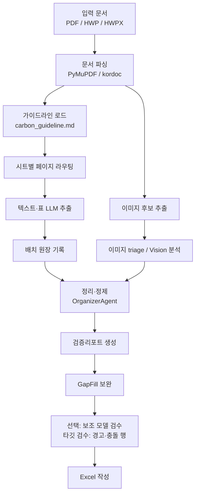

# 가이드라인 기반 지자체 탄소중립 계획 정보 추출 시스템

환경부 「지자체 탄소중립 녹색성장 기본계획 수립 및 추진상황 점검 가이드라인」(`carbon_guideline.md`)을 기준으로 지자체 탄소중립 계획서에서 구조화 데이터를 추출해 Excel로 정리하는 파이프라인입니다.

이 프로젝트의 핵심 목표는 단순히 많이 뽑는 것이 아니라, **조용한 데이터 유실을 막고 사람이 검증할 수 있는 근거를 남기는 것**입니다. v4/v4.1이 안정성(부분 실패 허용, 배치 원장, quota 복구, 출처페이지)을 확보했다면, v5는 가이드라인 구조적 주입과 참조 사전으로 추출 충실도를 높이고, 행 단위 데이터상태·타깃 검수로 사람이 재확인할 지점을 파이프라인이 직접 지목하게 했습니다.

## 현재 구현 요약

- 입력: PDF, HWP, HWPX
- 출력: `00_문서메타`부터 `16_시각자료목록`까지 17개 기본 시트 + `90_코드북`
- 선택 출력: `17_보조검수후보`, `18_보조병합로그`, `19_검증리포트`
- 데이터 시트에는 행 단위 `출처페이지`·`데이터상태` 컬럼이 붙어 원문 대조와 우선 검토가 가능
- 기본 LLM 백엔드: Gemini API (단계별로 `STAGE_PROVIDER_*` 분리 가능)
- 선택 백엔드: OpenAI API, Codex CLI, Claude Code CLI
- 기본 정책: 정확도와 검증 가능성을 우선하고, 위험한 최적화는 opt-in으로만 사용

## v5에서 달라진 핵심 (2026-07-05)

v5의 방향은 두 가지입니다. **가이드라인을 형식적으로가 아니라 구조적으로 소비하는 것**, 그리고 **사람이 재확인해야 할 행을 파이프라인이 스스로 지목하게 만드는 것**입니다. v4/v4.1의 상세 내용은 문서 맨 아래 업데이트 기록 토글에 보존되어 있습니다.

### 1. 구조적 가이드라인 주입 (기본 활성)

기존에는 `carbon_guideline.md`를 키워드 스니펫 최대 3개로만 프롬프트에 붙였고, 이 과정에서 표 구조가 뭉개졌습니다. 이제 md에 심어둔 시트 앵커(`<!-- sheets: ... -->`)를 기계 파싱해 시트별 관련 섹션·컬럼 정의 표·매핑 규칙을 **표 개행을 보존한 채** 프롬프트에 주입합니다. md를 고치면 파이프라인에 바로 반영됩니다.

- 시트당 상한 `GUIDELINE_PROMPT_MAX_CHARS`(기본 3000자)에서 섹션 경계로만 자르며, 표를 중간에서 절단하지 않습니다.
- `GUIDELINE_STRUCTURED_INJECTION=0`으로 기존 스니펫 방식과 A/B 비교할 수 있습니다(`scripts/run_ab_validation.py`).
- v6 이전 레거시 스키마와 미사용 코드를 제거했습니다. HWP 가이드라인 입력(`--guideline`)은 스니펫 방식으로 계속 동작합니다.

### 2. 단계별 백엔드 오버라이드

대량 추출, 정밀 차트 판독, 의심 행 재검수는 요구 특성이 다른데 기존에는 전부 같은 백엔드로 돌았습니다. `STAGE_PROVIDER_EXTRACTION / VISION / GAP_FILL / REVIEW`(모델은 `STAGE_MODEL_*`)로 단계별 백엔드를 분리할 수 있습니다. 미설정 시 전역 `LLM_PROVIDER`를 그대로 따르므로 기존 동작은 완전히 불변이고, LLM 캐시 키도 단계별 모델을 정확히 반영합니다.

### 3. 타깃 보조검수 — 전량 재검수에서 문제 행만으로

`--hybrid-review`의 기본 모드가 타깃 검수로 바뀌었습니다. 검수 대상은 결정론적으로 좁혀집니다.

1. 검증리포트 "경고"가 가리키는 행 — organizer가 이슈에 시트·행 번호를 내부 필드로 직결해 두므로 텍스트 파싱 없이 정확한 행이 선정됩니다.
2. `데이터상태 = conflicting` 행.
3. (선택) 원장 호출/파싱 실패 배치 페이지에서 나온 행 — `HYBRID_REVIEW_INCLUDE_FAILED_PAGES=1`.

각 대상 행은 원문 발췌(출처페이지 ±1페이지)와 함께 검수 백엔드로 보내 유지/수정안/판단불가 판정을 받습니다. 자동 병합은 하지 않고 `17_보조검수후보`/`18_보조병합로그`에만 기록합니다. 병합로그 `반영` 행이 최종 시트에 반드시 존재하도록 dedup 키 단일화와 반영 불변식도 이번에 정비했습니다.

### 4. 부록 참조 사전과 90_코드북

가이드라인 부록4 사업목록 507개와 부록3 감축원단위 114개를 CSV로 정형화해(`data/`, 생성 스크립트 `scripts/build_reference_data.py`) organizer가 결정론적으로 사용합니다.

- `08_감축사업목록` 사업명을 부록4와 매칭해 표준사업연번·매칭신뢰도(high/medium/low)를 내부 기록합니다. 부문이 비어 있으면 채우고, 다르면 덮어쓰지 않고 검증리포트에 남깁니다.
- `10_정량감축량`의 감축원단위ID가 비어 있으면 부록3 매칭으로 채우고, 기존 값과 5% 넘게 다르면 리포트합니다.
- 실행에 쓰인 코드북(달성여부·사업유형·전망방법·표준부문·데이터상태)을 `90_코드북` 시트로 출력합니다. `CODEBOOK_SHEET_ENABLED=0`으로 제외할 수 있습니다.

### 5. 행 단위 데이터상태 컬럼

16개 데이터 시트 맨 뒤에 `데이터상태` 컬럼이 붙어, 사람이 어떤 행부터 재확인해야 하는지 한 컬럼으로 드러납니다.

| 값 | 의미 |
|---|---|
| `reported` | 원문에서 그대로 보고된 행(기본) |
| `visual_only` | 이미지·그래프 판독에서 유래한 행 |
| `gap_fill` | 빈칸 보완 재추출에서 유래한 행 |
| `calculated` | organizer가 값을 재계산·교정한 행(감축률 등) |
| `conflicting` | 중복 제거에서 값 충돌이 있었던 행 |

중복 병합 시에는 더 주의가 필요한 상태가 살아남습니다(`conflicting` > `calculated` > `visual_only` > `gap_fill` > `reported`). `DATA_STATUS_ENABLED=0`으로 컬럼을 제외할 수 있습니다.

### 6. 장 문맥 프로비넌스 — 기존계획과 본계획의 분리

지자체 계획서의 "기존 계획 평가" 장은 본계획과 **같은 형식의 관리번호로 다른 사업**을 싣습니다(서울 실측: p149의 M1-2와 p253의 M1-2가 서로 다른 사업). 이 장의 페이지 구간을 결정론 휴리스틱으로 탐지해 08/09/10/11 행을 내부 태깅(`계획구분출처`)하고, 관리번호-사업명 충돌은 검증리포트 경고로 남겨 타깃 검수(3번)로 이어집니다. 행을 자동 이동·삭제하지 않으며, 탐지 0건 문서에서는 완전한 no-op입니다.

### 7. 시트 폐루프 실행 경로 (opt-in)

`--sheet-closed-loop`를 켜면 시트마다 `추출 → 정제 → 보조검수·판정`을 닫고 다음 시트로 넘어갑니다(시트는 순차, 시트 내 배치는 병렬). quota나 장애로 실행이 끊겨도 완료된 시트는 검수까지 끝난 완결 상태로 보존되고, 판정 상한은 시트 경계를 넘어 전역으로 관리됩니다.

알려진 한계: 이미지 분석과 GapFill 보완은 폐루프 이후 실행되므로 보조검수가 본 기준본과 최종본이 다를 수 있습니다. 최종 `OrganizerAgent` 검증 패스가 최종본 기준으로 정합성을 다시 점검하지만, 폐루프 후보·병합 로그를 해석할 때는 이 시점 차이를 감안해야 합니다.

### 8. organizer 정밀 보정

서울 실측 검수에서 확인된 계통 오류들을 고쳤습니다.

- 관리권한 시트에서 에너지원 표기("전력"·"열"·"에너지")가 "전환" 부문으로 오분류되던 것을 차단 — 원값을 유지하고 직간접구분을 보정한 뒤 리포트합니다.
- `06_감축목표` 중복 제거 키에 목표범위를 포함해, GIR 기준 행과 자체 인벤토리 기준 행이 하나로 합쳐져 소실되던 문제를 해소했습니다.
- `00_문서메타`를 지자체당 1행으로 병합합니다(비어 있지 않은 값 우선, 목표연도는 합집합, 상충 시 리포트).
- 전망방법 코드북에 ENPEP·MARKAL-MACRO를 추가하고 긴 키워드 우선 매칭으로 오분류를 막았습니다.

> v5 전체 구현은 명세 대조 검수(작업 패키지별 병렬 검수 + 8개 커밋 각각의 회귀 테스트)를 거쳤고, 검수에서 발견된 결함(내부 필드-엑셀 컬럼 충돌 등 치명 1건, 중요 10건)을 모두 수정한 상태입니다. 전체 테스트는 111개입니다.

## 무거운 기능은 기본으로 켜지지 않습니다

아래 기능은 품질 회귀 가능성이 있어 기본값이 꺼져 있습니다.

| 설정 | 기본값 | 의미 |
|---|---:|---|
| `EXTRACTION_SHEET_CLUSTERING` | `False` | 여러 시트를 한 번에 추출해 호출 수를 줄이는 opt-in 최적화 |
| `ROUTE_DROP_UBIQUITOUS_STRONG` | `False` | 문서 전반에 반복되는 strong 키워드까지 라우팅 점수에서 제외하는 실험적 최적화 |
| `HYBRID_REVIEW_ENABLED` | `False` | 기본 추출 후 보조 모델로 누락/충돌 후보를 검수하는 선택 기능 |
| `SHEET_CLOSED_LOOP_ENABLED` | `False` | 추출까지 시트 단위로 닫는 v5 폐루프 실행 경로 |

테스트 파일이 늘어난 것은 런타임을 무겁게 만들기 위해서가 아니라, 위 안정성 계약을 깨지 못하게 막기 위한 회귀 테스트입니다. 일반 실행 시 `tests/`는 실행되지 않습니다.

## 처리 흐름



## 출력 Excel 시트

### 기본 시트

| 시트 | 내용 |
|---|---|
| `00_문서메타` | 계획명, 지자체, 발간기관, 계획기간, 기준/목표연도 |
| `01_계획개요` | 수립 배경, 법적 근거, 추진체계, 추진경과 |
| `02_지역여건` | 자연·인문·경제·에너지 지표 |
| `03_배출현황_지역` | 지역 기준 온실가스 배출·흡수 현황 |
| `04_배출현황_관리권한` | 지자체 관리권한 인벤토리 |
| `05_배출전망` | BAU 및 시나리오별 배출 전망 |
| `06_감축목표` | 총괄·부문별 감축목표, 감축률 |
| `07_비전전략` | 비전문구, 추진전략, 세부전략 |
| `08_감축사업목록` | 감축사업, 관리번호, 성과지표 |
| `09_연차별이행계획` | 사업별 연도별 계획과 목표물량 |
| `10_정량감축량` | 활동량, 감축원단위, 예상감축량 |
| `11_재정투자계획` | 부문·사업·재원·연도별 예산 |
| `12_대응기반강화` | 적응, 교육, 녹색성장 등 대응 기반 과제 |
| `13_이행관리환류` | 점검체계, 담당조직, 절차, 산출물 |
| `14_점검실적` | 연도별 이행실적, 달성여부, 사업유형 |
| `15_변경과제_조치` | 변경사업, 미달성 사유, 조치계획 |
| `16_시각자료목록` | 이미지·그래프 판독 결과와 디지타이징 필요 여부 |

### 선택 시트

| 시트 | 생성 조건 | 내용 |
|---|---|---|
| `17_보조검수후보` | `--hybrid-review` | 보조 모델이 찾은 누락 후보, 값 충돌, 오염 의심 항목 |
| `18_보조병합로그` | `--hybrid-review` | 후보 판정, 원문 근거, 병합 여부와 차단 사유 |
| `19_검증리포트` | 검증 이슈 존재 | 원장 실패, 정합성 경고, 빈 시트 원인 등 |
| `90_코드북` | 기본 생성 (`CODEBOOK_SHEET_ENABLED=0`으로 제외) | 실행에 사용된 코드 체계(달성여부·사업유형·전망방법·표준부문·데이터상태) |

## 설치

Python 3.10 이상을 권장합니다.

```powershell
py -m pip install -r requirements.txt
npm install
```

macOS/Linux에서는 `py` 대신 `python3`를 사용합니다.

```bash
python3 -m pip install -r requirements.txt
python3 main.py "서울특별시_탄소중립계획.pdf" -o "서울_결과.xlsx"
```

PDF만 처리한다면 Node.js는 필수가 아닙니다. HWP/HWPX 입력이나 kordoc 기반 파싱을 사용하려면 Node.js 18 이상과 `npm install`이 필요합니다.

### API 키 설정

기본 백엔드는 Gemini입니다. `load_dotenv()`가 프로젝트 루트 `.env`를 읽으므로, 먼저 `.env.example`을 `.env`로 복사한 뒤 필요한 키만 채웁니다.

```env
GEMINI_API_KEY=
```

OpenAI 백엔드를 사용할 때는 다음 값을 설정합니다.

```env
LLM_PROVIDER=openai
OPENAI_API_KEY=
OPENAI_MODEL=gpt-5.4-mini
```

로컬 에이전트를 사용할 때는 Codex CLI 또는 Claude Code CLI가 설치·로그인되어 있어야 합니다.

```powershell
codex --version
claude --version
```

## 실행 방법

### 기본 실행

```powershell
py main.py "서울특별시_탄소중립계획.pdf" -o "서울_결과.xlsx"
```

### 백엔드 선택

```powershell
py main.py "서울특별시_탄소중립계획.pdf" --agent gemini -o "서울_결과.xlsx"
py main.py "서울특별시_탄소중립계획.pdf" --agent openai --agent-model gpt-5.4-mini -o "서울_결과.xlsx"
py main.py "서울특별시_탄소중립계획.pdf" --agent codex -o "서울_결과.xlsx"
py main.py "서울특별시_탄소중립계획.pdf" --agent claude -o "서울_결과.xlsx"
```

### 이미지 분석 제외

이미지 Vision 호출 비용이나 시간을 줄이고 싶을 때 사용합니다.

```powershell
py main.py "서울특별시_탄소중립계획.pdf" --no-images -o "서울_결과.xlsx"
```

### 전체 페이지 스캔

라우팅 누락이 의심될 때 사용합니다. 비용과 시간이 늘어납니다.

```powershell
py main.py "서울특별시_탄소중립계획.pdf" --full-scan -o "서울_결과.xlsx"
```

### 보조 모델 검수

기본 추출본을 만든 뒤 고위험 시트만 보조 모델로 다시 검수합니다. 기본값에서는 시트마다 `후보 탐색 → 묶음 판정 → 즉시 병합 로그 기록`을 끝내고 다음 시트로 넘어가므로, 장시간 실행 중에도 시트/배치별 진행 상황을 바로 볼 수 있습니다. 후보는 본 시트에 자동 병합하지 않고 `17_보조검수후보`, `18_보조병합로그`에 남깁니다.

```powershell
py main.py "서울특별시_탄소중립계획.pdf" --agent openai --agent-model gpt-5.4-mini --hybrid-review -o "서울_결과.xlsx"
```

자동 병합까지 테스트하려면 명시적으로 켭니다.

```powershell
py main.py "서울특별시_탄소중립계획.pdf" --agent openai --agent-model gpt-5.4-mini --hybrid-review --hybrid-auto-merge -o "서울_결과.xlsx"
```

기존처럼 전체 후보를 먼저 모은 뒤 단건 판정하려면 회귀 확인용으로 `--legacy-hybrid-flow`를 사용합니다. 하이브리드 검수·판정 백엔드는 `gemini` 외에 설치된 `codex`, `claude`, `auto`도 지정할 수 있습니다.

### 시트 폐루프 실행

추출까지 시트 단위로 닫는 v5 폐루프는 실험 경로라 기본값에서는 꺼져 있습니다. 시트별로 `추출 → 정제 → 보조검수·판정`을 완료한 뒤 다음 시트로 넘어가려면 명시적으로 켭니다.

```powershell
py main.py "서울특별시_탄소중립계획.pdf" --sheet-closed-loop --hybrid-review -o "서울_폐루프.xlsx"
```

## 주요 옵션

| 옵션 | 설명 |
|---|---|
| `input_path` | 입력 문서 경로. PDF, HWP, HWPX 지원 |
| `-o`, `--output` | 출력 Excel 파일 경로 |
| `-g`, `--guideline` | 환경부 가이드라인 HWP/HWPX 경로 |
| `--agent` | `gemini`, `openai`, `codex`, `claude`, `auto` 중 선택 |
| `--agent-model` | 선택 백엔드 모델명 |
| `--agent-timeout` | 로컬 에이전트 1회 호출 제한 시간(초) |
| `-k`, `--api-key` | API 백엔드 키 |
| `-r`, `--retries` | 품질 미달 시 전체 파이프라인 재시도 횟수 |
| `-v`, `--verbose` | 상세 로그 출력 |
| `--no-images` | 이미지·그래프 분석 생략 |
| `--max-images` | Vision 분석 이미지 수를 명시적으로 제한 |
| `--full-scan` | 시트 라우팅 대신 전체 페이지를 스캔 |
| `--hybrid-review` | 보조 모델 후보 검수 활성화 |
| `--sheet-closed-loop` | v5 시트별 추출→정제→검수 폐루프 활성화(기본 비활성) |
| `--hybrid-review-max-batches` | 보조 검수 시 시트당 최대 배치 수 |
| `--hybrid-adjudication-model` | 보조 후보 판정 모델 |
| `--hybrid-adjudication-max-candidates` | 판정 후보 최대 개수. `0`이면 전체 |
| `--hybrid-adjudication-batch-size` | 시트 단위 후보판정 묶음 크기 |
| `--legacy-hybrid-flow` | 기존 전체 후보 수집 후 판정 방식 사용 |
| `--no-hybrid-adjudication` | 후보 판정 생략 |
| `--hybrid-auto-merge` | 안전 조건을 통과한 후보를 본 시트에 자동 병합 |

## 중요한 설정

`config.py` 또는 환경변수로 조정합니다.

| 설정 | 기본값 | 설명 |
|---|---:|---|
| `LLM_PROVIDER` | `gemini` | 기본 LLM 백엔드 |
| `LOCAL_AGENT_TIMEOUT` | `300` | Codex/Claude 1회 호출 제한 시간 |
| `PARALLEL_PROCESSING_ENABLED` | `True` | 독립 배치 병렬 실행 |
| `TEXT_WORKERS` | `4` | 텍스트 추출 병렬 워커 수 |
| `LLM_CACHE_ENABLED` | `True` | 성공한 LLM 응답 캐시 |
| `LLM_CACHE_DIR` | `.cache/llm_responses` | 캐시 저장 위치 |
| `LLM_QUOTA_WAIT_ENABLED` | `True` | quota 발생 시 짧게 대기 후 재개 |
| `LLM_QUOTA_WAIT_POLL_SECONDS` | `120` | quota 회복 대기 기본 간격 |
| `LLM_QUOTA_WAIT_MAX_SECONDS` | `1800` | quota 누적 대기 상한 |
| `GAP_FILL_ENABLED` | `True` | 커버리지 낮은 시트 재추출 |
| `PROVENANCE_ENABLED` | `True` | 본문 시트에 `출처페이지` 컬럼 추가 |
| `MAX_IMAGES` | `None` | 기본은 triage 통과 이미지 전수 분석 |
| `HYBRID_REVIEW_ENABLED` | `False` | 보조 모델 검수 기본 비활성 |
| `SHEET_CLOSED_LOOP_ENABLED` | `False` | 시트별 추출→정제→검수 폐루프 기본 비활성 |
| `HYBRID_SHEETWISE_FLOW_ENABLED` | `True` | 시트 단위 후보 탐색·묶음 판정 흐름 |
| `HYBRID_PROGRESS_LOG_ENABLED` | `True` | 시트/배치별 하이브리드 진행 로그 출력 |
| `HYBRID_ADJUDICATION_BATCH_SIZE` | `6` | 후보판정 1회 호출에 묶을 후보 수 |
| `HYBRID_ADJUDICATION_CONTEXT_CHARS` | `8000` | 묶음 판정 후보당 원문 문맥 길이 |
| `HYBRID_AUTO_MERGE_ENABLED` | `False` | 보조 후보 자동 병합 기본 비활성 |
| `EXTRACTION_SHEET_CLUSTERING` | `False` | 시트 클러스터링 추출 opt-in |
| `ROUTE_DROP_UBIQUITOUS_STRONG` | `False` | strong 키워드 라우팅 샤프닝 opt-in |
| `GUIDELINE_STRUCTURED_INJECTION` | `True` | 가이드라인 구조적 주입. `0`이면 기존 스니펫 방식 |
| `GUIDELINE_PROMPT_MAX_CHARS` | `3000` | 시트당 가이드라인 주입 상한(섹션 경계 절단) |
| `STAGE_PROVIDER_*` / `STAGE_MODEL_*` | 빈 값 | 추출·비전·보완·검수 단계별 백엔드/모델 오버라이드 |
| `HYBRID_REVIEW_TARGETED` | `True` | 보조검수를 검증리포트 경고·충돌 행 타깃으로 한정 |
| `DATA_STATUS_ENABLED` | `True` | 데이터 시트에 `데이터상태` 컬럼 추가 |
| `CODEBOOK_SHEET_ENABLED` | `True` | `90_코드북` 시트 생성 |

## 프로젝트 구조

```text
2026_GovReport_Analyzer/
├─ main.py                    # CLI 진입점
├─ config.py                  # 백엔드, 배치, 라우팅, quota, 검수 설정
├─ carbon_guideline.md        # 환경부 가이드라인 기반 보조 지침
├─ data/
│  ├─ appendix3_reduction_units.csv  # 부록3 감축원단위 114건
│  └─ appendix4_projects.csv         # 부록4 표준 사업목록 507건
├─ agents/
│  ├─ guideline_agent.py      # 가이드라인/스키마 관리
│  ├─ guideline_parser.py     # 앵커 기반 구조적 주입 파서
│  ├─ extractor_agent.py      # 텍스트·표 추출, 배치 원장
│  ├─ image_agent.py          # 이미지 triage와 그래프 판독
│  ├─ organizer_agent.py      # 결정론적 정제·중복 제거·검증
│  ├─ gap_fill_agent.py       # 커버리지 기반 빈칸 보완
│  ├─ hybrid_review_agent.py  # 선택 보조 모델 검수
│  ├─ excel_agent.py          # Excel 작성
│  └─ supervisor.py           # 전체 파이프라인 조율
├─ utils/
│  ├─ llm_client.py           # LLM 호출, JSON 파싱, quota 대기, 재시도
│  ├─ llm_cache.py            # 성공 응답 캐시
│  ├─ parallel.py             # 순서 보존 병렬 실행/실패 수집
│  ├─ pdf_reader.py           # PDF 파싱
│  ├─ hwp_reader.py           # HWP/HWPX 파싱(kordoc)
│  ├─ reference_data.py       # 부록3·4 참조 사전 로드와 매칭
│  └─ excel_writer.py         # openpyxl 기반 Excel 생성
├─ scripts/
│  ├─ run_ab_validation.py    # A/B 검증 리포트 생성
│  ├─ build_reference_data.py # 부록 CSV 생성(1회, 경계 검증 내장)
│  └─ verify_routing_coverage.py
└─ tests/                     # 신뢰성·기능 계약 회귀 테스트
```

## 테스트

전체 테스트는 v4의 신뢰성 계약과 v5의 기능 계약을 함께 검증합니다.

```powershell
python -m pytest tests/ -q
```

주요 테스트 역할은 다음과 같습니다.

| 영역 | 테스트 파일 |
|---|---|
| LLM 호출, 캐시, JSON 재시도, quota 예외 | `tests/test_llm_client.py`, `tests/test_llm_json_retry_stats.py`, `tests/test_quota_resilience.py` |
| 병렬 실패 수집과 원장 | `tests/test_parallel.py`, `tests/test_extraction_ledger.py` |
| 라우팅/GAP_FILL/검증리포트 | `tests/test_extractor_routing.py`, `tests/test_gap_fill_trigger.py`, `tests/test_validation_report.py` |
| 이미지/PDF/출처페이지 | `tests/test_image_agent_fallback.py`, `tests/test_pdf_reader_rendering.py`, `tests/test_provenance.py` |
| 정제·중복 제거 | `tests/test_organizer_dedup.py` |
| 시트 단위 보조검수·묶음 판정 | `tests/test_hybrid_sheetwise.py` |
| 가이드라인 구조적 주입 | `tests/test_guideline_injection.py` |
| 단계별 백엔드·타깃 검수·병합 정합 | `tests/test_hybrid_targeted_wp3.py`, `tests/test_hybrid_consistency_wp3.py` |
| 부록 참조 사전·데이터상태 | `tests/test_reference_data_wp4.py`, `tests/test_data_status_wp5.py` |
| organizer 보정·장 문맥 프로비넌스 | `tests/test_organizer_wp6.py`, `tests/test_prior_plan_context.py` |
| 시트 폐루프 | `tests/test_sheet_closed_loop.py`, `tests/test_sheet_closed_loop_regressions.py` |
| A/B 하네스 | `tests/test_ab_validation.py` |

## 검증과 운영 팁

### 라우팅 최적화 검증

라우팅 기본값을 더 공격적으로 바꾸기 전에는 정답지 기반 커버리지 검증을 먼저 통과해야 합니다.

```powershell
py scripts/verify_routing_coverage.py "서울특별시_탄소중립계획_정리.xlsx" "서울특별시_탄소중립계획.pdf"
```

### A/B 비교

설정 변경 전후의 출력 차이를 기록하려면 A/B 하네스를 사용합니다.

```powershell
py scripts/run_ab_validation.py "서울특별시_탄소중립계획.pdf" --output-dir output/ab
```

### 캐시

성공한 LLM 응답은 `.cache/llm_responses`에 저장됩니다. 같은 프롬프트·모델·이미지 조합은 재사용되므로 재실행 비용이 줄어듭니다. 실패 응답은 캐시하지 않습니다.

### 실행 시간 로그

파이프라인 종료 시 단계별 소요 시간, LLM 호출 수, 실패 수, 재시도 수, quota 대기 누적, 캐시 hit/miss가 출력됩니다. 병목을 볼 때는 전체 시간보다 `텍스트 추출`, `이미지 분석`, `quota 대기 누적`을 먼저 확인하세요.

## 자주 발생하는 상황

### `JSON 파싱 실패`

응답에 설명이 섞이거나 JSON이 깨진 경우입니다. 현재는 1회 재요청 후에도 실패하면 원장과 검증리포트에 남깁니다. 반복된다면 `BATCH_SIZE`를 낮추는 것이 안전합니다.

### `원장 호출실패` 또는 `원장 파싱실패`

해당 배치가 실패했지만 파이프라인은 완주했다는 뜻입니다. `19_검증리포트`의 시트명과 페이지를 기준으로 재실행 또는 수동 검토하면 됩니다.

### quota/세션 한도 대기

Codex/Claude 로컬 에이전트에서 quota나 세션 한도가 감지되면 짧게 대기 후 재개합니다. 상한을 넘으면 해당 배치만 실패로 기록합니다.

### 출력 파일이 열려 있거나 잠긴 경우

원본 경로 저장이 실패하면 같은 디렉터리에 `{파일명}_YYYYMMDD_HHMMSS.xlsx`로 한 번 대체 저장하고, 실제 저장 경로를 출력합니다. 출력 부모 디렉터리는 실행 시작 시 미리 만들고 쓰기 가능성을 확인합니다.

### 스캔본 PDF 의심 경고

문서 텍스트 레이어가 거의 없으면 경고를 출력하고 `19_검증리포트`에 정보 항목을 남긴 뒤 실행은 계속합니다. 결과가 비어 있으면 OCR 또는 텍스트 레이어가 있는 사본으로 재실행하세요.

### `MuPDF error: syntax error`

일부 PDF 내부 객체가 엄격하지 않아 PyMuPDF가 경고를 출력하는 경우입니다. 페이지 파싱이 완료되고 결과가 생성된다면 대체로 치명적 문제는 아닙니다.

## 한계

- LLM 기반 추출이므로 원문 표가 복잡하거나 OCR 품질이 낮으면 오추출이 생길 수 있습니다.
- 스캔본 PDF처럼 텍스트 레이어가 약한 문서는 정확도가 낮습니다.
- HWP/HWPX 입력은 텍스트·표 중심이며 PDF 이미지 분석과 동일한 수준의 이미지 추출을 보장하지 않습니다.
- 지도형 시각화와 수치가 없는 그래프는 자동 판독 신뢰도가 낮습니다.
- opt-in 최적화는 반드시 A/B 검증 후 사용해야 합니다.

## 변경 이력 요약

- v4: 부분 실패 허용 병렬 실행, 배치 원장, JSON 재시도, dedup 충돌 리포트, 커버리지 기반 GapFill, 출처페이지, 검증리포트 확장, A/B 하네스, 실행 텔레메트리 도입
- v4.1: quota 복구 공백 해소, quota 실패 배치 격리, Supervisor 부분 결과 안전망, 스테일 summary 코드 제거, JSON 성공 판정 보정
- 2026-07-04: 시트 단위 보조검수·묶음 판정 도입(진행 가시성 개선, v3 팀원 개선의 v4 포팅), 하이브리드 백엔드 codex/claude/auto 지원, 검수 경로 백엔드 전환 버그 수정, `--legacy-hybrid-flow` 회귀 경로 추가
- v5 (2026-07-05): 구조적 가이드라인 주입, 단계별 백엔드 오버라이드, 타깃 보조검수, 부록 참조 사전·`90_코드북`, 행 단위 `데이터상태`, 장 문맥 프로비넌스, organizer 정밀 보정, 시트 폐루프 opt-in 경로. 명세 대조 검수에서 발견된 치명 1건·중요 10건 수정 완료(커밋별 회귀 테스트 통과, 총 111개 테스트)

<details>
<summary><b>이전 버전 업데이트 기록 전문</b> (내용 보존용)</summary>

## v4/v4.1 핵심 업데이트 기록 (2026-06-30 ~ 07-04)

### 1. 실패를 숨기지 않는 추출 원장

각 LLM 배치의 결과를 원장으로 남깁니다.

- `ok`: 추출 성공
- `call_fail`: 호출 실패
- `parse_fail`: JSON 파싱 실패

실패한 배치가 있어도 이미 성공한 배치 결과는 버리지 않습니다. 실패 정보는 `19_검증리포트`에 `원장 호출실패` 또는 `원장 파싱실패`로 남아 사람이 어느 시트·어느 페이지를 다시 확인해야 하는지 알 수 있습니다.

### 2. quota/세션 한도 복구

v4.1 기준 quota 동작은 다음 원칙을 따릅니다.

1. 짧게 기다려 회복을 시도한다.
2. 정해진 상한을 넘으면 해당 배치만 실패로 격리한다.
3. 이미 성공한 배치 결과는 보존한다.
4. 가능한 경우 파이프라인은 부분 데이터로 끝까지 완주한다.

즉, quota가 발생했다고 전체 실행 결과가 통째로 사라지지 않습니다. 다만 quota가 실제로 발생한 경우에는 회복 대기 때문에 실행 시간이 길어질 수 있습니다.

### 3. 부분 실패 허용 병렬 실행

`parallel_map_collect`는 독립적인 LLM 배치를 병렬로 실행하되, 항목별 성공/실패를 `(결과, 예외)` 형태로 수집합니다.

- 일반 실패는 해당 배치 원장에 기록하고 나머지 배치는 계속 처리
- quota는 이후 미완료 배치를 실패로 채우고, 이미 완료된 결과는 보존
- 입력 순서가 유지되어 출력 결정성이 흔들리지 않음

### 4. JSON 재시도와 성공 판정 보정

LLM 응답이 JSON으로 파싱되지 않으면 같은 프롬프트에 재요청 문구를 붙여 1회만 다시 호출합니다.

v4.1에서는 불필요한 재호출을 줄이기 위해 다음 응답도 정상 JSON으로 인정합니다.

- 최상위 JSON 배열: `[ { ... } ]`
- 코드펜스에 감싼 의도적 빈 객체: 예를 들어 `json` 코드블록 안의 `{}`
- 의도적 빈 배열: `[]`

### 5. 출처페이지와 검증리포트

데이터 행에는 가능한 경우 `출처페이지`를 붙입니다. 정제 단계에서는 아래 항목을 결정론적으로 점검해 `19_검증리포트`에 남깁니다.

- 배치 호출/파싱 실패
- 빈 시트 원인
- 감축률 산식 불일치
- 부문/목표연도 누락 가능성
- 단위 스케일 혼재
- 기준배출량과 배출현황 불일치
- 재정 합계와 부분합 불일치
- 중복 키의 값 충돌

### 6. GapFill 보완

1차 추출 후 비어 있거나 커버리지가 낮은 핵심 시트를 다시 점검합니다. 단순히 “라우팅된 페이지”가 아니라 **성공적으로 추출된 페이지**를 기준으로 보완 대상을 정하므로, 호출 실패나 파싱 실패로 유실된 페이지도 다시 후보가 될 수 있습니다.

### 7. Organizer는 결정론적 정제만 수행

`OrganizerAgent`는 LLM을 호출하지 않습니다. 정제·중복 제거·검증은 Python 규칙으로 처리합니다. 이 설계는 재현성과 디버깅 가능성을 위해 유지합니다.

### 8. 시트 단위 보조검수·묶음 판정 (2026-07-04)

기존 보조 모델 검수는 "전체 시트의 후보를 모두 수집한 뒤 마지막에 한 건씩 판정"하는 구조라, 장시간 실행에서 검수가 후반에 몰려 진행 상황을 알 수 없었습니다. 팀원이 v3 계열에서 검증한 개선을 v4 구조에 맞게 이식했습니다.

- **시트 단위 흐름(기본)**: 시트마다 `후보 탐색 → 묶음 판정 → 병합 로그 기록`을 끝내고 다음 시트로 넘어갑니다. 시트/배치별 진행 로그가 실시간으로 출력됩니다. 기존 방식은 `--legacy-hybrid-flow`로 유지됩니다.
- **묶음 판정**: 판정 모델 호출 수가 후보 수가 아니라 묶음 수 기준으로 줄어듭니다 (`HYBRID_ADJUDICATION_BATCH_SIZE`, 기본 6건).
- **fail-closed 안전장치**: 묶음 판정 응답에서 후보 ID가 누락되거나 어긋나면 임의로 짝을 맞추지 않고 `needs_human`으로 보류합니다. 잘못된 행이 자동 병합되는 것보다 사람 검토로 넘기는 쪽을 택했습니다.
- **하이브리드 백엔드 확장**: 검수·판정 백엔드로 `gemini`/`openai` 외에 로컬 `codex`/`claude` CLI와 `auto`를 지정할 수 있습니다. provider와 모델명이 어긋나면(예: codex에 Gemini 모델명) provider 기본 모델로 자동 보정합니다.
- **버그 수정**: 검수 경로가 존재하지 않는 백엔드 전환 함수를 참조해 `--hybrid-review` 활성 시 실행이 중단되던 문제를 함께 고쳤습니다.

서울 소형 PDF 스모크로 시트 단위 경로와 `--legacy-hybrid-flow` 경로가 같은 판정 결과를 내는 것을 확인했습니다.


## v2 (2026-06-29): 추출 정확도·완결성·실행 안정성

"빠짐없이·정확하게 추출하고, 이미지까지 놓치지 않으며, 결과를 정형화해 Excel에 담는다"를 목표로 파이프라인 전반을 보강했습니다.

**추출 누락 방지 (recall)**
- **의미 단위 배치**: 페이지를 연속 구간으로 묶고, 여러 페이지에 걸친 표가 배치 경계에서 잘리지 않게 보호
- **라우팅 이중 게이트 제거**: 라우팅이 고른 페이지를 키워드로 또 거르던 필터 제거 → 표만 있고 본문 키워드가 약한 페이지도 추출
- **표 파싱 강건화**: `lines_strict → lines → text` 폴백 (서울 표본 기준 표 추출 34 → 79개)
- **빈칸 보완 연결**: 비었거나 채움률이 낮은 시트를 자동으로 재추출 (`GAP_FILL_ENABLED`)
- **지자체명 fallback**: LLM 추출 실패 시 정규식으로 행정구역명 보정

**이미지 매칭**
- **벡터 차트 누락 방지**: 임베드 이미지로 안 잡히는 벡터 차트 페이지를 렌더링 대상으로 승격
- **종류별 분기**: 이미지 차트 값을 현황/전망/목표에 따라 올바른 시트로 라우팅, 금액 단위 행의 배출 시트 오분류 차단
- **판독 결과 보존**: 이미지·표 판독값을 `16_시각자료목록`에 빠짐없이 기록 (이전 버전은 유실)

**정형화·검증**
- **단위 표기 통일**: `천 톤CO2eq.` · `천톤CO₂eq` 등 → `천톤CO2eq`로 정규화
- **검증 리포트(`19_검증리포트`)**: 감축률 산식 재계산, 부문/목표연도 누락, 단위 스케일 혼재, 재정 합계≠부분합을 결정론적으로 점검
- **빈 보조 시트 생략**: `17`/`18`/`19`는 데이터가 있을 때만 생성

**실행 안정성**
- **한도 대기-재개**: 세션/사용량 한도에 막히면 죽지 않고, 회복 시각까지 대기 후 그 자리에서 자동 재개 (`LLM_QUOTA_WAIT_*`)
- **타임아웃 = throttling 대응**: codex가 한도 근처에서 hang(타임아웃)으로 나타나면 연속 N회부터 대기-재개로 전환 (`LLM_TIMEOUT_AS_QUOTA_THRESHOLD`)
- 디스크 캐시로 재실행 시 완료된 구간은 건너뜀

## 2026-06-28 업데이트: 하이브리드 검수·실행 안정화

동료의 개선 코드 분석 이후, 기본 파이프라인은 유지하되 **재현성, 검수 신뢰도, 모델 비교 가능성**을 높이는 방향으로 보완했습니다.

- **OpenAI 백엔드 정식 연결**: `--agent openai --agent-model gpt-5.4-mini` 실행 경로를 추가해 GPT 계열 모델을 기본 추출 엔진으로 비교할 수 있게 했습니다. OpenAI 호출도 JSON 모드, 재시도, 캐시 체계에 포함됩니다.
- **GPT 기본본 + 보조 모델 검수 구조**: 기본 추출본은 GPT/OpenAI 등 한 모델이 만들고, `--hybrid-review` 사용 시 Gemini Flash가 고위험 시트의 누락·충돌 후보를 별도 탐색합니다. 후보는 `17_보조검수후보` 시트에 기록됩니다.
- **후보 전체 판정과 모델 교체 지원**: `HYBRID_ADJUDICATION_MAX_CANDIDATES=0`이면 보조검수 후보 전체를 판정합니다. 판정 모델은 `HYBRID_ADJUDICATION_PROVIDER`와 `HYBRID_ADJUDICATION_MODEL`로 바꿀 수 있어 `gemini-2.5-pro`와 `gpt-5.4`를 같은 후보에 대해 비교할 수 있습니다.
- **판정 등급 세분화**: 후보 판정값을 `accept`, `fix_then_merge`, `reject`, `needs_human`으로 나눴습니다. `accept`는 그대로 병합 가능, `fix_then_merge`는 부문명·단위·직간접구분 같은 정규화 후 병합 가능한 후보를 뜻합니다.
- **보수적 자동 병합**: 기본값에서는 후보를 본문 시트에 자동 반영하지 않고 `18_보조병합로그`에 근거와 차단 사유만 남깁니다. `--hybrid-auto-merge`를 켠 경우에만 `accept` 또는 `fix_then_merge`이면서 `high` 신뢰도, 원문 근거, 중복·참고자료 차단 조건을 통과한 후보를 본문 시트에 반영합니다.
- **표 번호 기반 근거페이지 보정**: 후보 사유에 `표 2-31` 같은 표 번호가 있을 때 목차 페이지(`p4`, `p6` 등)가 근거로 들어가는 문제를 줄이기 위해, PDF 전체에서 실제 표 본문 페이지를 다시 찾아 판정 문맥으로 사용합니다.
- **LLM 캐시와 단계별 소요시간 로그 정리**: 반복 테스트에서는 `.cache/llm_responses`의 캐시를 재사용해 시간과 비용을 줄입니다. 파이프라인 종료 시 텍스트 추출, 이미지 분석, 보조검수, 후보판정 등 단계별 소요 시간과 캐시 hit/miss를 출력합니다.
- **Gemini 일시 오류 내성 강화**: Gemini 503/서버 과부하 오류는 quota 오류와 분리해 재시도하며, 설정에 따라 해당 호출만 빈 JSON으로 처리하고 파이프라인을 계속 진행할 수 있게 했습니다.

권장 비교 실행 예시는 다음과 같습니다.

```powershell
# GPT-Mini 기본 추출 + Gemini Flash 후보탐색 + GPT-5.4 후보판정
py main.py "서울특별시_탄소중립계획.pdf" --agent openai --agent-model gpt-5.4-mini --hybrid-review
```

```env
HYBRID_REVIEW_ENABLED=1
HYBRID_REVIEW_PROVIDER=gemini
HYBRID_REVIEW_MODEL=gemini-2.5-flash
HYBRID_ADJUDICATION_PROVIDER=openai
HYBRID_ADJUDICATION_MODEL=gpt-5.4
HYBRID_ADJUDICATION_MAX_CANDIDATES=0
HYBRID_AUTO_MERGE_ENABLED=0
LLM_CACHE_ENABLED=1
```

## 2026년 6월 업데이트: Claude Code 모드 토큰 최적화

`--agent claude` 실행 시 세션/사용량 한도 초과를 완화하기 위해, **추출 품질은 그대로 유지**하면서 호출당 오버헤드와 라우팅 중복만 줄였습니다. 모든 변경은 LLM 토큰을 쓰지 않는 검증기로 품질 비회귀를 증명했습니다.

- **기본 백엔드 설명 정리 및 실행 로그 강화**: 실제 기본값은 Gemini API입니다. `main.py`, `config.py`, README의 설명을 이에 맞췄고, 실행 시작 시 백엔드·모델·이미지 상한·캐시·라우팅 설정을 출력합니다. 파이프라인 종료 시 단계별 소요 시간과 LLM 캐시 hit/miss도 함께 보여줍니다.
- **OpenAI API 백엔드 추가**: Gemini Flash 계열 대안 테스트를 위해 `--agent openai` / `LLM_PROVIDER=openai` 실행 경로를 추가했습니다. 기본 OpenAI 모델은 `gpt-5.4-mini`이며, 텍스트·이미지·이미지 배치 호출 모두 Responses API JSON 모드로 동작합니다.
- **GPT 기본본 + Gemini 2단계 보조 검수 구조 추가**: `--hybrid-review`를 켜면 GPT/OpenAI 기본본을 유지한 채 Gemini Flash가 고위험 시트의 누락·충돌 후보를 찾고, Gemini Pro가 후보별 원문 근거를 다시 판정합니다. 결과는 `17_보조검수후보`, `18_보조병합로그`에 남기며, 자동 병합은 기본 비활성입니다.
- **Gemini 503 내성 강화**: Gemini 서버 과부하/일시 장애는 quota 오류와 분리해 처리합니다. `GEMINI_MAX_RETRIES`만큼 지수 백오프로 재시도하고, 계속 실패하면 해당 호출만 빈 JSON으로 처리해 전체 파이프라인 중단을 막습니다. `GEMINI_FAIL_SOFT_ON_TRANSIENT=0`으로 기존처럼 중단시킬 수 있습니다.
- **문서메타 라우팅 상한은 기본 비활성**: 테스트와 비교 재현성을 위해 `document_meta`도 기본적으로 전체 후보 범위를 유지합니다. 속도 최적화가 필요할 때만 `DOCUMENT_ROUTE_MAX_PAGES_DOCUMENT_META` 환경변수로 별도 상한을 줄 수 있습니다.
- **세션 오버헤드 제거** (`utils/llm_client.py`): 로컬 에이전트를 중립 임시 디렉터리에서 실행해 프로젝트 `CLAUDE.md`/`AGENTS.md` 자동 로드를 막고, Claude Code 호출 시 MCP 서버·스킬·설정/훅·동적 시스템 프롬프트 섹션을 비활성화합니다(텍스트 호출은 도구 없음, 이미지 호출은 Read만 허용). 추출 입력·출력은 동일하며 `CLAUDE_MINIMAL_SESSION=0`으로 끌 수 있습니다.
- **라우팅 샤프닝** (`agents/extractor_agent.py`): 문서 전반에 편재해 변별력이 없는 weak 키워드(예: 머리말의 `탄소중립`·`녹색성장`)의 점수 가산을 제외해, 거의 전 문서가 모든 시트에 배정되던 중복을 줄입니다. strong 신호는 보존하므로 실제 데이터 페이지는 그대로 선택됩니다(서울 기준 텍스트 호출 297→273). `ROUTE_UBIQUITY_RATIO=0.5`가 무회귀 최대치입니다.
- **라우팅 커버리지 검증기** (`scripts/verify_routing_coverage.py`): 정답지 값을 원문 페이지에 매핑해 시트별 리콜이 베이스라인 이상인지 LLM 없이 증명합니다. 라우팅을 더 공격적으로 조이기 전에는 반드시 이 게이트를 통과해야 합니다.

```powershell
# 라우팅 변경이 정답 리콜을 떨어뜨리지 않는지 토큰 0으로 검증
py scripts/verify_routing_coverage.py "서울특별시_탄소중립계획_정리.xlsx" "서울특별시_탄소중립계획.pdf"
```

> 참고: 페이지가 여러 시트의 정당한 strong 신호에 걸리는 **구조적 중복**은 라우팅만으로 품질 무손실로 제거하기 어렵습니다. 한도 초과의 실질적 해결은 위 세션 오버헤드 제거이며, 더 큰 절감이 필요하면 배치당 다중 시트 통합 추출을 검증기로 보증하며 도입할 수 있습니다.

## 2026년 6월 업데이트: 가이드라인 기반 16시트 구조 전환

전체 파이프라인을 `carbon_guideline.md` 기반으로 재설계했습니다.

- **16개 표준 시트**: 가이드라인 §5.2절에 정의된 문서메타, 계획개요, 지역여건, 배출현황(지역/관리권한), 배출전망, 감축목표, 비전전략, 감축사업목록, 연차별이행계획, 정량감축량, 재정투자계획, 대응기반강화, 이행관리환류, 점검실적, 변경과제 + 시각자료목록
- **가이드라인 마크다운 직접 로드**: HWP 파싱 없이 `carbon_guideline.md`에서 시트별 보조 지침을 바로 생성
- **기본 LLM 백엔드**: Gemini API (`GEMINI_API_KEY` 필요)
- **OpenAI API 지원**: `--agent openai --agent-model gpt-5.4-mini`로 GPT 계열 모델 테스트 가능
- **로컬 에이전트 지원**: `--agent codex` 또는 `--agent claude`로 로컬 CLI 사용 가능
- **이미지 분석**: 기본 포함. 그래프·표 이미지에서 수치를 추출해 해당 시트에 병합

</details>
