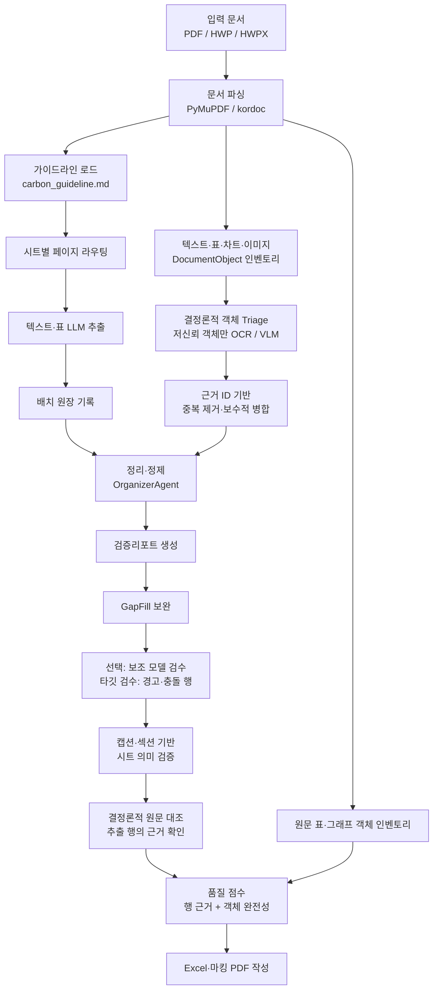

# 가이드라인 기반 지자체 탄소중립 계획 정보 추출 시스템

환경부 「지자체 탄소중립 녹색성장 기본계획 수립 및 추진상황 점검 가이드라인」(`carbon_guideline.md`)을 기준으로 지자체 탄소중립 계획서에서 구조화 데이터를 추출해 Excel로 정리하는 파이프라인입니다.

이 프로젝트의 핵심 목표는 단순히 많이 뽑는 것이 아니라, **조용한 데이터 유실을 막고 사람이 검증할 수 있는 근거를 남기는 것**입니다. v4/v4.1이 안정성(부분 실패 허용, 배치 원장, quota 복구, 출처페이지)을 확보했다면, v5는 가이드라인 구조적 주입과 참조 사전으로 추출 충실도를 높이고, 행 단위 데이터상태·타깃 검수로 사람이 재확인할 지점을 파이프라인이 직접 지목하게 했습니다. v6는 **측정 체계**를 도입해 "얼마나 정확한가"를 골든셋 기준 숫자로 답할 수 있게 했고, 그 숫자를 근거로 vision 백엔드 선정과 차트 판독값의 본 시트 병합을 **"값 오병합 0" 정책**으로 열었습니다.

## 현재 구현 요약

- 입력: PDF, HWP, HWPX
- 출력: `00_문서메타`부터 `16_시각자료목록`까지 17개 기본 시트 + `90_코드북`
- 선택 출력: `17_보조검수후보`, `18_보조병합로그`, `19_검증리포트`, `20_원문대조`, `21_원문객체인벤토리`
- 데이터 시트에는 행 단위 `근거ID`·`출처페이지`·`데이터상태` 컬럼이 붙어 원문 대조와 우선 검토가 가능
- 최종 행은 LLM 호출 없이 원문과 재대조되며, 대응 좌표를 표시한 마킹 PDF도 함께 생성
- 기본 LLM 백엔드: Gemini API (단계별로 `STAGE_PROVIDER_*` 분리 가능)
- 선택 백엔드: OpenAI API, Codex CLI, Claude Code CLI
- 기본 정책: 정확도와 검증 가능성을 우선하고, 위험한 최적화는 opt-in으로만 사용

## v8 객체 근거 파이프라인 스냅숏 (2026-08-05)

현재 개발 브랜치는 `codex/v8-object-evidence-pipeline`입니다. `codex/v7-fidelity-integration`의 재개 실행·결정론적 검증 기반에서 분기해, Unlimited-OCR 실험에서 확인한 객체 우선 처리 원리를 특정 OCR 엔진에 종속되지 않는 운영 구조로 확장합니다.

### 개발 브랜치 구조

| 브랜치 | 역할과 관계 |
|---|---|
| `main` | 공개·통합 기준 브랜치 |
| `feat/v6-measurement-baseline` | 골든셋·시각 인벤토리·회귀 평가 기반. 현재 로컬 통합 계열의 커밋 조상 |
| `codex/v7-fidelity-integration` | 실행 재개, 배치 원장, 결정론적 원문 대조를 보존한 v8의 직접 분기점 |
| `origin/feat/v7-extraction-fidelity` | 동료가 관리하는 원격 v7 추출 충실도 브랜치. 현재 v8의 직접 부모가 아니라 비교·선별 도입 대상 |
| `codex/experiment-v7-model-resolver` | 모델 resolver 회귀 테스트용 별도 worktree |
| `codex/v8-object-evidence-pipeline` | 현재 worktree. 객체 인벤토리, 선택적 OCR/VLM, 근거 병합, 문서 비종속 라우팅과 선택 복구를 통합 |

### 최근 구현 타임라인

| 날짜 | 간단한 구현 내용 |
|---|---|
| 2026-07-19 | 실행 매니페스트·배치 원장·중단 재개·실패 배치 선택 복구와 원문 객체 완전성 검증 추가 |
| 2026-07-28 | 개발/홀드아웃 평가 계약, 셀 정확도·객체 재현율·라우팅 오류율 독립 평가 추가 |
| 2026-07-30 | 로컬 v7 통합 기준점을 보존하고 모델 resolver 실험을 별도 worktree로 분리 |
| 2026-08-01 | PDF를 `text/table/chart/image` `DocumentObject`로 분해하고 저신뢰 객체만 OCR/VLM으로 보내는 선택적 파이프라인 추가 |
| 2026-08-02 | 해시가 고정된 시각 표본, 적응형 분할 재시도, 객체별 최종 상태와 `needs_review` 계약 추가 |
| 2026-08-03 | 근거 ID 기반 병합 계약 v3, 값·단위 보존, 선택 복구, 무API 병합 A/B 스냅샷 추가 |
| 2026-08-04 | 목차·본문 객체 연결, PyMuPDF/OCR/VLM 중복 제거, 복수 허용 시트와 선택적 고정 라우팅 분모 추가 |
| 2026-08-05 | 전체 무캐시 실행의 저장공간 실패 45배치를 47회 호출·8분 23초에 전부 복구. `1692/1692` 성공, 품질점수 `89.18`, 경고 `370`, 객체 재현율 `0.9024`, 객체 라우팅 오류율 `0.1429` 확인 |

이 타임라인은 구현 완료 여부를 기록하는 개발 스냅숏입니다. 정확도 수치는 서울 개발용 초벌 골든셋 기준이며, 강원·경기 일반화와 사람 확정 고정 라우팅 분모는 후속 검증 대상입니다.

## 문서 비종속 객체 라우팅 보강 (2026-08-04)

서울 보고서의 특정 페이지나 표 번호에 맞추지 않고, 서울·강원·경기 기본계획에서 공통으로 확인되는 문서 구조 신호를 사용하도록 원문 객체 평가 계층을 보강했습니다.

1. `목차`, `차례`, `CONTENTS`, `TABLES`, `PICTURES`, `표/그림 목차`, 점선 리더와 반복 참조 번호를 조합해 목차 페이지를 판별합니다. 목차의 표·그림 항목은 라우팅 평가 객체로 세지 않습니다.
2. 목차 참조는 표·그림 번호와 캡션 유사도로 실제 본문 객체에 연결합니다. 본문 객체에는 참조 페이지를 남기되 근거 페이지는 실제 본문 페이지를 사용합니다.
3. 같은 페이지·근거에서 생성된 PyMuPDF, OCR, VLM 객체는 번호·캡션·엔진 정보를 이용해 하나로 합치고 원래 객체 ID는 별칭으로 보존합니다.
4. `16_시각자료목록`은 보조 목록으로 분리합니다. 이 시트에만 기록된 객체는 본문 시트에 정상 배치된 것으로 간주하지 않고 `본문미연결`로 표시합니다.
5. 하나의 객체가 둘 이상의 본문 시트에 합법적으로 대응하면 `허용시트` 집합을 기록하고, 그중 하나와 연결되면 정상으로 판정합니다. 기존의 보수적인 행 자동 재분류 규칙은 그대로 유지합니다.
6. `21_원문객체인벤토리`에는 `허용시트`, `보조연결시트`, `목차참조페이지`, `중복객체ID`가 추가됩니다.
7. 평가 매니페스트에 선택적인 `routing_inventory`와 SHA256을 등록하면 사람 확정 객체 전체를 고정 분모로 사용합니다. 출력에서 사라진 객체도 `미추출`로 남습니다. 인벤토리가 없는 강원·경기 문서는 기존 동적 보조 지표로 안전하게 폴백합니다.

전체 페이지 판별 점검에서 서울은 `p3~20`, 강원은 `p3`, `p5~13`, 경기는 `p3`, `p5`, `p7~14`의 실제 목차·표목차·그림목차 페이지만 분류됐으며, 세 문서의 본문 오탐은 확인되지 않았습니다. 서울의 현재 시각요소 인벤토리는 `관련시트`가 아직 사람 확정되지 않아 고정 라우팅 분모에는 연결하지 않았습니다.

## 선택 복구·근거 병합 계약 v3 (2026-08-03)

전체 문서를 다시 호출하지 않고 실패 구간을 복구하면서, 시각값을 본문에 넣는 조건을 더 엄격하게 만들었습니다.

1. 텍스트 실패 배치는 `--retry-failed-only`, 시각 객체는 `--retry-vision-evidence` 또는 `--retry-vision-pages`로 선택 재처리합니다. 지정하지 않은 성공 체크포인트는 그대로 보존됩니다.
2. 캡션 프록시와 실제 렌더 이미지처럼 같은 물리 객체에서 파생된 ID는 하나의 정규 근거로 묶고 원래 ID는 별칭으로 유지합니다.
3. 근거 병합 계약을 `05_배출전망`, `06_감축목표`, `08_감축사업목록`까지 확장했습니다. 기간값은 임의의 단일 연도로 바꾸지 않고 `needs_review`로 격리합니다.
4. 원문 값·단위는 보존하고 비교용 정규화 값·단위·배율을 별도로 기록합니다. 예를 들어 `31.5 천tCO2eq`와 `31,500 tCO2eq`를 같은 양으로 비교할 수 있습니다.
5. 병합 판정은 `accept`, `fix_then_merge`, `duplicate`, `reject`, `needs_review`로 고정합니다. 자동 반영은 앞의 두 상태만 허용하며 기존의 채워진 텍스트 값은 덮어쓰지 않습니다.
6. 운영 실행은 결과 파일과 함께 `*_visual_merge_input.json.gz`를 남깁니다. 이 스냅샷은 API 호출 없이 기존 정책과 근거 기반 정책을 재생하는 A/B 입력입니다.

```powershell
# 텍스트 실패 배치와 특정 시각 객체만 재처리
# <실제_근거ID>는 16_시각자료목록 또는 21_원문객체인벤토리에서 복사합니다.
py main.py "서울특별시_탄소중립계획.pdf" `
  --retry-failed-only `
  --retry-vision-evidence "<실제_근거ID>"

# 페이지를 지정하면 그 페이지의 저신뢰 시각 객체를 선택 재처리
py main.py "서울특별시_탄소중립계획.pdf" `
  --resume --retry-vision-pages "71,89,131"

# 저장된 동일 관찰값으로 병합 정책만 무API 비교
# 스냅샷은 결과 xlsx와 같은 디렉터리에 생성됩니다.
py scripts/compare_operational_visual_merge.py `
  "<결과파일명>_visual_merge_input.json.gz" `
  --output-dir "output\visual_merge_ab"

# 양쪽 정책을 평가 가능한 Excel로 만들고 같은 골든셋으로 즉시 비교
py scripts/compare_operational_visual_merge.py `
  "<결과파일명>_visual_merge_input.json.gz" `
  --output-dir "output\visual_merge_ab_eval" `
  --source "서울특별시_탄소중립계획.pdf" `
  --dataset "seoul-development-v1-draft" `
  --allow-draft-evaluation
```

기본 실행도 `legacy_merge.xlsx`와 `evidence_merge.xlsx`를 함께 생성합니다. `--source`를 지정하면 두 파일 모두 동일한 시트 의미 검증, 원문 대조, 원문 객체 인벤토리를 거치며, `--dataset`까지 지정하면 `cell_accuracy`, 행 재현율·정밀도, 객체 재현율, 라우팅 오류율을 자동 비교합니다. 운영 A/B는 정책별 반영·격리량을 비교하는 도구이므로, 사람 확정 정답이 없으면 정확도 자체를 증명하지 않습니다.

## 객체 우선 선택적 OCR/VLM 파이프라인 (2026-08-01)

Unlimited-OCR 실험에서 확인한 원리를 외부 엔진 종속 없이 운영 파이프라인에 반영했습니다.

1. PDF 페이지를 좌표가 있는 `text`, `table`, `chart`, `image` `DocumentObject`로 분리합니다. 각 객체에는 페이지, bbox, 표·그림 번호, 캡션, 섹션, 근처 본문이 저장됩니다.
2. PyMuPDF 표의 셀 채움률, 행 불균일도, 행·열 수, 추출 전략을 코드로 평가합니다. 충분히 읽힌 객체는 OCR을 생략하고, 캡션만 있고 표가 없거나 부분 인식된 복잡표와 데이터 차트만 보완 후보가 됩니다.
3. 후보 페이지에 기존 전체 렌더가 있으면 재사용하고, 없을 때만 객체 좌표를 지연 렌더링합니다. 따라서 `MAX_IMAGES` 이전에 실제 호출 분모가 축소됩니다.
4. OCR/VLM 결과는 Markdown/HTML 표를 포함한 `DocumentObject`로 정규화합니다. 원본과 보완 객체는 페이지·번호·좌표로 만든 `근거ID`를 기준으로 중복 제거되며, 신뢰도가 낮은 원본만 보완 결과로 교체됩니다.
5. `OCR_BACKEND=vlm|unlimited_ocr|none`으로 백엔드를 교체할 수 있습니다. `unlimited_ocr` 모드는 모델 서버를 파이프라인이 직접 구동하지 않고 사전 생성된 Markdown/JSONL 결과를 읽습니다.
6. `21_원문객체인벤토리`에는 좌표, 원본신뢰도, Triage판정·사유, 보완백엔드·상태, 객체별 `최종상태·시도횟수·종결사유`, 근거ID가 기록됩니다. 최종 성능은 기존 `--evaluate` 골든셋 계약으로 비교합니다.
7. 시각 판독값은 `근거ID`가 단 하나이고 원문 원장의 단 하나의 `extracted` 객체와 정확히 일치할 때만 병합 후보가 됩니다. 텍스트 충돌, 복수 ID·객체, 미등록 ID, 전부 null인 판독값은 본문 시트에 넣지 않고 `16_시각자료목록`에 `needs_review`와 차단 사유를 남깁니다.

```text
PDF 객체 인벤토리 -> 결정론적 Triage -> PyMuPDF 기본 추출
                    -> 저신뢰 객체만 OCR/VLM -> 근거 기반 병합 -> 골든셋 평가
```

```powershell
# 기본: 기존 Vision 모델을 저신뢰 객체에만 사용
py main.py "서울특별시_탄소중립계획.pdf" --ocr-backend vlm --evaluate

# Unlimited-OCR가 미리 생성한 Markdown/JSONL 결과를 선택적으로 병합
py main.py "서울특별시_탄소중립계획.pdf" `
  --ocr-backend unlimited_ocr `
  --ocr-results-dir "runs\seoul_uocr_v1\official_uocr_raw" `
  --evaluate

# OCR/VLM 없이 PyMuPDF 객체 기준선만 측정
py main.py "서울특별시_탄소중립계획.pdf" --ocr-backend none --evaluate
```

## 고정 시각 표본 무캐시 벤치마크 (2026-08-02)

전체 515페이지를 매번 무캐시로 실행하기 전에, 같은 객체만 대상으로 유실 복구와 회귀를 비교하는 고정 표본 도구를 추가했습니다. 원본 PDF를 그대로 기준으로 두고 최근 `vision_유실` 전부, 정상 양성 대조군, 음성 대조군을 결정론적으로 선택합니다. 원본·인벤토리·감사 결과·렌더 이미지의 SHA256과 객체 ID가 `manifest.json`에 고정되므로 서로 다른 실행이 실제로 같은 입력을 본 것인지 검증할 수 있습니다.

```powershell
# 서울 개발 표본 생성 및 해시 검증
py scripts/fixed_visual_sample.py build `
  "출력 결과 모음집\서울특별시_탄소중립계획.pdf" `
  --inventory "data\golden\서울_시각요소_인벤토리_v1.xlsx" `
  --audit "output\evaluation_20260801_233926\visual\visual_inventory_audit_20260802_083515.json" `
  --dataset-id "seoul-visual-fixed-v1" `
  --output-dir "output\fixed_visual_samples\seoul-visual-fixed-v1"

py scripts/fixed_visual_sample.py validate `
  "output\fixed_visual_samples\seoul-visual-fixed-v1\manifest.json"

# 현재 기준선: 새 응답만 측정하고 개별 재시도는 끔
py scripts/fixed_visual_sample.py run `
  "output\fixed_visual_samples\seoul-visual-fixed-v1\manifest.json" `
  --provider codex --model "gpt-5.6-luna" `
  --cache-mode off --retry-missing none `
  --output-dir "output\fixed_visual_samples\runs\baseline"
```

기본 자동 지표는 응답 커버리지, 기대 객체 리콜, 음성 특이도, 분류 정확도, 수치값 보유 커버리지입니다. 원본 대조 주석을 전달하면 임시 매니페스트와 별개로 `검토 정답 분류 정확도`, `구조화 셀 정확도`, `숫자값 재현율`, `숫자값 정밀도`를 따로 계산합니다. 따라서 숫자는 맞지만 항목명·기간·단위가 틀린 경우와 숫자 자체가 틀린 경우를 구분할 수 있습니다. `expected_visual_rows`는 이미지에서 직접 판독해야 할 원시 값, `expected_merged_rows`는 최종 엑셀에 자동 병합되어야 할 행입니다. 개별 재시도 A/B, 버전 관리, 정답 작성과 합격 기준은 [고정 시각 표본 실험 절차](docs/benchmark/고정_시각표본_실험_절차.md)를 따릅니다.

### 시각 값 계약 v3

- 항목명·범례명·부호·기간·단위를 원문 그대로 요구하며, 공백·유니코드 단위처럼 의미가 같은 표기만 평가 시 정규화합니다.
- `21~30년` 같은 기간은 잘못된 단일 연도로 확장하지 않고 `기간원문`으로 보존합니다.
- BAU·감축량·감축률·신규·누계·예산은 값 하나당 한 행으로 원자화합니다.
- 각 값은 `명시라벨`, `표셀`, `축추정`, `계산값`, `불명` 중 하나의 `값근거`를 갖습니다.
- 자동 병합은 단일 근거 ID 정확 일치뿐 아니라 값 검증도 통과해야 합니다. 축 추정·계산값·불명, 동일 근거의 값 충돌, 명시 합계와 세부합 불일치는 `needs_review`로 격리됩니다.
- `16_시각자료목록`에는 `값근거`, `값검증상태`, `계약버전`, 원문·정규화 값과 단위가 기록됩니다. 계약 v3 이전 캐시는 근거·단위 계약이 부족해 보수적으로 검토 대상으로 내려갈 수 있으므로 v3 성능 비교는 무캐시 실행을 기준으로 합니다.

누락 복구 실험은 `--retry-missing adaptive`를 사용합니다. 호출 실패 또는 객체 ID 누락 시 실패 객체만 `배치→절반→단일 객체` 순서로 격리하고, `--max-object-attempts` 상한 이후에도 응답이 없으면 `needs_review`로 종결합니다. 새 결과는 모든 표본에 `attempt_count`, `terminal_reason`, `attempt_history`를 남기며, 데이터 객체가 `extracted`로 응답했어도 명시 값이 전부 비어 있으면 `no_data`로 정규화합니다.

### 근거 기반 병합 A/B

저장된 동일 Vision 결과를 기존 병합과 근거 ID 기반 병합에 각각 투입하는 무API A/B 도구도 포함합니다. 먼저 값 판독 주석을 보존한 병합 주석 계약을 만들고 검토자가 `review_status`, `expected_sheet`, `expected_merge`, `expected_visual_rows`, `expected_merged_rows`를 확정합니다. `fixture_evidence`와 `fixture_baseline_rows`는 복수 근거, 근거 누락, 텍스트 충돌 같은 실패 계약을 결정론적으로 재현할 때만 사용합니다.

```powershell
# 1. 기존 값 주석을 보존한 병합 검수 템플릿 생성
py scripts/fixed_visual_sample.py prepare-merge-annotations `
  "output\fixed_visual_samples\seoul-visual-fixed-v1\manifest.json" `
  --base "output\fixed_visual_samples\seoul-visual-fixed-v1\annotations_template.jsonl" `
  --output "output\fixed_visual_samples\seoul-visual-fixed-v1\annotations_merge.jsonl"

# 2. 같은 adaptive_retry Vision 결과를 두 병합 정책으로 비교
py scripts/fixed_visual_sample.py merge-ab `
  "output\fixed_visual_samples\seoul-visual-fixed-v1\manifest.json" `
  --results "output\fixed_visual_samples\runs\adaptive_retry\results.jsonl" `
  --annotations "output\fixed_visual_samples\seoul-visual-fixed-v1\annotations_merge.jsonl" `
  --output-dir "output\fixed_visual_samples\merge_ab\adaptive_retry"
```

출력은 `legacy_rows.jsonl`, `evidence_rows.jsonl`, `evidence_candidates.jsonl`, `needs_review.jsonl`, `ab_report.json`, `ab_report.md`입니다. 보고서는 판정 정확도, 대상 시트 정확도, 자동 병합 정밀도·재현율, 오병합 감소, 정확 근거 매칭률, 복수 근거·전부 null·텍스트 충돌 격리율을 분리합니다. 정확도 계열 지표는 원본 대조를 마친 `review_status=reviewed` 또는 독립 2차 검토까지 마친 `confirmed` 표본만 분모로 사용합니다.

## 7월 보고서 평가 체계 반영 (2026-07-28)

7월 보고서의 후속 계획을 실제 회귀 실험으로 검증할 수 있도록 세 가지 조건을 추가했습니다.

1. `data/evaluation/benchmark_manifest.json`에서 개발용 골든셋과 홀드아웃을 역할별로 분리하고, 원문·골든셋·시각 인벤토리의 SHA256을 고정합니다. 같은 ID의 파일이 바뀌면 평가는 즉시 실패하며, 홀드아웃은 `--evaluate-holdout` 없이는 열리지 않습니다.
2. 최종 행을 원문 표 번호·캡션·섹션 문맥과 대조해 시트 의미를 검증합니다. 자동 재분류는 계획 시작 이후의 배출현황 값이 명시적인 전망표에서 나온 경우처럼 안전한 범위에만 적용합니다. `21_원문객체인벤토리`에는 `예상시트`와 `시트정합상태`가 추가됩니다.
3. 감독관 총점과 별도로 **셀 정확도**, **객체 재현율**, **라우팅 오류율**을 산출합니다. 셀 정확도는 고정 골든셋, 객체 재현율은 사람 확정 시각요소 인벤토리, 라우팅 오류율은 의미 판정 가능한 표·그래프 객체를 각각 분모로 사용합니다.

일반 실행의 `원문 객체 완전성/자동 객체 커버리지`는 자동 연결 지표이며, 사람 확정 인벤토리를 분모로 하는 `객체 재현율`과 구분됩니다. 후자는 `--evaluate`를 지정한 고정 평가에서만 보고됩니다.

현재 서울 골든셋은 파일 해시는 고정됐지만 사람 최종 확정 전 초벌이므로, 테스트할 때만 다음처럼 명시적으로 허용합니다.

```powershell
py main.py "서울특별시_탄소중립계획.pdf" --evaluate --allow-draft-evaluation

# 이미 생성된 결과만 다시 평가하면 LLM 호출 없이 실행됩니다.
py scripts/evaluate_benchmark.py `
  "탄소중립_추출결과.xlsx" `
  "서울특별시_탄소중립계획.pdf" `
  --allow-draft-evaluation
```

강원·경기 문서는 홀드아웃 후보로 등록했지만 골든셋이 아직 없으므로 평가가 의도적으로 차단됩니다. 사람 확정 골든셋과 시각 인벤토리를 만든 뒤 새 버전 ID와 해시를 등록해야 합니다.

## 실행 재현성·자동 복구 업데이트 (2026-07-19)

장시간 실행이 중단되거나 일부 LLM 배치가 실패해도 처음부터 다시 처리하지 않도록 다음 실행 계약을 추가했습니다.

1. 원문 대조 검색어, 마킹 좌표, Excel 행은 페이지·내용 해시 기준으로 정렬해 같은 입력의 출력 순서를 고정합니다.
2. 입력·가이드라인·프롬프트·구현·설정·모델 해시를 담은 실행 매니페스트를 `.cache/runs/<run-id>/run_manifest.json`과 결과 파일 옆 `*_run_manifest.json`에 기록합니다.
3. 각 텍스트 배치의 성공·실패·부분 성공과 결과를 append-only `ledger.jsonl`에 즉시 기록합니다. 정상 종료 전 중단되면 매니페스트 상태가 `interrupted`로 남습니다.
4. `--resume`은 성공 배치를 체크포인트에서 복원하고 미완료 배치만 실행합니다. `--retry-failed-only`는 기존 원장의 실패·부분 배치만 다시 실행합니다.
5. 타임아웃, API 호출 실패, JSON 파싱 실패는 설정된 깊이까지 페이지 범위를 반으로 나눠 자동 복구합니다. 일부 하위 배치만 성공해도 그 결과는 보존합니다.
6. 병합은 안정 행 ID로 완전 중복을 제거합니다. 동일 엔터티의 값이 다르면 임의 덮어쓰기를 하지 않고 양쪽 행과 `merge_conflicts.jsonl`을 보존합니다.
7. 실패 대체값인 빈 `{}`·잘린 JSON·오류 문자열은 LLM 캐시에 저장하지 않습니다. 매니페스트의 `complete`, `needs_review`, `partial`, `failed`, `interrupted` 상태로 실행 완결성을 판정합니다.

### 대용량 배치·완전성 검증 보강 (2026-07-19)

1. LLM 호출 전에 문자 수가 큰 배치를 페이지 단위로 나누며, 한 페이지가 큰 경우 본문과 표 객체를 별도 청크로 분리합니다.
2. 큰 표는 표 번호·캡션·섹션·근처 본문을 유지하고 헤더를 반복해 행 묶음별로 재추출합니다.
3. `21_원문객체인벤토리`는 원문의 데이터 표·그래프를 분모로 삼아 결과 행 연결 상태를 `확인/부분/미확인`으로 기록합니다.
4. 결정론적 품질 점수는 행 근거 대조뿐 아니라 원문 객체 완전성도 반영합니다. 인벤토리가 연결된 실행에는 기존 95점 상한을 적용하지 않습니다.
5. 중복 키 충돌은 표 출처·데이터 출처·필드 채움률로 선택 근거가 있는 경우 `정보`로 분류하고, 근거 없는 동률만 `경고`로 유지합니다. 재정 부분합 검사는 같은 사업·연도·단위 내부에서만 수행합니다.
6. Vision 배치는 텍스트와 같은 실행 원장에 저장합니다. 실패한 이미지 묶음은 절반씩 재귀 분할하며 성공한 하위 묶음은 다음 재개 실행에서 재사용합니다.

```powershell
# 중단 지점부터 재개: 성공 배치는 재호출하지 않음
py main.py "서울특별시_탄소중립계획.pdf" --resume

# 같은 실행 지문의 실패·부분 배치만 재처리
py main.py "서울특별시_탄소중립계획.pdf" --retry-failed-only

# 성공 체크포인트 중 특정 Vision 근거만 강제 재처리
py main.py "서울특별시_탄소중립계획.pdf" `
  --resume --retry-vision-evidence "<16번 또는 21번 시트의 실제 근거ID>"
```

재개 식별자는 입력 파일명이나 출력 파일명이 아니라 **입력 내용, 가이드라인, 프롬프트, 구현 및 주요 실행 설정의 해시**입니다. 이 중 하나가 바뀌면 새 실행으로 분리되므로 이전 코드의 결과가 새 코드에 잘못 섞이지 않습니다. 성공 응답 캐시와 배치 원장은 역할이 다릅니다. 캐시는 동일 LLM 요청의 비용을 줄이고, 원장은 어느 배치가 완료·실패했는지를 판단해 재개 범위를 결정합니다.

## v6에서 달라진 핵심 (2026-07-07 ~ 2026-07-14)

v6의 방향은 하나입니다. **측정 없이는 개선도 없다** — 추출 정확도를 골든셋 기준 숫자로 만들고, 이후 모든 변경(임계 조정, 모델 교체, 병합 정책 완화)은 이 숫자의 개선으로만 정당화합니다. 이 원칙 위에서 vision 백엔드 선정, 시각 판독값 병합, 소수정 라운드를 전부 실측으로 결정했습니다. 국면별 실측 기록은 `docs/audit/`(시각 병합 트랙의 단일 기준 문서는 `M2-4.2_병합경로_실측_20260712.md`), 현재 수준 요약은 `docs/audit/중간점검_현재수준_20260714.md`입니다.

### 1. 측정 하네스 (M1-2 · M2-1)

- `scripts/score_against_golden.py`: 파이프라인 출력 xlsx와 골든셋 xlsx를 LLM 토큰 0으로 대조해 시트별 리콜/정밀도/값일치율과 **출처유형별(텍스트 유래 vs 시각 유래) 분해 리포트**를 산출합니다. 행 매칭은 4단 티어 — 엄격(키 완전 일치) → 완화(값 검증 동반) → 의미완화(02 한정, 연도·단위·값 일치 + 지표명 토큰 자카드) → 문자유사(02 한정, 2-gram). 수치는 0.5% 상대오차로 비교합니다. 형식 계약은 `docs/specs/M1-2_골든셋대조하네스_구현명세서.md` §1.
- `scripts/audit_visual_inventory.py`: 사람 확정 시각요소 인벤토리와 `16_시각자료목록`을 대조해 요소별 유실 단계(이미지 추출 → triage → vision → 기록)와 임계 민감도 표를 산출합니다.

### 2. 서울 골든셋과 현재 기준선 (`data/golden/`)

- 서울 골든셋 채점 3,522행: 독립 추출 3종 교차합의 → 값불일치 전량 원문 판정 → GPT-5.5 합의 승격 → 시각 정답 보강(에이전트 판독 → 반박 재검증 → 사람 표본 확인, 시각 유래 312행). 부분 골든이므로 리콜은 유효, 정밀도는 골든이 차오를수록 유의미해집니다.
- `서울_시각요소_인벤토리_v1.xlsx`: 본문 캡션 505건에서 확정한 시각요소 176개(사람+Claude 3라운드 교정).
- **현재 기준선(기본 실행 = 가장 싼 구성: 텍스트 flash-lite + vision gpt-5.6-luna, 즉 하한선)**: 텍스트 유래 리콜 0.6129·값일치율 0.8798, 시각 유래 리콜 0.1656(값일치 0.7812). 같은 파이프라인의 GPT-5.5 실측은 리콜 0.87/값일치 0.90(판정 골든 1,760행 축) — 리콜은 파이프라인보다 텍스트 LLM 등급이 지배합니다.

### 3. vision 교차 프로바이더 벤치마크와 기본값 (M2-3)

통제 조건 벤치마크(`scripts/benchmark_vision.py`)로 시각요소 리콜을 실측했습니다: gemini-2.5-pro 0.976 > gpt-5.6-luna 0.963 > gpt-5.5 xhigh 0.951 ≫ flash-lite 0.707. 채택은 **API 모드 vision = `gemini-2.5-pro`(`GEMINI_VISION_MODEL`), 에이전트(codex) 모드 vision = `gpt-5.6-luna`(`CODEX_VISION_MODEL`)** — API 과금과 구독 quota를 분리하는 비용-성능 이원 전략입니다. 값 판독 정확도는 표본 실측 0.81~0.83, 라벨·표 인쇄형 98%, 사전지식 환각 0.

### 4. 시각 판독값의 본 시트 병합 — "값 오병합 0" 정책 (M2-4.x)

차트에서 읽은 값을 본 시트에 편입하는 것은 오염 위험이 큰 작업이라, 게이트를 통과한 값만 열었습니다.

- **라벨 기반(비추정) 판독값만**, 단일 근거 ID 정확 매칭, 시트 1차 키 완성, 텍스트 교차검증을 모두 통과할 때만 병합합니다(`VISUAL_MERGE_LABELED_ENABLED`, `VISUAL_EVIDENCE_MERGE_ENABLED`).
- 계약 v3에서는 `05_배출전망`과 `06_감축목표`도 값 역할·시나리오·연도 키가 완전한 경우에만 허용합니다. 감축량과 목표배출량 역할이 불명확하거나 기간이 단일 연도가 아니면 `needs_review`로 격리합니다.
- 3지자체 게이트 실측: 병합/생략/경고/차단 = 서울 209/15/0/1,320 · 강원 49/98/0/830 · 경기 213/2/0/1,912 — **값 오병합 0**. 병합되지 않은 판독값은 전부 `16_시각자료목록`에 보존됩니다.
- 시각 유래 리콜 여정: 0.013 → 0.1656(13배). 남은 갭의 본류는 vision 프롬프트의 시트 키 공급(차기 라운드).

### 5. 소수정 라운드 (v5.2 · v5.3 · v6.3)

실측이 지목한 계통 오류를 라운드 단위로 수정했습니다 — 직간접구분·영문코드 정규화, 부문 괄호 한정어 분리, 06 기준연도 분리, 메탄(가스종) 차트 값의 부문 배출량 위장 유입 차단(서울 03 값일치율 0.60→0.93) 등. **모든 수정은 지자체 하드코딩 0 원칙과 서울·강원·경기 3중 회귀 게이트를 통과해야 병합됩니다.**

### 6. 남은 병목 (우선순위 순, v7에서 진행)

1. 06 연차별 사업카드 값의 목표 행 유입 — 06 값일치 0.15의 실원인, 값불일치 22쌍 증거 확보 (**v7 착수 국면**)
2. vision 프롬프트 키 공급 라운드 — 시각 리콜의 본류(재추출 비용 수반)
3. 저리콜 서술형 시트(01/07/13)의 원인 분해 — 채점 한계 vs 추출 한계
4. M3: 골든 없는 지자체의 검증 체계

## 무거운 기능은 기본으로 켜지지 않습니다

아래 기능은 품질 회귀 가능성이 있어 기본값이 꺼져 있습니다.

| 설정 | 기본값 | 의미 |
|---|---:|---|
| `EXTRACTION_SHEET_CLUSTERING` | `False` | 여러 시트를 한 번에 추출해 호출 수를 줄이는 opt-in 최적화 |
| `ROUTE_DROP_UBIQUITOUS_STRONG` | `False` | 문서 전반에 반복되는 strong 키워드까지 라우팅 점수에서 제외하는 실험적 최적화 |
| `HYBRID_REVIEW_ENABLED` | `False` | 기본 추출 후 보조 모델로 누락/충돌 후보를 검수하는 선택 기능 |
| `SHEET_CLOSED_LOOP_ENABLED` | `False` | 추출까지 시트 단위로 닫는 v5 폐루프 실행 경로 |

테스트 파일이 늘어난 것은 런타임을 무겁게 만들기 위해서가 아니라, 위 안정성 계약을 깨지 못하게 막기 위한 회귀 테스트입니다. 일반 실행 시 `tests/`는 실행되지 않습니다.

## 처리 흐름



## 출력 Excel 시트

### 기본 시트

| 시트 | 내용 |
|---|---|
| `00_문서메타` | 계획명, 지자체, 발간기관, 계획기간, 기준/목표연도 |
| `01_계획개요` | 수립 배경, 법적 근거, 추진체계, 추진경과 |
| `02_지역여건` | 자연·인문·경제·에너지 지표 |
| `03_배출현황_지역` | 지역 기준 온실가스 배출·흡수 현황 |
| `04_배출현황_관리권한` | 지자체 관리권한 인벤토리 |
| `05_배출전망` | BAU 및 시나리오별 배출 전망 |
| `06_감축목표` | 총괄·부문별 감축목표, 감축률 |
| `07_비전전략` | 비전문구, 추진전략, 세부전략 |
| `08_감축사업목록` | 감축사업, 관리번호, 성과지표 |
| `09_연차별이행계획` | 사업별 연도별 계획과 목표물량 |
| `10_정량감축량` | 활동량, 감축원단위, 예상감축량 |
| `11_재정투자계획` | 부문·사업·재원·연도별 예산 |
| `12_대응기반강화` | 적응, 교육, 녹색성장 등 대응 기반 과제 |
| `13_이행관리환류` | 점검체계, 담당조직, 절차, 산출물 |
| `14_점검실적` | 연도별 이행실적, 달성여부, 사업유형 |
| `15_변경과제_조치` | 변경사업, 미달성 사유, 조치계획 |
| `16_시각자료목록` | 이미지·그래프 판독 결과와 디지타이징 필요 여부 |

### 선택 시트

| 시트 | 생성 조건 | 내용 |
|---|---|---|
| `17_보조검수후보` | `--hybrid-review` | 보조 모델이 찾은 누락 후보, 값 충돌, 오염 의심 항목 |
| `18_보조병합로그` | `--hybrid-review` | 후보 판정, 원문 근거, 병합 여부와 차단 사유 |
| `19_검증리포트` | 검증 이슈 존재 | 원장 실패, 정합성 경고, 빈 시트 원인 등 |
| `20_원문대조` | 기본 생성 | 모든 최종 행의 원문 확인 상태, 출처/확인 페이지, 검색어와 신뢰도 |
| `21_원문객체인벤토리` | 기본 생성 | 원문 표·그래프별 결과 연결 상태, 완전성, 예상 시트와 시트 정합 상태 |
| `90_코드북` | 기본 생성 (`CODEBOOK_SHEET_ENABLED=0`으로 제외) | 실행에 사용된 코드 체계(달성여부·사업유형·전망방법·표준부문·데이터상태) |

## 설치

Python 3.10 이상을 권장합니다.

```powershell
py -m pip install -r requirements.txt
npm install
```

`requirements.txt`에는 기본 Gemini 백엔드 실행에 필요한 `google-genai`와 `google-api-core`가 모두 포함되어 있습니다. Gemini 실행 중 두 모듈 중 하나가 없다는 오류가 나오면 같은 명령으로 의존성을 다시 설치하세요.

macOS/Linux에서는 `py` 대신 `python3`를 사용합니다.

```bash
python3 -m pip install -r requirements.txt
python3 main.py "서울특별시_탄소중립계획.pdf" -o "서울_결과.xlsx"
```

PDF만 처리한다면 Node.js는 필수가 아닙니다. HWP/HWPX 입력이나 kordoc 기반 파싱을 사용하려면 Node.js 18 이상과 `npm install`이 필요합니다.

### API 키 설정

기본 백엔드는 Gemini입니다. `load_dotenv()`가 프로젝트 루트 `.env`를 읽으므로, 먼저 `.env.example`을 `.env`로 복사한 뒤 필요한 키만 채웁니다.

```env
GEMINI_API_KEY=
```

OpenAI 백엔드를 사용할 때는 다음 값을 설정합니다.

```env
LLM_PROVIDER=openai
OPENAI_API_KEY=
OPENAI_MODEL=gpt-5.4-mini
```

로컬 에이전트를 사용할 때는 Codex CLI 또는 Claude Code CLI가 설치·로그인되어 있어야 합니다.

```powershell
codex --version
claude --version
```

## 실행 방법

### 기본 실행

```powershell
py main.py "서울특별시_탄소중립계획.pdf" -o "서울_결과.xlsx"
```

### 백엔드 선택

```powershell
py main.py "서울특별시_탄소중립계획.pdf" --agent gemini -o "서울_결과.xlsx"
py main.py "서울특별시_탄소중립계획.pdf" --agent openai --agent-model gpt-5.4-mini -o "서울_결과.xlsx"
py main.py "서울특별시_탄소중립계획.pdf" --agent codex -o "서울_결과.xlsx"
py main.py "서울특별시_탄소중립계획.pdf" --agent claude -o "서울_결과.xlsx"
```

### 이미지 분석 제외

이미지 Vision 호출 비용이나 시간을 줄이고 싶을 때 사용합니다.

```powershell
py main.py "서울특별시_탄소중립계획.pdf" --no-images -o "서울_결과.xlsx"
```

### 전체 페이지 스캔

라우팅 누락이 의심될 때 사용합니다. 비용과 시간이 늘어납니다.

```powershell
py main.py "서울특별시_탄소중립계획.pdf" --full-scan -o "서울_결과.xlsx"
```

### 보조 모델 검수

기본 추출본을 만든 뒤 고위험 시트만 보조 모델로 다시 검수합니다. 기본값에서는 시트마다 `후보 탐색 → 묶음 판정 → 즉시 병합 로그 기록`을 끝내고 다음 시트로 넘어가므로, 장시간 실행 중에도 시트/배치별 진행 상황을 바로 볼 수 있습니다. 후보는 본 시트에 자동 병합하지 않고 `17_보조검수후보`, `18_보조병합로그`에 남깁니다.

```powershell
py main.py "서울특별시_탄소중립계획.pdf" --agent openai --agent-model gpt-5.4-mini --hybrid-review -o "서울_결과.xlsx"
```

자동 병합까지 테스트하려면 명시적으로 켭니다.

```powershell
py main.py "서울특별시_탄소중립계획.pdf" --agent openai --agent-model gpt-5.4-mini --hybrid-review --hybrid-auto-merge -o "서울_결과.xlsx"
```

기존처럼 전체 후보를 먼저 모은 뒤 단건 판정하려면 회귀 확인용으로 `--legacy-hybrid-flow`를 사용합니다. 하이브리드 검수·판정 백엔드는 `gemini` 외에 설치된 `codex`, `claude`, `auto`도 지정할 수 있습니다.

### 시트 폐루프 실행

추출까지 시트 단위로 닫는 v5 폐루프는 실험 경로라 기본값에서는 꺼져 있습니다. 시트별로 `추출 → 정제 → 보조검수·판정`을 완료한 뒤 다음 시트로 넘어가려면 명시적으로 켭니다.

```powershell
py main.py "서울특별시_탄소중립계획.pdf" --sheet-closed-loop --hybrid-review -o "서울_폐루프.xlsx"
```

## 주요 옵션

| 옵션 | 설명 |
|---|---|
| `input_path` | 입력 문서 경로. PDF, HWP, HWPX 지원 |
| `-o`, `--output` | 출력 Excel 파일 경로 |
| `-g`, `--guideline` | 환경부 가이드라인 HWP/HWPX 경로 |
| `--agent` | `gemini`, `openai`, `codex`, `claude`, `auto` 중 선택 |
| `--agent-model` | 선택 백엔드 모델명 |
| `--agent-timeout` | 로컬 에이전트 1회 호출 제한 시간(초) |
| `-k`, `--api-key` | API 백엔드 키 |
| `-r`, `--retries` | 품질 미달 시 전체 파이프라인 재시도 횟수 |
| `-v`, `--verbose` | 상세 로그 출력 |
| `--no-images` | 이미지·그래프 분석 생략 |
| `--max-images` | Vision 분석 이미지 수를 명시적으로 제한 |
| `--full-scan` | 시트 라우팅 대신 전체 페이지를 스캔 |
| `--resume` | 같은 실행 지문의 성공 체크포인트를 복원하고 미완료 항목부터 재개 |
| `--retry-failed-only` | 실패·부분 성공 텍스트 배치만 재실행 |
| `--retry-vision-evidence` | 지정 근거 ID의 Vision 판독만 강제 재실행. 반복 지정 가능 |
| `--retry-vision-pages` | 쉼표로 지정한 페이지의 저신뢰 시각 객체만 강제 재실행 |
| `--hybrid-review` | 보조 모델 후보 검수 활성화 |
| `--sheet-closed-loop` | v5 시트별 추출→정제→검수 폐루프 활성화(기본 비활성) |
| `--hybrid-review-max-batches` | 보조 검수 시 시트당 최대 배치 수 |
| `--hybrid-adjudication-model` | 보조 후보 판정 모델 |
| `--hybrid-adjudication-max-candidates` | 판정 후보 최대 개수. `0`이면 전체 |
| `--hybrid-adjudication-batch-size` | 시트 단위 후보판정 묶음 크기 |
| `--legacy-hybrid-flow` | 기존 전체 후보 수집 후 판정 방식 사용 |
| `--no-hybrid-adjudication` | 후보 판정 생략 |
| `--hybrid-auto-merge` | 안전 조건을 통과한 후보를 본 시트에 자동 병합 |

## 중요한 설정

`config.py` 또는 환경변수로 조정합니다.

| 설정 | 기본값 | 설명 |
|---|---:|---|
| `LLM_PROVIDER` | `gemini` | 기본 LLM 백엔드 |
| `GEMINI_VISION_MODEL` | `gemini-2.5-pro` | API 모드 vision(차트 판독) 기본 모델. 벤치마크 실측(0.976 vs flash-lite 0.707)으로 채택. 에이전트(codex/claude) 모드 vision에는 적용되지 않음 |
| `CODEX_VISION_MODEL` | `gpt-5.6-luna` | 에이전트(codex) 모드 vision 기본 모델. 벤치마크 실측(리콜 0.963, 환각 0)으로 채택. 빈 값이면 CLI 기본 모델 |
| `VISUAL_MERGE_LABELED_ENABLED` | `True` | 라벨 기반 시각 판독값의 게이트 병합. 3지자체 실측(값 오병합 0)으로 기본 활성 |
| `VISUAL_EVIDENCE_MERGE_ENABLED` | `True` | 객체 원장이 있는 실행에서 단일 `근거ID`와 단일 `extracted` 객체가 정확히 일치한 후보만 자동 병합 |
| `GEMINI_REQUEST_TIMEOUT_SECONDS` | `180` | Gemini SDK 요청 1회 타임아웃. 초 단위 env 값을 SDK에는 ms로 전달 |
| `LOCAL_AGENT_TIMEOUT` | `300` | Codex/Claude 1회 호출 제한 시간 |
| `PARALLEL_PROCESSING_ENABLED` | `True` | 독립 배치 병렬 실행 |
| `TEXT_WORKERS` | `4` | 텍스트 추출 병렬 워커 수 |
| `LLM_CACHE_ENABLED` | `True` | 성공한 LLM 응답 캐시 |
| `LLM_CACHE_DIR` | `.cache/llm_responses` | 캐시 저장 위치 |
| `LLM_QUOTA_WAIT_ENABLED` | `True` | quota 발생 시 짧게 대기 후 재개 |
| `LLM_QUOTA_WAIT_POLL_SECONDS` | `120` | quota 회복 대기 기본 간격 |
| `LLM_QUOTA_WAIT_MAX_SECONDS` | `1800` | quota 누적 대기 상한 |
| `LOCAL_AGENT_TIMEOUT_RETRIES` | `1` | 로컬 호출 타임아웃 뒤 허용할 추가 재시도 횟수 |
| `EXTRACTION_SPLIT_ON_TIMEOUT` | `True` | 타임아웃된 텍스트 배치를 더 작은 페이지 묶음으로 자동 분할 |
| `EXTRACTION_TIMEOUT_MIN_BATCH_PAGES` | `2` | 타임아웃 분할을 중단할 최소 페이지 수 |
| `EXTRACTION_TIMEOUT_MAX_SPLIT_DEPTH` | `6` | 한 원본 배치에서 허용할 재귀 분할 깊이 |
| `EXTRACTION_TIMEOUT_RECOVERY_BUDGET_SECONDS` | `900` | 한 원본 배치의 타임아웃 분할 복구 시간 상한 |
| `EXTRACTION_SPLIT_ON_FAILURE` | `True` | API 호출 실패·JSON 파싱 실패도 작은 배치로 자동 분할 |
| `EXTRACTION_MAX_BATCH_CHARS` | `18000` | LLM 호출 전 텍스트 배치 최대 문자 수 |
| `EXTRACTION_RECOVERY_MAX_BATCH_CHARS` | `12000` | 실패 복구 하위 배치 최대 문자 수 |
| `EXTRACTION_TABLE_ROWS_PER_BATCH` | `20` | 큰 표의 헤더 반복 행 청크 크기 |
| `RUN_STATE_ENABLED` | `True` | 입력·프롬프트·구현·설정 해시별 배치 원장과 매니페스트 기록 |
| `RUN_STATE_DIR` | `.cache/runs` | 실행 상태와 체크포인트 저장 위치 |
| `EXTRACTION_RESUME` | `False` | 성공 체크포인트를 복원하고 미완료 배치를 실행 (`--resume` 권장) |
| `EXTRACTION_RETRY_FAILED_ONLY` | `False` | 원장에 실패·부분 상태로 기록된 배치만 재실행 (`--retry-failed-only` 권장) |
| `VISION_RETRY_EVIDENCE_IDS` | 빈 값 | 성공 체크포인트에서도 다시 판독할 시각 근거 ID 목록 |
| `VISION_RETRY_PAGES` | 빈 값 | 다시 판독할 저신뢰 시각 객체의 페이지 번호 목록 |
| `VISUAL_MERGE_SNAPSHOT_ENABLED` | `True` | 운영 시각 관찰값과 근거 원장을 무API A/B 스냅샷으로 저장 |
| `LLM_TEMPERATURE` | `0` | Gemini JSON 추출의 응답 변동 최소화 |
| `PRIOR_PLAN_MAX_PAGES` | `60` | 다음 장 경계 미검출 시 기존계획 구간 탐지를 무효화할 안전 상한 |
| `GAP_FILL_ENABLED` | `True` | 커버리지 낮은 시트 재추출 |
| `PROVENANCE_ENABLED` | `True` | 본문 시트에 `출처페이지` 컬럼 추가 |
| `SOURCE_VERIFICATION_ENABLED` | `True` | 최종 행을 PDF/HWP 파싱 텍스트·표와 결정론적으로 대조 |
| `SOURCE_VERIFICATION_GLOBAL_SEARCH` | `True` | 출처페이지에서 실패하면 문서 전체에서 근거를 재탐색 |
| `SOURCE_VERIFICATION_MARK_PDF` | `True` | 확인된 원문 좌표를 표시한 `마킹_*.pdf` 생성 |
| `SOURCE_OBJECT_INVENTORY_ENABLED` | `True` | 원문 표·그래프를 분모로 결과 연결 완전성 계산 |
| `SOURCE_OBJECT_PARTIAL_WEIGHT` | `0.5` | 같은 페이지만 연결된 객체의 부분 점수 |
| `SEMANTIC_ROUTING_ENABLED` | `True` | 표 캡션·섹션 기반 시트 의미 검증 |
| `SEMANTIC_ROUTING_AUTO_RECLASSIFY` | `True` | 안전한 미래연도 배출현황→전망 오배치만 자동 재분류 |
| `SEMANTIC_ROUTING_ALLOWED_SCORE_DELTA` | `1.5` | 객체의 최고 후보와 함께 허용할 복수 시트 점수 차이 |
| `SEMANTIC_ROUTING_MAX_ALLOWED_TARGETS` | `3` | 한 객체에 기록할 허용 시트 최대 수 |
| `EVALUATION_MANIFEST_PATH` | `data/evaluation/benchmark_manifest.json` | 고정 개발/홀드아웃 평가 계약 |
| `QUALITY_THRESHOLD` | `70` | 근거성·필드·출처·정합성·핵심시트·추출성공률 기반 품질 통과 기준 |
| `QUALITY_MAX_WITHOUT_SOURCE_INVENTORY` | `95` | 원문 전체 객체 인벤토리 미연결 상태의 점수 상한 |
| `MAX_IMAGES` | `None` | 기본은 triage 통과 이미지 전수 분석 |
| `VISION_CHECKPOINT_ENABLED` | `True` | Vision 성공·실패 배치를 실행 원장에 저장 |
| `VISION_SPLIT_ON_FAILURE` | `True` | 실패한 Vision 묶음을 더 작은 이미지 묶음으로 분할 |
| `VISION_RECOVERY_MAX_SPLIT_DEPTH` | `6` | Vision 재귀 분할 최대 깊이 |
| `VISION_RECOVERY_MAX_OBJECT_ATTEMPTS` | `7` | 루트 호출을 포함한 객체별 최대 Vision 시도 횟수 |
| `HYBRID_REVIEW_ENABLED` | `False` | 보조 모델 검수 기본 비활성 |
| `SHEET_CLOSED_LOOP_ENABLED` | `False` | 시트별 추출→정제→검수 폐루프 기본 비활성 |
| `HYBRID_SHEETWISE_FLOW_ENABLED` | `True` | 시트 단위 후보 탐색·묶음 판정 흐름 |
| `HYBRID_PROGRESS_LOG_ENABLED` | `True` | 시트/배치별 하이브리드 진행 로그 출력 |
| `HYBRID_ADJUDICATION_BATCH_SIZE` | `6` | 후보판정 1회 호출에 묶을 후보 수 |
| `HYBRID_ADJUDICATION_CONTEXT_CHARS` | `8000` | 묶음 판정 후보당 원문 문맥 길이 |
| `HYBRID_AUTO_MERGE_ENABLED` | `False` | 보조 후보 자동 병합 기본 비활성 |
| `EXTRACTION_SHEET_CLUSTERING` | `False` | 시트 클러스터링 추출 opt-in |
| `ROUTE_DROP_UBIQUITOUS_STRONG` | `False` | strong 키워드 라우팅 샤프닝 opt-in |
| `GUIDELINE_STRUCTURED_INJECTION` | `True` | 가이드라인 구조적 주입. `0`이면 기존 스니펫 방식 |
| `GUIDELINE_PROMPT_MAX_CHARS` | `3000` | 시트당 가이드라인 주입 상한(섹션 경계 절단) |
| `STAGE_PROVIDER_*` / `STAGE_MODEL_*` | 빈 값 | 추출·비전·보완·검수 단계별 백엔드/모델 오버라이드 |
| `LLM_CAPACITY_CIRCUIT_ENABLED` | `True` | 명시적인 model-at-capacity 응답 후 같은 모델의 호출 폭주 차단 |
| `LLM_CAPACITY_FAILURE_THRESHOLD` | `1` | capacity 회로를 여는 연속 오류 수 |
| `LLM_CAPACITY_COOLDOWN_SECONDS` | `120` | 원 모델을 다시 시험하기 전 차단 시간 |
| `LLM_CAPACITY_FALLBACK_MODEL` | 빈 값 | 단계별 값이 없을 때 사용하는 공통 대체 모델 |
| `STAGE_FALLBACK_MODEL_*` | 빈 값 | capacity 시에만 사용하는 단계별 대체 모델. 빈 값이면 자동 전환하지 않음 |
| `HYBRID_REVIEW_TARGETED` | `True` | 보조검수를 검증리포트 경고·충돌 행 타깃으로 한정 |
| `DATA_STATUS_ENABLED` | `True` | 데이터 시트에 `데이터상태` 컬럼 추가 |
| `CODEBOOK_SHEET_ENABLED` | `True` | `90_코드북` 시트 생성 |

## 프로젝트 구조

```text
2026_GovReport_Analyzer/
├─ main.py                    # CLI 진입점
├─ config.py                  # 백엔드, 배치, 라우팅, quota, 검수 설정
├─ carbon_guideline.md        # 환경부 가이드라인 기반 보조 지침
├─ data/
│  ├─ appendix3_reduction_units.csv  # 부록3 감축원단위 114건
│  ├─ appendix4_projects.csv         # 부록4 표준 사업목록 507건
│  ├─ evaluation/
│  │  └─ benchmark_manifest.json     # 개발용·홀드아웃 평가 파일/해시 계약
│  └─ golden/                        # 고정 골든셋과 시각요소 인벤토리
├─ agents/
│  ├─ guideline_agent.py      # 가이드라인/스키마 관리
│  ├─ guideline_parser.py     # 앵커 기반 구조적 주입 파서
│  ├─ extractor_agent.py      # 텍스트·표 추출, 배치 원장
│  ├─ image_agent.py          # 이미지 triage와 그래프 판독
│  ├─ organizer_agent.py      # 결정론적 정제·중복 제거·검증
│  ├─ gap_fill_agent.py       # 커버리지 기반 빈칸 보완
│  ├─ hybrid_review_agent.py  # 선택 보조 모델 검수
│  ├─ excel_agent.py          # Excel 작성
│  └─ supervisor.py           # 전체 파이프라인 조율
├─ utils/
│  ├─ llm_client.py           # LLM 호출, JSON 파싱, quota 대기, 재시도
│  ├─ llm_cache.py            # 성공 응답 캐시
│  ├─ parallel.py             # 순서 보존 병렬 실행/실패 수집
│  ├─ pdf_reader.py           # PDF 파싱
│  ├─ hwp_reader.py           # HWP/HWPX 파싱(kordoc)
│  ├─ benchmark_evaluation.py # 고정 평가 계약과 독립 지표 통합
│  ├─ semantic_routing.py     # 캡션·섹션 기반 시트 의미 검증
│  ├─ source_verifier.py      # 원문 행·객체 대조와 결정론적 품질 평가
│  ├─ reference_data.py       # 부록3·4 참조 사전 로드와 매칭
│  └─ excel_writer.py         # openpyxl 기반 Excel 생성
├─ scripts/
│  ├─ evaluate_benchmark.py   # 셀 정확도·객체 재현율·라우팅 오류율 통합 평가
│  ├─ score_against_golden.py # 골든셋 대비 리콜·정밀도·값일치율 채점
│  │                          #   (보조 모듈 golden_score_*.py — 계약/매칭/리포트/워크북)
│  ├─ audit_visual_inventory.py # 시각 요소 인벤토리 dump/audit 리포트
│  ├─ benchmark_vision.py     # vision 교차 프로바이더 벤치마크
│  │                          #   (보조 모듈 vision_benchmark_*.py)
│  ├─ reclean_offline.py      # 저장된 원시 추출로 organizer만 재실행(정제 A/B, 토큰 0)
│  ├─ run_ab_validation.py    # A/B 검증 리포트 생성
│  ├─ build_reference_data.py # 부록 CSV 생성(1회, 경계 검증 내장)
│  └─ verify_routing_coverage.py
└─ tests/                     # 신뢰성·기능 계약 회귀 테스트
```

## 테스트

300개 이상의 테스트가 v4의 신뢰성 계약, v5의 기능 계약, v6의 측정·병합 계약과 고정 평가 계약을 함께 검증합니다.

```powershell
python -m pytest tests/ -q
```

주요 테스트 역할은 다음과 같습니다.

| 영역 | 테스트 파일 |
|---|---|
| LLM 호출, 캐시, JSON 재시도, quota 예외 | `tests/test_llm_client.py`, `tests/test_llm_json_retry_stats.py`, `tests/test_quota_resilience.py` |
| 병렬 실패 수집과 원장 | `tests/test_parallel.py`, `tests/test_extraction_ledger.py` |
| 라우팅/GAP_FILL/검증리포트 | `tests/test_extractor_routing.py`, `tests/test_gap_fill_trigger.py`, `tests/test_validation_report.py` |
| 이미지/PDF/출처페이지 | `tests/test_image_agent_fallback.py`, `tests/test_pdf_reader_rendering.py`, `tests/test_provenance.py` |
| 정제·중복 제거 | `tests/test_organizer_dedup.py` |
| 시트 단위 보조검수·묶음 판정 | `tests/test_hybrid_sheetwise.py` |
| 가이드라인 구조적 주입 | `tests/test_guideline_injection.py` |
| 단계별 백엔드·타깃 검수·병합 정합 | `tests/test_hybrid_targeted_wp3.py`, `tests/test_hybrid_consistency_wp3.py` |
| 부록 참조 사전·데이터상태 | `tests/test_reference_data_wp4.py`, `tests/test_data_status_wp5.py` |
| organizer 보정·장 문맥 프로비넌스 | `tests/test_organizer_wp6.py`, `tests/test_prior_plan_context.py` |
| 시트 폐루프 | `tests/test_sheet_closed_loop.py`, `tests/test_sheet_closed_loop_regressions.py` |
| A/B 하네스 | `tests/test_ab_validation.py` |
| 골든셋 채점·매칭 티어 | `tests/test_score_against_golden.py`, `tests/test_semantic_relax_matching.py`, `tests/test_char_similarity_matching.py` |
| 고정 개발/홀드아웃 평가 계약 | `tests/test_benchmark_evaluation.py` |
| 캡션·섹션 기반 시트 의미 검증 | `tests/test_semantic_routing.py`, `tests/test_source_verifier.py` |
| 시각 인벤토리 감사·vision 벤치마크 | `tests/test_audit_visual_inventory.py`, `tests/test_benchmark_vision.py` |
| 시각 병합 게이트·경로 | `tests/test_visual_merge_labeled.py`, `tests/test_visual_schema_extension.py`, `tests/test_m24*_*.py` |
| 소수정 일반화 회귀 | `tests/test_v53_organizer_generalization.py`, `tests/test_v63_minor_fixes.py` |
| 오프라인 재정제 | `tests/test_reclean_offline.py` |

## 검증과 운영 팁

### 라우팅 최적화 검증

라우팅 기본값을 더 공격적으로 바꾸기 전에는 정답지 기반 커버리지 검증을 먼저 통과해야 합니다.

```powershell
py scripts/verify_routing_coverage.py "서울특별시_탄소중립계획_정리.xlsx" "서울특별시_탄소중립계획.pdf"
```

### A/B 비교

설정 변경 전후의 출력 차이를 기록하려면 A/B 하네스를 사용합니다.

```powershell
py scripts/run_ab_validation.py "서울특별시_탄소중립계획.pdf" --output-dir output/ab
```

골든셋이 있으면 기존 라우팅 커버리지 검증과 함께 스니펫·구조 결과 xlsx 각각을 채점합니다. A/B 리포트에는 `골든셋 채점 — 스니펫`, `골든셋 채점 — 구조` 섹션이 추가되고, 세부 리포트는 같은 출력 디렉터리의 `golden_score_*.md/json`에 저장됩니다.

```powershell
py scripts/run_ab_validation.py "서울특별시_탄소중립계획.pdf" `
  --golden data/golden/서울특별시_골든셋_v1.xlsx `
  --output-dir output/ab
```

### 골든셋 채점

파이프라인 출력 xlsx와 사람이 확정한 골든셋 xlsx를 LLM 호출 없이 대조합니다. 골든셋은 1행 헤더 형식이어야 하며, `00_문서메타`를 제외한 01~15 시트에는 계약 컬럼 뒤에 `골든_출처유형`, `골든_출처페이지`, `골든_채점제외`, `골든_비고`를 붙입니다.

```powershell
py scripts/score_against_golden.py output/서울_결과.xlsx data/golden/서울특별시_골든셋_v1.xlsx `
  --report-dir output `
  --label 서울_기준선 `
  --json
```

리포트에는 시트별 리콜·정밀도·값일치율, 엄격/완화 매칭 수, 텍스트 유래와 시각 유래 출처유형별 분해, 미매칭 상세, 값 불일치 상세, 출처페이지 교집합 참고 통계가 포함됩니다. 점수 자체는 실패 게이트가 아니며, 파일·형식 오류가 있을 때만 비정상 종료합니다.

### 시각 요소 인벤토리 리콜 감사

`16_시각자료목록`이 서울 문서의 차트·이미지 표·그래프를 어느 단계에서 놓치는지 확인할 때 사용합니다. 이 도구는 PDF 파싱(PyMuPDF), 기존 이미지 triage(Pillow 휴리스틱), xlsx 대조만 수행하며 LLM/vision 백엔드는 호출하지 않습니다. `IMAGE_TRIAGE_MIN_SCORE`나 `VECTOR_RENDER_MIN_DRAWINGS` 기본값도 바꾸지 않고, 임계 조정 판단에 필요한 숫자만 리포트합니다.

```powershell
# 사람 확정 인벤토리 작성을 위한 초안 생성
py scripts/audit_visual_inventory.py dump "서울특별시_탄소중립계획.pdf" --out data/golden/시각요소_초안.xlsx

# 사람 확정 인벤토리와 파이프라인 출력의 16_시각자료목록 대조
py scripts/audit_visual_inventory.py audit `
  data/golden/서울_시각요소_인벤토리_v1.xlsx `
  output/서울_결과.xlsx `
  "서울특별시_탄소중립계획.pdf" `
  --report-dir output
```

리포트는 `visual_inventory_audit_*.md/json`으로 저장되며 요소별 상태(`이미지_미추출`, `triage_탈락`, `참고자료_제외`, `vision_유실`, `동일페이지_부분기록`, `기록됨`), 유형별 리콜, `IMAGE_TRIAGE_MIN_SCORE={3,4,5,6}` 및 `VECTOR_RENDER_MIN_DRAWINGS={30,45,60}` 민감도 표를 포함합니다. dump 초안은 파이프라인이 본 후보만 나열하므로 사람이 원문 PDF를 넘기며 통째로 누락된 요소를 직접 추가해야 최종 인벤토리가 됩니다.

### 캐시

성공한 LLM 응답은 `.cache/llm_responses`에 저장됩니다. 같은 프롬프트·모델·이미지 조합은 재사용되므로 재실행 비용이 줄어듭니다. 실패 응답은 캐시하지 않습니다.

긴 실행이 중간에 멈췄다면 같은 `LLM_CACHE_DIR`을 유지한 채 같은 입력·모델·옵션으로 재실행하세요. 성공했던 호출은 캐시에서 재사용되고, 실패했거나 캐시되지 않은 구간만 다시 호출되는 보충런 패턴으로 이어갈 수 있습니다.

### 실행 시간 로그

파이프라인 종료 시 단계별 소요 시간, LLM 호출 수, 실패 수, 재시도 수, quota 대기 누적, 캐시 hit/miss가 출력됩니다. 병목을 볼 때는 전체 시간보다 `텍스트 추출`, `이미지 분석`, `quota 대기 누적`을 먼저 확인하세요.

## 자주 발생하는 상황

### `JSON 파싱 실패`

응답에 설명이 섞이거나 JSON이 깨진 경우입니다. 현재는 1회 재요청 후에도 실패하면 원장과 검증리포트에 남깁니다. 반복된다면 `BATCH_SIZE`를 낮추는 것이 안전합니다.

### `원장 호출실패` 또는 `원장 파싱실패`

해당 배치가 실패했지만 파이프라인은 완주했다는 뜻입니다. `19_검증리포트`의 시트명과 페이지를 기준으로 재실행 또는 수동 검토하면 됩니다.

### quota/세션 한도 대기

Codex/Claude 로컬 에이전트에서 quota나 세션 한도가 감지되면 짧게 대기 후 재개합니다. 상한을 넘으면 해당 배치만 실패로 기록합니다.

### 출력 파일이 열려 있거나 잠긴 경우

원본 경로 저장이 실패하면 같은 디렉터리에 `{파일명}_YYYYMMDD_HHMMSS.xlsx`로 한 번 대체 저장하고, 실제 저장 경로를 출력합니다. 출력 부모 디렉터리는 실행 시작 시 미리 만들고 쓰기 가능성을 확인합니다.

### 스캔본 PDF 의심 경고

문서 텍스트 레이어가 거의 없으면 경고를 출력하고 `19_검증리포트`에 정보 항목을 남긴 뒤 실행은 계속합니다. 결과가 비어 있으면 OCR 또는 텍스트 레이어가 있는 사본으로 재실행하세요.

### `MuPDF error: syntax error`

일부 PDF 내부 객체가 엄격하지 않아 PyMuPDF가 경고를 출력하는 경우입니다. 페이지 파싱이 완료되고 결과가 생성된다면 대체로 치명적 문제는 아닙니다.

## 한계

- LLM 기반 추출이므로 원문 표가 복잡하거나 OCR 품질이 낮으면 오추출이 생길 수 있습니다.
- 스캔본 PDF처럼 텍스트 레이어가 약한 문서는 정확도가 낮습니다.
- HWP/HWPX 입력은 텍스트·표 중심이며 PDF 이미지 분석과 동일한 수준의 이미지 추출을 보장하지 않습니다.
- 지도형 시각화와 수치가 없는 그래프는 자동 판독 신뢰도가 낮습니다.
- opt-in 최적화는 반드시 A/B 검증 후 사용해야 합니다.

## 변경 이력 요약

- v4: 부분 실패 허용 병렬 실행, 배치 원장, JSON 재시도, dedup 충돌 리포트, 커버리지 기반 GapFill, 출처페이지, 검증리포트 확장, A/B 하네스, 실행 텔레메트리 도입
- v4.1: quota 복구 공백 해소, quota 실패 배치 격리, Supervisor 부분 결과 안전망, 스테일 summary 코드 제거, JSON 성공 판정 보정
- 2026-07-04: 시트 단위 보조검수·묶음 판정 도입(진행 가시성 개선, v3 팀원 개선의 v4 포팅), 하이브리드 백엔드 codex/claude/auto 지원, 검수 경로 백엔드 전환 버그 수정, `--legacy-hybrid-flow` 회귀 경로 추가
- v5 (2026-07-05): 구조적 가이드라인 주입, 단계별 백엔드 오버라이드, 타깃 보조검수, 부록 참조 사전·`90_코드북`, 행 단위 `데이터상태`, 장 문맥 프로비넌스, organizer 정밀 보정, 시트 폐루프 opt-in 경로. 명세 대조 검수에서 발견된 치명 1건·중요 10건 수정 완료(커밋별 회귀 테스트 통과, 총 111개 테스트)
- v6 (2026-07-07 ~ 07-14): 측정 체계 구축(골든셋 채점 하네스·시각 인벤토리 감사·서울 골든셋 3,522행·채점기 4단 매칭 티어), vision 교차 프로바이더 벤치마크와 기본값 채택(API `gemini-2.5-pro`, codex `gpt-5.6-luna`), 라벨 시각 병합 게이트 도입·기본 활성화(3지자체 실측 값 오병합 0, 시각 유래 리콜 0.013→0.1656), 소수정 v5.2/v5.3/v6.3(정규화·오염 제거, 서울 03 값일치율 0.60→0.93), 서울·강원·경기 3중 회귀 게이트 확립. 기준선(하한 구성) 텍스트 리콜 0.6129·값일치율 0.8798. 총 305개 테스트
- v7 로컬 통합 (2026-07-19 ~ 07-30): 재현 가능한 실행 매니페스트·배치 원장, 대용량 배치 분할, 실패 배치 선택 복구, 결정론적 원문 대조·객체 완전성 평가, 개발/홀드아웃 평가 계약 도입
- v8 (2026-08-01 ~ 08-05): `DocumentObject` 기반 선택적 OCR/VLM, 객체별 적응형 복구, 근거 ID 병합 계약 v3, 무API 병합 A/B, 문서 비종속 목차·본문 라우팅과 엔진 간 객체 중복 제거를 통합

<details>
<summary><b>이전 버전 업데이트 기록 전문</b> (내용 보존용)</summary>

## v6 초기 스냅숏 (2026-07-07)

> 아래는 v6 개시 시점의 기록입니다. 최신 상태는 본문 "v6에서 달라진 핵심" 참조.

### 서울 골든셋과 첫 기준선

- `서울특별시_골든셋_v1_초벌.xlsx`: 독립 추출 3종 교차합의 + 원문 판정으로 만든 채점 1,760행(값불일치 77건 전량 원문 판정 완료).
- **첫 기준선** (`docs/audit/M1_기준선_잠정_20260706.md`): 텍스트 리콜 0.674·매칭 행 값일치율 0.829, 시각 리콜 codex 0.988 vs gemini flash-lite 0.707. 시각 경로(추출·triage·필터)는 유실 0으로 검증됐고, 남은 병목은 vision 판독력 — M2-3(교차 프로바이더 vision 벤치마크)의 근거.

### vision 기본값 채택 (2026-07-07)

벤치마크 결과에 따라 API 모드의 vision 기본 모델을 `gemini-2.5-pro`로 채택(`GEMINI_VISION_MODEL`). 에이전트 모드(codex)의 vision은 당시 CLI 기본 모델(gpt-5.5)을 유지 — 이후 M2-3 재실측으로 `gpt-5.6-luna`로 갱신됨.

## v5에서 달라진 핵심 (2026-07-05)

v5의 방향은 두 가지입니다. **가이드라인을 형식적으로가 아니라 구조적으로 소비하는 것**, 그리고 **사람이 재확인해야 할 행을 파이프라인이 스스로 지목하게 만드는 것**입니다. v4/v4.1의 상세 내용은 문서 맨 아래 업데이트 기록 토글에 보존되어 있습니다.

### 1. 구조적 가이드라인 주입 (기본 활성)

기존에는 `carbon_guideline.md`를 키워드 스니펫 최대 3개로만 프롬프트에 붙였고, 이 과정에서 표 구조가 뭉개졌습니다. 이제 md에 심어둔 시트 앵커(`<!-- sheets: ... -->`)를 기계 파싱해 시트별 관련 섹션·컬럼 정의 표·매핑 규칙을 **표 개행을 보존한 채** 프롬프트에 주입합니다. md를 고치면 파이프라인에 바로 반영됩니다.

- 시트당 상한 `GUIDELINE_PROMPT_MAX_CHARS`(기본 3000자)에서 섹션 경계로만 자르며, 표를 중간에서 절단하지 않습니다.
- `GUIDELINE_STRUCTURED_INJECTION=0`으로 기존 스니펫 방식과 A/B 비교할 수 있습니다(`scripts/run_ab_validation.py`).
- v6 이전 레거시 스키마와 미사용 코드를 제거했습니다. HWP 가이드라인 입력(`--guideline`)은 스니펫 방식으로 계속 동작합니다.

### 2. 단계별 백엔드 오버라이드

대량 추출, 정밀 차트 판독, 의심 행 재검수는 요구 특성이 다른데 기존에는 전부 같은 백엔드로 돌았습니다. `STAGE_PROVIDER_EXTRACTION / VISION / GAP_FILL / REVIEW`(모델은 `STAGE_MODEL_*`)로 단계별 백엔드를 분리할 수 있습니다. 미설정 시 전역 `LLM_PROVIDER`를 그대로 따르므로 기존 동작은 완전히 불변이고, LLM 캐시 키도 단계별 모델을 정확히 반영합니다.

### 3. 타깃 보조검수 — 전량 재검수에서 문제 행만으로

`--hybrid-review`의 기본 모드가 타깃 검수로 바뀌었습니다. 검수 대상은 결정론적으로 좁혀집니다.

1. 검증리포트 "경고"가 가리키는 행 — organizer가 이슈에 시트·행 번호를 내부 필드로 직결해 두므로 텍스트 파싱 없이 정확한 행이 선정됩니다.
2. `데이터상태 = conflicting` 행.
3. (선택) 원장 호출/파싱 실패 배치 페이지에서 나온 행 — `HYBRID_REVIEW_INCLUDE_FAILED_PAGES=1`.

각 대상 행은 원문 발췌(출처페이지 ±1페이지)와 함께 검수 백엔드로 보내 유지/수정안/판단불가 판정을 받습니다. 자동 병합은 하지 않고 `17_보조검수후보`/`18_보조병합로그`에만 기록합니다. 병합로그 `반영` 행이 최종 시트에 반드시 존재하도록 dedup 키 단일화와 반영 불변식도 이번에 정비했습니다.

### 4. 부록 참조 사전과 90_코드북

가이드라인 부록4 사업목록 507개와 부록3 감축원단위 114개를 CSV로 정형화해(`data/`, 생성 스크립트 `scripts/build_reference_data.py`) organizer가 결정론적으로 사용합니다.

- `08_감축사업목록` 사업명을 부록4와 매칭해 표준사업연번·매칭신뢰도(high/medium/low)를 내부 기록합니다. 부문이 비어 있으면 채우고, 다르면 덮어쓰지 않고 검증리포트에 남깁니다.
- `10_정량감축량`의 감축원단위ID가 비어 있으면 부록3 매칭으로 채우고, 기존 값과 5% 넘게 다르면 리포트합니다.
- 실행에 쓰인 코드북(달성여부·사업유형·전망방법·표준부문·데이터상태)을 `90_코드북` 시트로 출력합니다. `CODEBOOK_SHEET_ENABLED=0`으로 제외할 수 있습니다.

### 5. 행 단위 데이터상태 컬럼

16개 데이터 시트 맨 뒤에 `데이터상태` 컬럼이 붙어, 사람이 어떤 행부터 재확인해야 하는지 한 컬럼으로 드러납니다.

| 값 | 의미 |
|---|---|
| `reported` | 원문에서 그대로 보고된 행(기본) |
| `visual_only` | 이미지·그래프 판독에서 유래한 행 |
| `gap_fill` | 빈칸 보완 재추출에서 유래한 행 |
| `calculated` | organizer가 값을 재계산·교정한 행(감축률 등) |
| `conflicting` | 중복 제거에서 값 충돌이 있었던 행 |

중복 병합 시에는 더 주의가 필요한 상태가 살아남습니다(`conflicting` > `calculated` > `visual_only` > `gap_fill` > `reported`). `DATA_STATUS_ENABLED=0`으로 컬럼을 제외할 수 있습니다.

### 6. 장 문맥 프로비넌스 — 기존계획과 본계획의 분리

지자체 계획서의 "기존 계획 평가" 장은 본계획과 **같은 형식의 관리번호로 다른 사업**을 싣습니다(서울 실측: p149의 M1-2와 p253의 M1-2가 서로 다른 사업). 이 장의 페이지 구간을 결정론 휴리스틱으로 탐지해 08/09/10/11 행을 내부 태깅(`계획구분출처`)하고, 관리번호-사업명 충돌은 검증리포트 경고로 남겨 타깃 검수(3번)로 이어집니다. 행을 자동 이동·삭제하지 않으며, 탐지 0건 문서에서는 완전한 no-op입니다.

### 7. 시트 폐루프 실행 경로 (opt-in)

`--sheet-closed-loop`를 켜면 시트마다 `추출 → 정제 → 보조검수·판정`을 닫고 다음 시트로 넘어갑니다(시트는 순차, 시트 내 배치는 병렬). quota나 장애로 실행이 끊겨도 완료된 시트는 검수까지 끝난 완결 상태로 보존되고, 판정 상한은 시트 경계를 넘어 전역으로 관리됩니다.

알려진 한계: 이미지 분석과 GapFill 보완은 폐루프 이후 실행되므로 보조검수가 본 기준본과 최종본이 다를 수 있습니다. 최종 `OrganizerAgent` 검증 패스가 최종본 기준으로 정합성을 다시 점검하지만, 폐루프 후보·병합 로그를 해석할 때는 이 시점 차이를 감안해야 합니다.

### 8. organizer 정밀 보정

서울 실측 검수에서 확인된 계통 오류들을 고쳤습니다.

- 관리권한 시트에서 에너지원 표기("전력"·"열"·"에너지")가 "전환" 부문으로 오분류되던 것을 차단 — 원값을 유지하고 직간접구분을 보정한 뒤 리포트합니다.
- `06_감축목표` 중복 제거 키에 목표범위를 포함해, GIR 기준 행과 자체 인벤토리 기준 행이 하나로 합쳐져 소실되던 문제를 해소했습니다.
- `00_문서메타`를 지자체당 1행으로 병합합니다(비어 있지 않은 값 우선, 목표연도는 합집합, 상충 시 리포트).
- 전망방법 코드북에 ENPEP·MARKAL-MACRO를 추가하고 긴 키워드 우선 매칭으로 오분류를 막았습니다.

> v5 전체 구현은 명세 대조 검수(작업 패키지별 병렬 검수 + 8개 커밋 각각의 회귀 테스트)를 거쳤고, 검수에서 발견된 결함(내부 필드-엑셀 컬럼 충돌 등 치명 1건, 중요 10건)을 모두 수정한 상태입니다. 전체 테스트는 111개입니다.


## v4/v4.1 핵심 업데이트 기록 (2026-06-30 ~ 07-04)

### 1. 실패를 숨기지 않는 추출 원장

각 LLM 배치의 결과를 원장으로 남깁니다.

- `ok`: 추출 성공
- `call_fail`: 호출 실패
- `parse_fail`: JSON 파싱 실패

실패한 배치가 있어도 이미 성공한 배치 결과는 버리지 않습니다. 실패 정보는 `19_검증리포트`에 `원장 호출실패` 또는 `원장 파싱실패`로 남아 사람이 어느 시트·어느 페이지를 다시 확인해야 하는지 알 수 있습니다.

### 2. quota/세션 한도 복구

v4.1 기준 quota 동작은 다음 원칙을 따릅니다.

1. 짧게 기다려 회복을 시도한다.
2. 정해진 상한을 넘으면 해당 배치만 실패로 격리한다.
3. 이미 성공한 배치 결과는 보존한다.
4. 가능한 경우 파이프라인은 부분 데이터로 끝까지 완주한다.

즉, quota가 발생했다고 전체 실행 결과가 통째로 사라지지 않습니다. 다만 quota가 실제로 발생한 경우에는 회복 대기 때문에 실행 시간이 길어질 수 있습니다.

### 3. 부분 실패 허용 병렬 실행

`parallel_map_collect`는 독립적인 LLM 배치를 병렬로 실행하되, 항목별 성공/실패를 `(결과, 예외)` 형태로 수집합니다.

- 일반 실패는 해당 배치 원장에 기록하고 나머지 배치는 계속 처리
- quota는 이후 미완료 배치를 실패로 채우고, 이미 완료된 결과는 보존
- 입력 순서가 유지되어 출력 결정성이 흔들리지 않음

### 4. JSON 재시도와 성공 판정 보정

LLM 응답이 JSON으로 파싱되지 않으면 같은 프롬프트에 재요청 문구를 붙여 1회만 다시 호출합니다.

v4.1에서는 불필요한 재호출을 줄이기 위해 다음 응답도 정상 JSON으로 인정합니다.

- 최상위 JSON 배열: `[ { ... } ]`
- 코드펜스에 감싼 의도적 빈 객체: 예를 들어 `json` 코드블록 안의 `{}`
- 의도적 빈 배열: `[]`

### 5. 출처페이지와 검증리포트

데이터 행에는 가능한 경우 `출처페이지`를 붙입니다. 정제 단계에서는 아래 항목을 결정론적으로 점검해 `19_검증리포트`에 남깁니다.

- 배치 호출/파싱 실패
- 빈 시트 원인
- 감축률 산식 불일치
- 부문/목표연도 누락 가능성
- 단위 스케일 혼재
- 기준배출량과 배출현황 불일치
- 재정 합계와 부분합 불일치
- 중복 키의 값 충돌

정제와 보조검수가 끝나면 모든 00~16 시트 행을 다시 원문과 대조합니다. 각 행에서
사업명·지표명·캡션·연도·수치 등 검색어를 만들고 `출처페이지 ± 반경`을 먼저 확인한 뒤,
실패하면 설정에 따라 문서 전체를 검색합니다. 상세 결과는 `20_원문대조`, 시트별 집계
경고는 `19_검증리포트`, 확인 좌표는 `마킹_결과파일명.pdf`에 기록됩니다.

감독관 점수는 더 이상 행 수만으로 계산하지 않습니다. 인벤토리가 연결된 실행은 원문 근거 25점,
원문 표·그래프 객체 완전성 5점, 필수 필드 20점, 출처페이지 10점, 결정론적 정합성 15점,
핵심 시트 존재 10점, 루트 추출 배치 성공률 15점으로 계산합니다. 인벤토리를 끈 실행에만
`QUALITY_MAX_WITHOUT_SOURCE_INVENTORY=95` 상한을 적용합니다.

### 6. GapFill 보완

1차 추출 후 비어 있거나 커버리지가 낮은 핵심 시트를 다시 점검합니다. 단순히 “라우팅된 페이지”가 아니라 **성공적으로 추출된 페이지**를 기준으로 보완 대상을 정하므로, 호출 실패나 파싱 실패로 유실된 페이지도 다시 후보가 될 수 있습니다.

### 7. Organizer는 결정론적 정제만 수행

`OrganizerAgent`는 LLM을 호출하지 않습니다. 정제·중복 제거·검증은 Python 규칙으로 처리합니다. 이 설계는 재현성과 디버깅 가능성을 위해 유지합니다.

### 8. 시트 단위 보조검수·묶음 판정 (2026-07-04)

기존 보조 모델 검수는 "전체 시트의 후보를 모두 수집한 뒤 마지막에 한 건씩 판정"하는 구조라, 장시간 실행에서 검수가 후반에 몰려 진행 상황을 알 수 없었습니다. 팀원이 v3 계열에서 검증한 개선을 v4 구조에 맞게 이식했습니다.

- **시트 단위 흐름(기본)**: 시트마다 `후보 탐색 → 묶음 판정 → 병합 로그 기록`을 끝내고 다음 시트로 넘어갑니다. 시트/배치별 진행 로그가 실시간으로 출력됩니다. 기존 방식은 `--legacy-hybrid-flow`로 유지됩니다.
- **묶음 판정**: 판정 모델 호출 수가 후보 수가 아니라 묶음 수 기준으로 줄어듭니다 (`HYBRID_ADJUDICATION_BATCH_SIZE`, 기본 6건).
- **fail-closed 안전장치**: 묶음 판정 응답에서 후보 ID가 누락되거나 어긋나면 임의로 짝을 맞추지 않고 `needs_human`으로 보류합니다. 잘못된 행이 자동 병합되는 것보다 사람 검토로 넘기는 쪽을 택했습니다.
- **하이브리드 백엔드 확장**: 검수·판정 백엔드로 `gemini`/`openai` 외에 로컬 `codex`/`claude` CLI와 `auto`를 지정할 수 있습니다. provider와 모델명이 어긋나면(예: codex에 Gemini 모델명) provider 기본 모델로 자동 보정합니다.
- **버그 수정**: 검수 경로가 존재하지 않는 백엔드 전환 함수를 참조해 `--hybrid-review` 활성 시 실행이 중단되던 문제를 함께 고쳤습니다.

서울 소형 PDF 스모크로 시트 단위 경로와 `--legacy-hybrid-flow` 경로가 같은 판정 결과를 내는 것을 확인했습니다.


## v2 (2026-06-29): 추출 정확도·완결성·실행 안정성

"빠짐없이·정확하게 추출하고, 이미지까지 놓치지 않으며, 결과를 정형화해 Excel에 담는다"를 목표로 파이프라인 전반을 보강했습니다.

**추출 누락 방지 (recall)**
- **의미 단위 배치**: 페이지를 연속 구간으로 묶고, 여러 페이지에 걸친 표가 배치 경계에서 잘리지 않게 보호
- **라우팅 이중 게이트 제거**: 라우팅이 고른 페이지를 키워드로 또 거르던 필터 제거 → 표만 있고 본문 키워드가 약한 페이지도 추출
- **표 파싱 강건화**: `lines_strict → lines → text` 폴백 (서울 표본 기준 표 추출 34 → 79개)
- **빈칸 보완 연결**: 비었거나 채움률이 낮은 시트를 자동으로 재추출 (`GAP_FILL_ENABLED`)
- **지자체명 fallback**: LLM 추출 실패 시 정규식으로 행정구역명 보정

**이미지 매칭**
- **벡터 차트 누락 방지**: 임베드 이미지로 안 잡히는 벡터 차트 페이지를 렌더링 대상으로 승격
- **종류별 분기**: 이미지 차트 값을 현황/전망/목표에 따라 올바른 시트로 라우팅, 금액 단위 행의 배출 시트 오분류 차단
- **판독 결과 보존**: 이미지·표 판독값을 `16_시각자료목록`에 빠짐없이 기록 (이전 버전은 유실)

**정형화·검증**
- **단위 표기 통일**: `천 톤CO2eq.` · `천톤CO₂eq` 등 → `천톤CO2eq`로 정규화
- **검증 리포트(`19_검증리포트`)**: 감축률 산식 재계산, 부문/목표연도 누락, 단위 스케일 혼재, 재정 합계≠부분합을 결정론적으로 점검
- **빈 보조 시트 생략**: `17`~`21`은 데이터가 있을 때만 생성

**실행 안정성**
- **명시적 한도 대기-재개**: quota/session-limit 메시지가 확인된 경우에만 회복 대기 후 재개 (`LLM_QUOTA_WAIT_*`)
- **타임아웃 격리·분할**: 일반 타임아웃은 제한 횟수만 재시도하고, 큰 텍스트 배치는 반으로 나눠 복구합니다. 작은 배치도 실패하면 원장에 남기고 다음 태스크로 진행합니다 (`LOCAL_AGENT_TIMEOUT_RETRIES`, `EXTRACTION_SPLIT_ON_TIMEOUT`).
- 디스크 캐시로 재실행 시 완료된 구간은 건너뜀

## 2026-06-28 업데이트: 하이브리드 검수·실행 안정화

동료의 개선 코드 분석 이후, 기본 파이프라인은 유지하되 **재현성, 검수 신뢰도, 모델 비교 가능성**을 높이는 방향으로 보완했습니다.

- **OpenAI 백엔드 정식 연결**: `--agent openai --agent-model gpt-5.4-mini` 실행 경로를 추가해 GPT 계열 모델을 기본 추출 엔진으로 비교할 수 있게 했습니다. OpenAI 호출도 JSON 모드, 재시도, 캐시 체계에 포함됩니다.
- **GPT 기본본 + 보조 모델 검수 구조**: 기본 추출본은 GPT/OpenAI 등 한 모델이 만들고, `--hybrid-review` 사용 시 Gemini Flash가 고위험 시트의 누락·충돌 후보를 별도 탐색합니다. 후보는 `17_보조검수후보` 시트에 기록됩니다.
- **후보 전체 판정과 모델 교체 지원**: `HYBRID_ADJUDICATION_MAX_CANDIDATES=0`이면 보조검수 후보 전체를 판정합니다. 판정 모델은 `HYBRID_ADJUDICATION_PROVIDER`와 `HYBRID_ADJUDICATION_MODEL`로 바꿀 수 있어 `gemini-2.5-pro`와 `gpt-5.4`를 같은 후보에 대해 비교할 수 있습니다.
- **판정 등급 세분화**: 후보 판정값을 `accept`, `fix_then_merge`, `reject`, `needs_human`으로 나눴습니다. `accept`는 그대로 병합 가능, `fix_then_merge`는 부문명·단위·직간접구분 같은 정규화 후 병합 가능한 후보를 뜻합니다.
- **보수적 자동 병합**: 기본값에서는 후보를 본문 시트에 자동 반영하지 않고 `18_보조병합로그`에 근거와 차단 사유만 남깁니다. `--hybrid-auto-merge`를 켠 경우에만 `accept` 또는 `fix_then_merge`이면서 `high` 신뢰도, 원문 근거, 중복·참고자료 차단 조건을 통과한 후보를 본문 시트에 반영합니다.
- **표 번호 기반 근거페이지 보정**: 후보 사유에 `표 2-31` 같은 표 번호가 있을 때 목차 페이지(`p4`, `p6` 등)가 근거로 들어가는 문제를 줄이기 위해, PDF 전체에서 실제 표 본문 페이지를 다시 찾아 판정 문맥으로 사용합니다.
- **LLM 캐시와 단계별 소요시간 로그 정리**: 반복 테스트에서는 `.cache/llm_responses`의 캐시를 재사용해 시간과 비용을 줄입니다. 파이프라인 종료 시 텍스트 추출, 이미지 분석, 보조검수, 후보판정 등 단계별 소요 시간과 캐시 hit/miss를 출력합니다.
- **Gemini 일시 오류 내성 강화**: Gemini 503/서버 과부하 오류는 quota 오류와 분리해 재시도하며, 설정에 따라 해당 호출만 빈 JSON으로 처리하고 파이프라인을 계속 진행할 수 있게 했습니다.

권장 비교 실행 예시는 다음과 같습니다.

```powershell
# GPT-Mini 기본 추출 + Gemini Flash 후보탐색 + GPT-5.4 후보판정
py main.py "서울특별시_탄소중립계획.pdf" --agent openai --agent-model gpt-5.4-mini --hybrid-review
```

```env
HYBRID_REVIEW_ENABLED=1
HYBRID_REVIEW_PROVIDER=gemini
HYBRID_REVIEW_MODEL=gemini-2.5-flash
HYBRID_ADJUDICATION_PROVIDER=openai
HYBRID_ADJUDICATION_MODEL=gpt-5.4
HYBRID_ADJUDICATION_MAX_CANDIDATES=0
HYBRID_AUTO_MERGE_ENABLED=0
LLM_CACHE_ENABLED=1
```

## 2026년 6월 업데이트: Claude Code 모드 토큰 최적화

`--agent claude` 실행 시 세션/사용량 한도 초과를 완화하기 위해, **추출 품질은 그대로 유지**하면서 호출당 오버헤드와 라우팅 중복만 줄였습니다. 모든 변경은 LLM 토큰을 쓰지 않는 검증기로 품질 비회귀를 증명했습니다.

- **기본 백엔드 설명 정리 및 실행 로그 강화**: 실제 기본값은 Gemini API입니다. `main.py`, `config.py`, README의 설명을 이에 맞췄고, 실행 시작 시 백엔드·모델·이미지 상한·캐시·라우팅 설정을 출력합니다. 파이프라인 종료 시 단계별 소요 시간과 LLM 캐시 hit/miss도 함께 보여줍니다.
- **OpenAI API 백엔드 추가**: Gemini Flash 계열 대안 테스트를 위해 `--agent openai` / `LLM_PROVIDER=openai` 실행 경로를 추가했습니다. 기본 OpenAI 모델은 `gpt-5.4-mini`이며, 텍스트·이미지·이미지 배치 호출 모두 Responses API JSON 모드로 동작합니다.
- **GPT 기본본 + Gemini 2단계 보조 검수 구조 추가**: `--hybrid-review`를 켜면 GPT/OpenAI 기본본을 유지한 채 Gemini Flash가 고위험 시트의 누락·충돌 후보를 찾고, Gemini Pro가 후보별 원문 근거를 다시 판정합니다. 결과는 `17_보조검수후보`, `18_보조병합로그`에 남기며, 자동 병합은 기본 비활성입니다.
- **Gemini 503 내성 강화**: Gemini 서버 과부하/일시 장애는 quota 오류와 분리해 처리합니다. `GEMINI_MAX_RETRIES`만큼 지수 백오프로 재시도하고, 계속 실패하면 해당 호출만 빈 JSON으로 처리해 전체 파이프라인 중단을 막습니다. `GEMINI_FAIL_SOFT_ON_TRANSIENT=0`으로 기존처럼 중단시킬 수 있습니다.
- **문서메타 라우팅 상한은 기본 비활성**: 테스트와 비교 재현성을 위해 `document_meta`도 기본적으로 전체 후보 범위를 유지합니다. 속도 최적화가 필요할 때만 `DOCUMENT_ROUTE_MAX_PAGES_DOCUMENT_META` 환경변수로 별도 상한을 줄 수 있습니다.
- **세션 오버헤드 제거** (`utils/llm_client.py`): 로컬 에이전트를 중립 임시 디렉터리에서 실행해 프로젝트 `CLAUDE.md`/`AGENTS.md` 자동 로드를 막고, Claude Code 호출 시 MCP 서버·스킬·설정/훅·동적 시스템 프롬프트 섹션을 비활성화합니다(텍스트 호출은 도구 없음, 이미지 호출은 Read만 허용). 추출 입력·출력은 동일하며 `CLAUDE_MINIMAL_SESSION=0`으로 끌 수 있습니다.
- **라우팅 샤프닝** (`agents/extractor_agent.py`): 문서 전반에 편재해 변별력이 없는 weak 키워드(예: 머리말의 `탄소중립`·`녹색성장`)의 점수 가산을 제외해, 거의 전 문서가 모든 시트에 배정되던 중복을 줄입니다. strong 신호는 보존하므로 실제 데이터 페이지는 그대로 선택됩니다(서울 기준 텍스트 호출 297→273). `ROUTE_UBIQUITY_RATIO=0.5`가 무회귀 최대치입니다.
- **라우팅 커버리지 검증기** (`scripts/verify_routing_coverage.py`): 정답지 값을 원문 페이지에 매핑해 시트별 리콜이 베이스라인 이상인지 LLM 없이 증명합니다. 라우팅을 더 공격적으로 조이기 전에는 반드시 이 게이트를 통과해야 합니다.

```powershell
# 라우팅 변경이 정답 리콜을 떨어뜨리지 않는지 토큰 0으로 검증
py scripts/verify_routing_coverage.py "서울특별시_탄소중립계획_정리.xlsx" "서울특별시_탄소중립계획.pdf"
```

> 참고: 페이지가 여러 시트의 정당한 strong 신호에 걸리는 **구조적 중복**은 라우팅만으로 품질 무손실로 제거하기 어렵습니다. 한도 초과의 실질적 해결은 위 세션 오버헤드 제거이며, 더 큰 절감이 필요하면 배치당 다중 시트 통합 추출을 검증기로 보증하며 도입할 수 있습니다.

## 2026년 6월 업데이트: 가이드라인 기반 16시트 구조 전환

전체 파이프라인을 `carbon_guideline.md` 기반으로 재설계했습니다.

- **16개 표준 시트**: 가이드라인 §5.2절에 정의된 문서메타, 계획개요, 지역여건, 배출현황(지역/관리권한), 배출전망, 감축목표, 비전전략, 감축사업목록, 연차별이행계획, 정량감축량, 재정투자계획, 대응기반강화, 이행관리환류, 점검실적, 변경과제 + 시각자료목록
- **가이드라인 마크다운 직접 로드**: HWP 파싱 없이 `carbon_guideline.md`에서 시트별 보조 지침을 바로 생성
- **기본 LLM 백엔드**: Gemini API (`GEMINI_API_KEY` 필요)
- **OpenAI API 지원**: `--agent openai --agent-model gpt-5.4-mini`로 GPT 계열 모델 테스트 가능
- **로컬 에이전트 지원**: `--agent codex` 또는 `--agent claude`로 로컬 CLI 사용 가능
- **이미지 분석**: 기본 포함. 그래프·표 이미지에서 수치를 추출해 해당 시트에 병합

</details>
