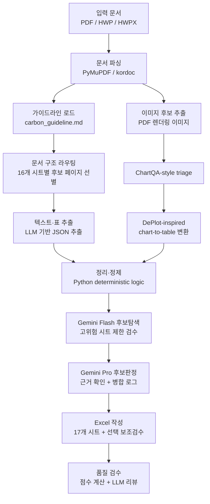

# 가이드라인 기반 지자체 탄소중립 계획 정보 추출 시스템

환경부 「지자체 탄소중립 녹색성장 기본계획 수립 및 추진상황 점검 가이드라인」(`carbon_guideline.md`) 기반으로 지자체 보고서에서 **16개 표준 시트**의 구조화 데이터를 추출해 Excel 파일로 정리하는 Python 프로젝트입니다.

PDF를 주 입력으로 지원하며, HWP/HWPX 문서는 `kordoc`를 통해 텍스트와 표를 읽어 파이프라인에 연결합니다.

## 2026-06-28 업데이트: 하이브리드 검수·실행 안정화

동료의 개선 코드 분석 이후, 기본 파이프라인은 유지하되 **재현성, 검수 신뢰도, 모델 비교 가능성**을 높이는 방향으로 보완했습니다.

- **OpenAI 백엔드 정식 연결**: `--agent openai --agent-model gpt-5.4-mini` 실행 경로를 추가해 GPT 계열 모델을 기본 추출 엔진으로 비교할 수 있게 했습니다. OpenAI 호출도 JSON 모드, 재시도, 캐시 체계에 포함됩니다.
- **GPT 기본본 + 보조 모델 검수 구조**: 기본 추출본은 GPT/OpenAI 등 한 모델이 만들고, `--hybrid-review` 사용 시 Gemini Flash가 고위험 시트의 누락·충돌 후보를 별도 탐색합니다. 후보는 `17_보조검수후보` 시트에 기록됩니다.
- **후보 전체 판정과 모델 교체 지원**: `HYBRID_ADJUDICATION_MAX_CANDIDATES=0`이면 보조검수 후보 전체를 판정합니다. 판정 모델은 `HYBRID_ADJUDICATION_PROVIDER`와 `HYBRID_ADJUDICATION_MODEL`로 바꿀 수 있어 `gemini-2.5-pro`와 `gpt-5.4`를 같은 후보에 대해 비교할 수 있습니다.
- **판정 등급 세분화**: 후보 판정값을 `accept`, `fix_then_merge`, `reject`, `needs_human`으로 나눴습니다. `accept`는 그대로 병합 가능, `fix_then_merge`는 부문명·단위·직간접구분 같은 정규화 후 병합 가능한 후보를 뜻합니다.
- **보수적 자동 병합**: 기본값에서는 후보를 본문 시트에 자동 반영하지 않고 `18_보조병합로그`에 근거와 차단 사유만 남깁니다. `--hybrid-auto-merge`를 켠 경우에만 `accept` 또는 `fix_then_merge`이면서 `high` 신뢰도, 원문 근거, 중복·참고자료 차단 조건을 통과한 후보를 본문 시트에 반영합니다.
- **표 번호 기반 근거페이지 보정**: 후보 사유에 `표 2-31` 같은 표 번호가 있을 때 목차 페이지(`p4`, `p6` 등)가 근거로 들어가는 문제를 줄이기 위해, PDF 전체에서 실제 표 본문 페이지를 다시 찾아 판정 문맥으로 사용합니다.
- **LLM 캐시와 단계별 소요시간 로그 정리**: 반복 테스트에서는 `.cache/llm_responses`의 캐시를 재사용해 시간과 비용을 줄입니다. 파이프라인 종료 시 텍스트 추출, 이미지 분석, 보조검수, 후보판정 등 단계별 소요 시간과 캐시 hit/miss를 출력합니다.
- **Gemini 일시 오류 내성 강화**: Gemini 503/서버 과부하 오류는 quota 오류와 분리해 재시도하며, 설정에 따라 해당 호출만 빈 JSON으로 처리하고 파이프라인을 계속 진행할 수 있게 했습니다.

권장 비교 실행 예시는 다음과 같습니다.

```powershell
# GPT-Mini 기본 추출 + Gemini Flash 후보탐색 + GPT-5.4 후보판정
py main.py "서울특별시_탄소중립계획.pdf" --agent openai --agent-model gpt-5.4-mini --hybrid-review
```

```env
HYBRID_REVIEW_ENABLED=1
HYBRID_REVIEW_PROVIDER=gemini
HYBRID_REVIEW_MODEL=gemini-2.5-flash
HYBRID_ADJUDICATION_PROVIDER=openai
HYBRID_ADJUDICATION_MODEL=gpt-5.4
HYBRID_ADJUDICATION_MAX_CANDIDATES=0
HYBRID_AUTO_MERGE_ENABLED=0
LLM_CACHE_ENABLED=1
```

## 2026년 6월 업데이트: Claude Code 모드 토큰 최적화

`--agent claude` 실행 시 세션/사용량 한도 초과를 완화하기 위해, **추출 품질은 그대로 유지**하면서 호출당 오버헤드와 라우팅 중복만 줄였습니다. 모든 변경은 LLM 토큰을 쓰지 않는 검증기로 품질 비회귀를 증명했습니다.

- **기본 백엔드 설명 정리 및 실행 로그 강화**: 실제 기본값은 Gemini API입니다. `main.py`, `config.py`, README의 설명을 이에 맞췄고, 실행 시작 시 백엔드·모델·이미지 상한·캐시·라우팅 설정을 출력합니다. 파이프라인 종료 시 단계별 소요 시간과 LLM 캐시 hit/miss도 함께 보여줍니다.
- **OpenAI API 백엔드 추가**: Gemini Flash 계열 대안 테스트를 위해 `--agent openai` / `LLM_PROVIDER=openai` 실행 경로를 추가했습니다. 기본 OpenAI 모델은 `gpt-5.4-mini`이며, 텍스트·이미지·이미지 배치 호출 모두 Responses API JSON 모드로 동작합니다.
- **GPT 기본본 + Gemini 2단계 보조 검수 구조 추가**: `--hybrid-review`를 켜면 GPT/OpenAI 기본본을 유지한 채 Gemini Flash가 고위험 시트의 누락·충돌 후보를 찾고, Gemini Pro가 후보별 원문 근거를 다시 판정합니다. 결과는 `17_보조검수후보`, `18_보조병합로그`에 남기며, 자동 병합은 기본 비활성입니다.
- **Gemini 503 내성 강화**: Gemini 서버 과부하/일시 장애는 quota 오류와 분리해 처리합니다. `GEMINI_MAX_RETRIES`만큼 지수 백오프로 재시도하고, 계속 실패하면 해당 호출만 빈 JSON으로 처리해 전체 파이프라인 중단을 막습니다. `GEMINI_FAIL_SOFT_ON_TRANSIENT=0`으로 기존처럼 중단시킬 수 있습니다.
- **문서메타 라우팅 상한은 기본 비활성**: 테스트와 비교 재현성을 위해 `document_meta`도 기본적으로 전체 후보 범위를 유지합니다. 속도 최적화가 필요할 때만 `DOCUMENT_ROUTE_MAX_PAGES_DOCUMENT_META` 환경변수로 별도 상한을 줄 수 있습니다.
- **세션 오버헤드 제거** (`utils/llm_client.py`): 로컬 에이전트를 중립 임시 디렉터리에서 실행해 프로젝트 `CLAUDE.md`/`AGENTS.md` 자동 로드를 막고, Claude Code 호출 시 MCP 서버·스킬·설정/훅·동적 시스템 프롬프트 섹션을 비활성화합니다(텍스트 호출은 도구 없음, 이미지 호출은 Read만 허용). 추출 입력·출력은 동일하며 `CLAUDE_MINIMAL_SESSION=0`으로 끌 수 있습니다.
- **라우팅 샤프닝** (`agents/extractor_agent.py`): 문서 전반에 편재해 변별력이 없는 weak 키워드(예: 머리말의 `탄소중립`·`녹색성장`)의 점수 가산을 제외해, 거의 전 문서가 모든 시트에 배정되던 중복을 줄입니다. strong 신호는 보존하므로 실제 데이터 페이지는 그대로 선택됩니다(서울 기준 텍스트 호출 297→273). `ROUTE_UBIQUITY_RATIO=0.5`가 무회귀 최대치입니다.
- **라우팅 커버리지 검증기** (`scripts/verify_routing_coverage.py`): 정답지 값을 원문 페이지에 매핑해 시트별 리콜이 베이스라인 이상인지 LLM 없이 증명합니다. 라우팅을 더 공격적으로 조이기 전에는 반드시 이 게이트를 통과해야 합니다.

```powershell
# 라우팅 변경이 정답 리콜을 떨어뜨리지 않는지 토큰 0으로 검증
py scripts/verify_routing_coverage.py "서울특별시_탄소중립계획_정리.xlsx" "서울특별시_탄소중립계획.pdf"
```

> 참고: 페이지가 여러 시트의 정당한 strong 신호에 걸리는 **구조적 중복**은 라우팅만으로 품질 무손실로 제거하기 어렵습니다. 한도 초과의 실질적 해결은 위 세션 오버헤드 제거이며, 더 큰 절감이 필요하면 배치당 다중 시트 통합 추출을 검증기로 보증하며 도입할 수 있습니다.

## 2026년 6월 업데이트: 가이드라인 기반 16시트 구조 전환

전체 파이프라인을 `carbon_guideline.md` 기반으로 재설계했습니다.

- **16개 표준 시트**: 가이드라인 §5.2절에 정의된 문서메타, 계획개요, 지역여건, 배출현황(지역/관리권한), 배출전망, 감축목표, 비전전략, 감축사업목록, 연차별이행계획, 정량감축량, 재정투자계획, 대응기반강화, 이행관리환류, 점검실적, 변경과제 + 시각자료목록
- **가이드라인 마크다운 직접 로드**: HWP 파싱 없이 `carbon_guideline.md`에서 시트별 보조 지침을 바로 생성
- **기본 LLM 백엔드**: Gemini API (`GEMINI_API_KEY` 필요)
- **OpenAI API 지원**: `--agent openai --agent-model gpt-5.4-mini`로 GPT 계열 모델 테스트 가능
- **로컬 에이전트 지원**: `--agent codex` 또는 `--agent claude`로 로컬 CLI 사용 가능
- **이미지 분석**: 기본 포함. 그래프·표 이미지에서 수치를 추출해 해당 시트에 병합

## 주요 기능

- PDF, HWP, HWPX 입력 지원
- `carbon_guideline.md` 기반 16개 표준 시트 자동 추출
- 문서 구조 라우팅으로 시트별 관련 페이지 선별 (16개 카테고리)
- Gemini API / OpenAI API / Codex CLI / Claude Code CLI 선택 가능
- ChartQA-style 이미지 triage + DePlot-inspired chart-to-table 변환
- 부문명 정규화, 중복 제거, 달성여부/사업유형 코드 정규화
- 기본 17개 시트 Excel 자동 생성, `--hybrid-review` 사용 시 보조 검수 후보·병합 로그 시트 추가

## 처리 흐름



## 프로젝트 구조

```text
졸업프로젝트/
├─ main.py                    # CLI 진입점
├─ config.py                  # 모델, 배치, 라우팅, 이미지 분석 설정
├─ requirements.txt           # Python 의존성
├─ package.json               # kordoc(Node.js) 의존성
├─ install.bat                # Windows 설치 보조 스크립트
├─ agents/
│  ├─ guideline_agent.py      # 환경부 가이드라인/스키마 관리
│  ├─ extractor_agent.py      # 텍스트·표 추출
│  ├─ image_agent.py          # 이미지 triage 및 그래프 표 변환
│  ├─ organizer_agent.py      # 정제·정규화·이상치 처리
│  ├─ hybrid_review_agent.py  # 보조 모델 기반 누락/충돌 후보 검수
│  ├─ excel_agent.py          # Excel 작성 에이전트
│  └─ supervisor.py           # 전체 파이프라인 조율
├─ utils/
│  ├─ llm_client.py           # Gemini/OpenAI API, Codex/Claude Code 호출, JSON 파싱, 재시도
│  ├─ llm_cache.py            # 프롬프트 해시 기반 LLM 응답 캐시(중단 시 재실행 이어받기)
│  ├─ pdf_reader.py           # PDF 파싱
│  ├─ hwp_reader.py           # HWP/HWPX 파싱(kordoc)
│  └─ excel_writer.py         # openpyxl 기반 Excel 생성
└─ scripts/
   └─ verify_routing_coverage.py  # 라우팅 커버리지 검증기(LLM 토큰 0)
```

## 설치

### 1. Python 패키지

Python 3.10 이상을 권장합니다.

```powershell
py -m pip install -r requirements.txt
```

`py -m ...` 실행 시 `No installed Python found!`가 나오면 Python 런타임이 설치되어 있지 않거나 Windows Python Launcher가 실제 Python을 찾지 못하는 상태입니다. 이 경우 [python.org](https://www.python.org/downloads/windows/)에서 Python 3.11 이상을 설치하고, 설치 화면에서 `Add python.exe to PATH`를 체크한 뒤 새 PowerShell을 열어 아래 명령으로 확인합니다.

```powershell
py -0p
py --version
```

또는 Windows에서:

```powershell
.\install.bat
```

### 2. HWP/HWPX 지원용 Node 패키지

PDF만 사용할 경우 필수는 아니지만, HWP/HWPX 입력 또는 가이드라인 HWP를 쓰려면 Node.js 18 이상과 `kordoc`가 필요합니다.

```powershell
npm install
```

프로젝트는 가능한 경우 전역 `npx`보다 로컬 `node_modules/.bin/kordoc.cmd`를 우선 사용합니다.

### 3. LLM 백엔드 준비

기본 실행은 **Gemini API**를 사용합니다. `.env` 파일 또는 환경변수에 API 키를 설정하세요.

```text
GEMINI_API_KEY=
```

Gemini SDK가 필요합니다:
```powershell
py -m pip install google-genai
```

OpenAI API를 테스트하려면 `.env` 파일 또는 환경변수에 아래 값을 설정합니다:

```text
LLM_PROVIDER=openai
OPENAI_API_KEY=
OPENAI_MODEL=gpt-5.4-mini
```

OpenAI SDK는 `requirements.txt`에 포함되어 있습니다. 기존 환경이라면 한 번 더 설치하세요:

```powershell
py -m pip install -r requirements.txt
```

로컬 에이전트를 사용하려면 아래처럼 설정합니다:

```text
LLM_PROVIDER=codex    # Codex CLI 사용
# 또는
LLM_PROVIDER=claude   # Claude Code CLI 사용
```

로컬 에이전트는 각각 로그인 상태가 필요합니다:
```powershell
codex --version
# 또는
claude --version
```

## 실행

### 기본 실행 (Gemini API)

```powershell
py main.py "서울특별시_탄소중립계획.pdf" -o "서울_결과.xlsx"
```

### Codex CLI로 실행

```powershell
py main.py "서울특별시_탄소중립계획.pdf" --agent codex -o "서울_결과.xlsx"
```

### OpenAI API로 실행

```powershell
py main.py "서울특별시_탄소중립계획.pdf" --agent openai --agent-model gpt-5.4-mini -o "서울_결과.xlsx"
```

### OpenAI 기본 추출 + Gemini 보조 검수

Gemini를 전체 재추출에 쓰지 않고, 고위험 시트의 누락 후보 탐지와 후보 판정에만 사용합니다. 기본 흐름은 `GPT-Mini 기본본 → Gemini Flash 후보탐색 → Gemini Pro 후보판정 → 규칙 기반 병합 로그`입니다.

```powershell
py main.py "서울특별시_탄소중립계획.pdf" --agent openai --agent-model gpt-5.4-mini --hybrid-review -o "서울_결과.xlsx"
```

기본값에서는 후보를 본 시트에 자동 병합하지 않고 `17_보조검수후보`, `18_보조병합로그`에 기록합니다. Pro가 `accept` 또는 `fix_then_merge`와 `high` 신뢰도로 판정하고 규칙 검사를 통과한 후보를 실제 본 시트에 반영하려면 아래처럼 명시적으로 켭니다.

```powershell
py main.py "서울특별시_탄소중립계획.pdf" --agent openai --agent-model gpt-5.4-mini --hybrid-review --hybrid-auto-merge -o "서울_결과.xlsx"
```

### Claude Code CLI로 실행

```powershell
py main.py "서울특별시_탄소중립계획.pdf" --agent claude -o "서울_결과.xlsx"
```

### 이미지 분석 제외

이미지 Vision 호출이 느리거나 비용을 줄이고 싶을 때:

```powershell
py main.py "서울특별시_탄소중립계획.pdf" --no-images -o "서울_결과.xlsx"
```

### 전체 페이지 스캔 (라우팅 누락 방지)

```powershell
py main.py "서울특별시_탄소중립계획.pdf" --full-scan -o "서울_결과.xlsx"
```

### 주요 옵션

| 옵션 | 설명 |
|---|---|
| `input_path` | 입력 문서 경로. PDF, HWP, HWPX 지원 |
| `-o`, `--output` | 출력 Excel 파일 경로 |
| `-g`, `--guideline` | 환경부 가이드라인 HWP/HWPX 경로 |
| `--agent` | LLM 백엔드: `gemini`, `openai`, `codex`, `claude`, `auto` |
| `--agent-model` | Gemini/OpenAI 또는 로컬 에이전트 모델명 |
| `--agent-timeout` | 로컬 에이전트 1회 호출 제한 시간(초) |
| `-k`, `--api-key` | 선택한 API 백엔드 키 (`gemini` 또는 `openai`) |
| `-r`, `--retries` | 품질 미달 시 파이프라인 재시도 횟수 |
| `-v`, `--verbose` | 상세 로그 출력 |
| `--no-images` | 이미지·그래프 분석 생략 |
| `--hybrid-review` | 기본 추출 후 보조 모델로 누락/충돌 후보 검수 |
| `--hybrid-review-max-batches` | 보조 검수 시 시트당 최대 배치 수 |
| `--hybrid-adjudication-model` | 보조 후보를 최종 판정할 모델명. 기본값 `gemini-2.5-pro` |
| `--hybrid-adjudication-max-candidates` | Pro 판정 후보 최대 개수. 기본값 0(전체 후보) |
| `--no-hybrid-adjudication` | Flash 후보탐색만 수행하고 Pro 후보판정은 생략 |
| `--hybrid-auto-merge` | Pro accept/fix_then_merge + high 신뢰도 + 규칙 검사를 통과한 후보를 본 시트에 자동 병합 |

## 출력 Excel

생성 파일은 `carbon_guideline.md` §5.2절 기준 17개 기본 시트로 구성됩니다. `--hybrid-review`를 켜면 후보 검토용 `17_보조검수후보`, Pro 판정·병합 추적용 `18_보조병합로그` 시트가 데이터가 있을 때만 추가됩니다.

| 시트 | 내용 |
|---|---|
| `00_문서메타` | 계획명, 지자체, 계획기간, 기준연도, 목표연도 |
| `01_계획개요` | 수립배경, 법적근거, 추진체계, 추진경과 |
| `02_지역여건` | 자연/인문/경제/에너지 지표 (자동차, 에너지 포함) |
| `03_배출현황_지역` | GIR 기준 직접·간접·흡수원 배출량 |
| `04_배출현황_관리권한` | 지자체 관리권한 인벤토리 |
| `05_배출전망` | BAU 및 시나리오별 전망값 |
| `06_감축목표` | 총괄·부문별 감축목표, 감축률 |
| `07_비전전략` | 비전문구, 추진전략, 세부전략 |
| `08_감축사업목록` | 감축대책 세부사업, 관리번호, 성과지표 |
| `09_연차별이행계획` | 사업별 연도별 목표물량 및 계획 |
| `10_정량감축량` | 감축원단위 기반 정량 감축량 산정 |
| `11_재정투자계획` | 부문별·재원별·연도별 예산 |
| `12_대응기반강화` | 적응/공유재산/교육/녹색성장 등 8개 영역 |
| `13_이행관리환류` | 점검체계, 담당조직, 절차, 기한 |
| `14_점검실적` | 연도별 이행실적, 달성여부, 사업유형 |
| `15_변경과제_조치` | 변경사업, 미달성 사유, 조치계획 |
| `16_시각자료목록` | 이미지·그래프 판독 결과 추적 |
| `17_보조검수후보` | 보조 모델이 제안한 누락 후보, 값 충돌, 오염 의심 항목 (`--hybrid-review` 사용 시) |
| `18_보조병합로그` | Gemini Pro 후보 판정, 원문 근거, 자동 병합 여부와 차단 사유 (`--hybrid-review` 사용 시) |

## 현재 주요 설정

`config.py`에서 실행 시간과 정확도 균형을 조정할 수 있습니다.

```python
LLM_PROVIDER = "gemini"        # 기본 백엔드 (gemini/openai/codex/claude/auto)
LOCAL_AGENT_MODEL = ""
LOCAL_AGENT_TIMEOUT = 900
GEMINI_API_KEY = ""            # .env 또는 환경변수로 설정
OPENAI_API_KEY = ""            # OpenAI 백엔드 사용 시 설정
OPENAI_MODEL = "gpt-5.4-mini"
OPENAI_MAX_OUTPUT_TOKENS = 32768

HYBRID_REVIEW_ENABLED = False  # --hybrid-review 또는 환경변수로 활성화
HYBRID_REVIEW_PROVIDER = "gemini"
HYBRID_REVIEW_MAX_BATCHES_PER_SHEET = 2
HYBRID_ADJUDICATION_ENABLED = True
HYBRID_ADJUDICATION_MODEL = "gemini-2.5-pro"
HYBRID_ADJUDICATION_MAX_CANDIDATES = 0  # 0이면 후보 전체 판정
HYBRID_AUTO_MERGE_ENABLED = False

BATCH_SIZE = 15                # 배치당 페이지 수

DOCUMENT_ROUTE_CONTEXT_PAGES = 1
DOCUMENT_ROUTE_MIN_SCORE = 3

# 토큰 최적화 (품질 무손실)
CLAUDE_MINIMAL_SESSION = True  # claude 호출 시 MCP/스킬/설정/CLAUDE.md 등 오버헤드 차단
ROUTE_DROP_UBIQUITOUS_WEAK = True  # 편재하는 변별력 없는 weak 키워드 점수 제외
ROUTE_UBIQUITY_RATIO = 0.5     # 이 비율 이상 페이지에 나오는 weak 키워드는 무시(무회귀 최대치)

MAX_IMAGES = None              # 기본값: triage 통과 이미지 전수 분석
IMAGE_TRIAGE_ENABLED = True
IMAGE_TRIAGE_MIN_SCORE = 5
IMAGE_CHART_TABLE_EXTRACTION = True
IMAGE_CHART_MERGE_MIN_CONFIDENCE = "medium"
```

권장값:

- 최종 산출용: 기본값 그대로 `MAX_IMAGES = None`으로 이미지 전수 분석
- 빠른 테스트: `MAX_IMAGES = 30~50` 또는 `--no-images`
- 라우팅 누락이 의심될 때: `--full-scan` 또는 `FULL_DOCUMENT_SCAN=1`
- JSON 파싱 실패가 잦을 때: `BATCH_SIZE = 10~15`
- GPT-Mini 기본본을 Gemini로 보조 검수할 때: `--hybrid-review`
- Pro 판정 결과 중 `accept`/`fix_then_merge`만 본 시트에 반영해 테스트할 때: `--hybrid-auto-merge`

## 동작 방식

### 문서 파싱

PDF는 PyMuPDF로 텍스트, 표, 이미지 후보를 추출합니다. HWP/HWPX는 `kordoc`를 subprocess로 호출해 Markdown/JSON 결과를 읽고, 기존 `PDFContent` 구조로 변환합니다.

### 가이드라인 반영

가이드라인 HWP가 제공되면 `GuidelineAgent`가 본문을 시트별 키워드로 검색해 관련 지침 조각을 추출 프롬프트에 추가합니다. 파싱에 실패하거나 관련 지침이 없으면 내장 스키마만 사용합니다.

### 텍스트 추출

전체 문서를 그대로 LLM에 넣지 않고, 시트별로 관련성이 높은 후보 페이지를 먼저 고릅니다. 이후 후보 페이지를 `BATCH_SIZE` 단위로 묶어 선택된 LLM 백엔드에 JSON 전용 프롬프트로 전달합니다.

라우팅 로그의 후보 페이지 수와 최종 추출 행 수는 다른 값입니다.

```text
문서 구조 라우팅 완료(시트별 후보 페이지 수): {'ghg': 180, ...}
완료. 누적: {'ghg': 75, ...}
```

첫 번째는 LLM에 보낼 후보 페이지 수이고, 두 번째는 실제 추출된 JSON 행 수입니다.

### 이미지 분석

이미지가 많은 PDF에서도 기본값은 `MAX_IMAGES=None`이므로 triage 통과 이미지를 전수 분석합니다.
속도 때문에 일부만 확인해야 하는 경우에만 `--max-images N` 또는 `MAX_IMAGES=N`을 명시합니다.

1. 로컬 triage로 차트·표 가능성이 높은 이미지 선별
2. 같은 페이지의 embedded 이미지가 전체 페이지 렌더에 포함되면 페이지 렌더 1장으로 대표해 중복 Vision 호출을 줄임
3. `우리나라 NDC`, `주요국`, `세계도시`, `COP`, `IPCC`, `동향`, `목차` 등 지자체 직접 데이터가 아닌 참고자료성 페이지 제외
4. 남은 후보를 전수 분석하되, `MAX_IMAGES`가 명시된 경우에만 상위 N개로 제한
5. 그래프는 `chart_table` 형태로 변환
6. 변환된 표를 `이미지·그래프 판독결과` 시트에 기록
7. 중복 행을 제거하고 연도 범위, 참고자료 여부, 값 존재 여부를 재검증
8. 연도와 값이 명확한 표 기반 고신뢰 행만 본 데이터에 병합하고, 막대·선 그래프 추정값은 검토 후보로 보관
9. Vision이 유효 차트로 판독하지 못한 페이지도 페이지 렌더/표 주변 텍스트에서 확인되는 수치는 검토 후보로 남김

LLM 호출이 실패하거나 타임아웃되면 설정된 재시도 횟수만큼 다시 실행합니다.

### 정리·정제

정제 단계는 가능한 한 LLM이 아니라 Python 규칙으로 처리합니다.

- 부문명 표준화
- 용도/차종명 정규화
- 중복 행 병합
- 비정상 주행거리 제거
- 에너지 합산행 제거
- GHG 이상치 제거
- `25432000 → 25432` 같은 천 단위 스케일 보정
- 요약카드 5개 항목 정리

### 빈칸 보완

1차 정제 후 자동차 대수/주행거리, 에너지 소비량, GHG 연도값, 감축전략 연도값이 크게 비어 있는 행을 찾습니다. 보완 대상 행과 관련 원문 페이지만 다시 LLM 백엔드에 보내 후보 값을 추가한 뒤, Organizer를 한 번 더 통과시켜 기존 중복 병합 로직으로 합칩니다.

자동차와 에너지는 보고서마다 위치가 다르므로 특정 페이지 번호에 의존하지 않습니다. `자동차 등록대수`, `연료별 자동차`, `주행거리`, `최종에너지`, `에너지원별 소비량`, `부문별 최종에너지` 같은 키워드로 전체 문서를 다시 점수화하고, 점수가 높은 구간만 집중 재분석합니다. 원문이 용도별 교차표가 아니라 연료별 총량만 제공하면 `용도=전체`로 기록해 잘못된 용도에 억지 배정하지 않습니다.

감축전략에서 연도값을 끝내 찾지 못한 행은 기존 `감축전략(계획실적)` 시트에서 제외하고 `감축전략(정성사업)` 시트로 분리합니다. 별도 상태 문구를 셀에 반복해서 적지 않고, 원문에서 확인된 성과지표만 유지합니다. 이 작업은 이미 추출된 행을 나누는 후처리이므로 에이전트 호출 수에는 영향을 주지 않습니다.

### 보조 모델 검수

`--hybrid-review`를 켜면 기본 추출이 끝난 뒤 보조 모델이 아래 고위험 시트만 제한적으로 다시 봅니다.

- `04_배출현황_관리권한`
- `06_감축목표`
- `08_감축사업목록`
- `10_정량감축량`
- `11_재정투자계획`

보조 검수는 두 단계입니다.

1. Gemini Flash가 고위험 시트의 일부 후보 페이지를 다시 읽고 `17_보조검수후보`에 `누락후보`, `값충돌`, `기본본오염의심`을 남깁니다.
2. Gemini Pro가 후보별 원문 문맥을 다시 확인해 `accept`, `fix_then_merge`, `reject`, `needs_human`으로 판정하고 `18_보조병합로그`에 근거 문구, 위험 플래그, 병합 차단 사유를 남깁니다.

후보 사유에 `표 2-31` 같은 표 번호가 있으면 목차 페이지 대신 PDF 전체에서 실제 표 본문 페이지를 찾아 판정 문맥으로 사용합니다. 기본값에서는 Pro가 `accept`해도 본 시트에 바로 병합하지 않습니다. `--hybrid-auto-merge`를 켠 경우에만 `accept` 또는 `fix_then_merge`, `high` 신뢰도, 원문 근거 존재, 참고자료/국가자료 문맥 아님, 기본본 중복 아님 조건을 모두 통과한 후보가 본 시트에 추가됩니다. 시트당 기본 2배치만 검수하므로 Gemini 전체 재실행보다 훨씬 짧게 동작합니다.

### 소요 시간 및 캐시 로그

실행 종료 시 병목 확인을 위해 단계별 누적 소요 시간을 출력합니다. 품질 미달로 재시도한 경우 `텍스트 추출`, `이미지 분석`, `정리·정제` 시간은 전체 시도 합산입니다.

```text
[감독관] 단계별 소요 시간
  - 문서 파싱: 42.3초
  - 가이드라인 로드: 0.2초
  - 텍스트 추출: 38분 12.4초
  - 이미지 분석: 21분 08.6초
  - 정리·정제: 1분 14.0초
  - 보조 모델 검수: 3분 20.0초
  - 보조 후보 판정·병합: 4분 10.0초
  - 엑셀 작성: 2.1초
  - LLM 최종 검수: 18.5초
  - 전체: 1시간 01분 37.8초
  - LLM 캐시: hit 12, miss 84, write 84, disabled 0
```

`hit`가 높을수록 이전 실행 결과를 재사용한 비율이 높다는 뜻입니다. 첫 실행에서는 대부분 `miss`가 정상입니다.

## 자주 발생하는 로그

### `관련 지침 0개 반영`

가이드라인 파일은 읽었지만 시트별 키워드로 선택된 보조 지침이 없다는 뜻입니다. 최근 버전에서는 kordoc의 `markdown`, `text`, `table.cells` 구조를 모두 읽도록 보완했습니다.

### `JSON 파싱 실패`

LLM 응답이 길거나 JSON 외 설명이 섞여 구조가 깨진 경우입니다. `BATCH_SIZE`를 낮추면 완화됩니다.

### `LLM/로컬 에이전트 실행 실패`

Gemini/OpenAI API 키, Codex/Claude Code CLI 설치, 로그인 상태, `LLM_PROVIDER`, `CODEX_COMMAND`, `CLAUDE_COMMAND` 값을 확인하세요. 로컬 에이전트 호출이 너무 오래 걸리면 `LOCAL_AGENT_TIMEOUT` 또는 `--agent-timeout`을 늘릴 수 있습니다.

### `Gemini 일시 과부하/서버 오류`

Gemini가 `503 UNAVAILABLE`, `high demand`를 반환한 경우입니다. 기본값에서는 `GEMINI_MAX_RETRIES=4`까지 재시도하고, 그래도 실패하면 해당 배치만 빈 결과로 처리해 다음 배치를 계속 진행합니다. 결과 누락이 걱정되면 같은 설정으로 재실행하면 캐시된 성공 호출은 재사용하고 실패 배치만 다시 시도됩니다.

### `MuPDF error: syntax error`

일부 PDF 내부 객체 형식이 엄격하지 않아 PyMuPDF가 경고를 출력하는 경우입니다. 텍스트/페이지 파싱이 완료된다면 대체로 치명적 문제는 아닙니다.

## 한계

- LLM 기반 추출이므로 원문 표 구조가 복잡하면 오추출이 발생할 수 있습니다.
- 스캔본 PDF처럼 텍스트 레이어가 약한 문서는 정확도가 낮습니다.
- HWP 입력은 현재 텍스트·표 중심이며 이미지 추출은 지원하지 않습니다.
- 지도형 시각화는 일반 그래프보다 수치 추출 신뢰도가 낮습니다.
- LLM 응답 속도는 선택한 백엔드, 모델, 이미지 분석 개수, 배치 크기에 영향을 받습니다.

## 개발 환경

| 항목 | 내용 |
|---|---|
| 언어 | Python 3.10+ |
| LLM | Gemini API / OpenAI API / Codex CLI / Claude Code CLI |
| PDF | PyMuPDF |
| HWP/HWPX | kordoc(Node.js) |
| Excel | openpyxl |
| 이미지 처리 | Pillow |
